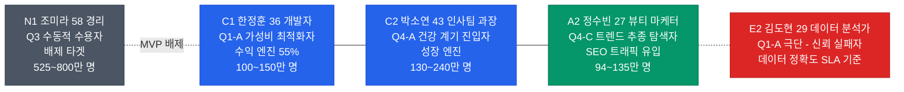
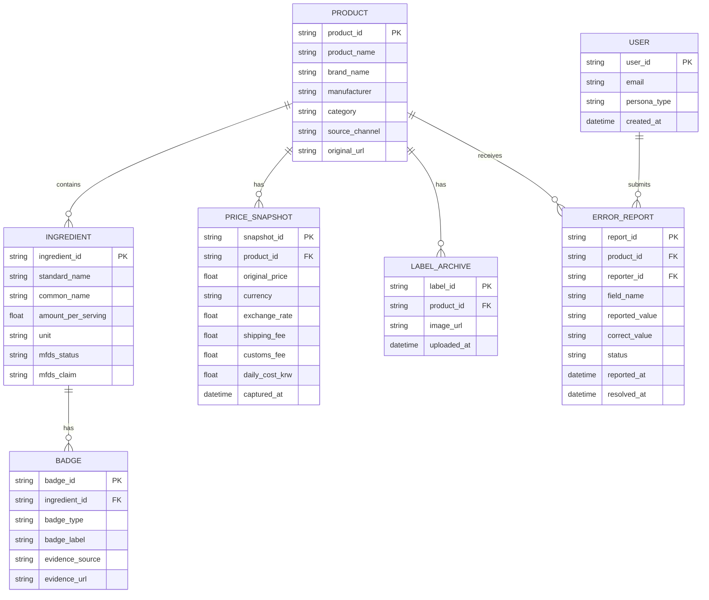
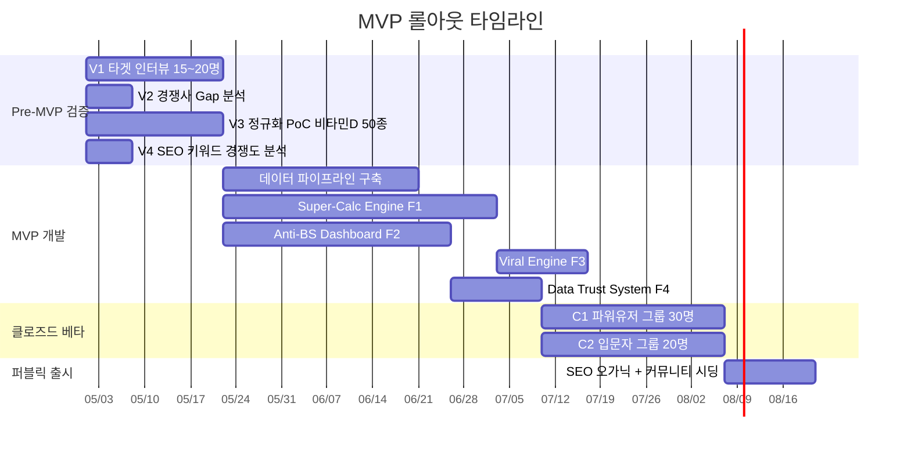

# 건기식 성분·가격 비교 초자동화 플랫폼 PRD v0.1

- **Owner 팀:** Product & Engineering
- **최종 업데이트:** 2026-04-11
- **기반 문서:** [VPS Merged V2 (fin)](../04_VPS-final/06_value-proposition-sheet_260410(fin).md)

---

## 1. 개요·목표

### 1-1. 문제 정의 (Pain 지표 포함)

국내 건강기능식품 시장(연 6조 원)은 OEM/ODM 발달로 수천 개 브랜드가 기능적 변별력 없이 쏟아지는 **공급 과잉 · 정보 혼돈** 상태에 있다. 소비자는 정보 접근권은 높아졌으나, **'비교할 수 있는 능력'이 상실**되어 신뢰할 수 있는 대리인(Agent)을 갈망하고 있다.

| Pain ID | Pain 내용 | 실패 KPI (현 상태) | 출처 |
|---|---|---|---|
| **CORE-1** | 채널 간 단가 비교 수동 작업 과부하 (C1) | 탐색·계산 소요 시간 **>= 60분/건** | AOS 3.0 / VPS IV |
| **CORE-2** | 성분 정보 해석 불가 - 비교 자체 불가 (C2) | 성분 비교 어려움 **47.2%**, 구매 여정 이탈률 **55~75%** | 식약처 2021, VPS II |
| **CORE-3** | 광고성 콘텐츠 범람, 독립 신뢰 정보 부재 (C2, A2) | 가격-품질 오인율 **41.3%**, 동일 성분 가격 차이 최대 **8.2배** | 한국소비자원 2022, 식약처 2021 |
| **CORE-4** | 가격 적정성 판단 기준 부재 (공통) | 탐색 후에도 결론 실패 비율 **>= 40%** (베스트셀러 타협 구매) | VPS IV |
| **EXT-2** | 기존 비교 앱 데이터 오류 - 카테고리 전체 불신 (E2) | 기존 앱 성분 DB 오류율 **추정 >= 10%**, 이탈 후 재방문율 **< 5%** | VPS IV |
| **CJM-1** | 인지 단계에서 광고 vs 독립 정보 구분 불가 (전체) | 오가닉 유입 - 가입 전환율 **<= 15%** (신뢰 부재) | VPS II-3 |

### 1-2. 목표 (Desired Outcome 수치화)

> **한 줄 비전:** *"수동 엑셀 계산과 뒷광고 필터링에 지친 건기식 소비자들을 위한, 리얼-타임 1일 단가 계산 및 의학 팩트체크 플랫폼"*

| Desired Outcome | 현재(Baseline) | 목표(Target) | 측정 시점 | Baseline 실측 방법 |
|---|---|---|---|---|
| 탐색~결제(또는 공유) 완료 소요 시간 | 60분 (VPS IV, JTBD 인터뷰 6명 평균) | **<= 5분** | MVP 출시 후 3개월 | Closed Beta 1 (n=30)에서 과제 수행 시간 사전 측정 |
| 계산 시간 압축 (C1) | 60분 (JTBD Card 01 인터뷰 기반) | **<= 5초** (90% 단축) | MVP 출시 후 1개월 | Closed Beta 1 과제: 비타민D 3채널 비교 수동 수행 시간 측정 |
| 광고 배제 신뢰 체감 (C2/A2) | Closed Beta 2 사전 설문에서 실측 후 기준선 확정 (5점 Likert) | **>= 4.0/5점** (만족도 조사) | MVP 출시 후 3개월 | Closed Beta 2 (n=20) 사전/사후 설문 비교 (Paired t-test) |
| 성분 DB 오류율 | V3 PoC(비타민D 50종) 실측 오류율로 대체 | **<= 5%** (Phase 1), **<= 2%** (Phase 2) | 출시 후 3 / 6개월 | V3 PoC 오류율 기준선 확정 - 월 1회 무작위 50건 샘플 검수 |

### 1-3. 성공 지표

#### North Star KPI

| KPI | 정의 | 기준선(Baseline) | 목표값(Target) | 측정 주기 |
|---|---|---|---|---|
| **TTC (Time-To-Completion)** | 탐색 시작 후 결제 링크 클릭 또는 SNS 공유 완료까지의 소요 시간 | 60분 (수동 탐색 추정) | **<= 5분** | 주간 (p50, p95 트래킹) |

#### 보조 KPI

| 카테고리 | KPI | 기준선 | 목표값 | 측정 주기 | 측정 경로 (도구 / 이벤트) |
|---|---|---|---|---|---|
| **획득** | SEO 오가닉 월 방문자 수 | 0명 (신규 서비스) | **>= 10,000명** | 월간 | Google Search Console - `clicks` 합산 |
| **활성** | 메인 - 단가 산출/뱃지 화면 퍼널 전환율 | 0% (출시 후 2주간 기준선 수립) | **>= 60%** | 주간 | Mixpanel Funnel: `page_view(main)` - `calc_result_view` |
| **전환** | 제휴사 구매 링크 CTR | 0% (출시 후 2주간 기준선 수립) | **>= 15%** | 주간 | Mixpanel: `affiliate_link_click` / `calc_result_view` x 100 |
| **바이럴** | 카카오톡 공유 카드 발송율 (K-Factor) | 0% (출시 후 2주간 기준선 수립) | **>= 10% (K >= 1.1)** | 주간 | Mixpanel: `kakao_share_send` / `session_start` x 100 |
| **유지** | D30~D60 재방문율 | 0% (출시 D30 이후 첫 측정) | **>= 20%** | 월간 | Amplitude Retention: `session_start` 코호트 D30/D60 셀 |
| **신뢰** | 성분 DB 오류율 | 0% (출시 후 1개월간 무작위 50건 샘플 검수로 기준선 수립) | **<= 5%** | 월간 | Jira: `label:db_error, status:resolved` / 전체 제품 수 x 100 |
| **매출** | 제휴 CPA 월 수익 | 0원 (신규 서비스) | **>= 500만 원** (Y1 말) | 월간 | iHerb 파트너스 대시보드 + 쿠팡 파트너스 정산 합산 |

---

## 2. 사용자와 페르소나

### 2-1. 핵심 페르소나 요약

### 2-2. 페르소나별 여정 Pain / Needs 링크

| 페르소나 | CJM 핵심 Pain 단계 | 핵심 Needs | AOS | DOS |
|---|---|---|---|---|
| **C1 한정훈** | 고려-결정 (단가 계산 과부하) | 5초 내 실시간 최저가 확인 | 3.0 | 2.70 |
| **C2 박소연** | 인지-고려 (성분 해석 불가, 광고 범람) | 30분 내 확신 있는 결정 | 3.0~4.0 | 2.40~3.60 |
| **A2 정수빈** | 인지 (트렌드 성분 근거 판단 불가) | 5초 팩트체크 + 1탭 공유 | 4.0 | 3.20 |
| **E2 김도현** | 결정-온보딩 (데이터 오류 불신) | 출처 2클릭 추적, 오류 48h 수정 | 4.0 | 3.20 |

> **배제 타겟:** E1 나경아(디지털 소외 - 카카오톡 간접 접근만 허용), N1 조미라(브랜드 맹신 - Satisfaction 과도, DOS -0.60 - 전환 유인 0%) - MVP 마케팅/기획 자원 투입 **전면 금지**.

---

## 3. 사용자 스토리와 수용 기준 (AC, Acceptance Criteria)

### Story 1: 실시간 채널 단가 비교 (C1 - Super-Calc Engine)

> **As a** 가성비 최적화 직구족(C1 한정훈),
> **I want** iHerb/쿠팡/네이버 등 다채널의 건기식을 "1일 복용량 기준 원화 최종 단가"로 자동 환산/정렬받고 싶다,
> **So that** 수동 엑셀 계산 없이 5초 만에 최저가를 확인하고 즉시 결제할 수 있다.

| AC | Given | When | Then | 측정 임계치 |
|---|---|---|---|---|
| **AC1 - 단가 산출 속도** | 사용자가 특정 영양소(예: 비타민D 1000IU)를 검색한 상태 | "1일 단가 비교" 버튼을 탭하면 | 모든 등록 채널의 1일 복용 기준 원화 단가가 정렬되어 표시된다 | **응답 시간 <= 2초 (p95)**, 실패율 **< 1.0%** |
| **AC2 - 환율 실시간 반영** | 사용자가 iHerb(USD) 제품과 쿠팡(KRW) 제품을 동시 비교할 때 | 결과 화면이 로드되면 | 각 가격에 적용된 환율과 "환율 기준 시각"이 명시적으로 표시된다 | 환율 갱신 주기 **<= 15분**, 표시 정확도 **+/- 0.5% 이내** |
| **AC3 - 최종가 정확도** | 배송비/관세/할인코드가 적용 가능한 제품이 있을 때 | 단가 랭킹이 표시되면 | "실지불가(배송비+관세 포함 최종가)"가 별도 컬럼으로 제공되며, 사용자가 직접 연산한 값과 일치한다 | 최종가 오차율 **<= 3%**, 오류 신고 후 수정 **<= 48시간** |
| **AC4 - 채널 API 장애 시 부분 결과 제공** _(Sad Path)_ | 등록된 3개 채널 중 1개(예: iHerb API)가 타임아웃 또는 5xx 오류를 반환하는 상태 | 사용자가 "1일 단가 비교"를 요청하면 | 정상 응답한 채널의 결과만 표시하고, 장애 채널에는 "현재 iHerb 가격을 가져올 수 없습니다. 마지막 수집: HH:MM" 안내를 인라인으로 표시한다. 전체 결과가 차단되지 않는다 | 부분 결과 제공 성공률 **>= 99%**, 장애 채널 안내 메시지 표시까지 **<= 500ms** |
| **AC5 - 미등록 성분 검색 시 안내** _(Sad Path)_ | 사용자가 DB에 미등록된 성분(예: "NMN")을 검색한 상태 | 검색 결과 화면이 로드되면 | "해당 성분은 현재 데이터베이스에 미등록 상태입니다. [제품 등록 요청하기]" 버튼이 표시되며, 사용자가 요청을 제출할 수 있다 | 빈 결과 - 등록 요청 CTA 노출까지 **<= 300ms**, 등록 요청 제출 성공률 **>= 99%** |

---

### Story 2: 광고 배제 팩트체크 대시보드 (C2/A2 - Anti-BS Dashboard)

> **As a** 건강 검진 후 첫 건기식을 구매하려는 입문자(C2 박소연) 또는 트렌드 성분의 과학적 근거를 확인하려는 탐색자(A2 정수빈),
> **I want** 광고/협찬 리뷰를 100% 배제한 상태에서, 식약처 인정 원료 DB와 의학 논문에 기반한 "한 줄 결론(뱃지)"만을 보고 싶다,
> **So that** 30분 안에 확신 있는 구매 결정을 내리고, 그 결과를 SNS로 공유할 수 있다.

| AC | Given | When | Then | 측정 임계치 |
|---|---|---|---|---|
| **AC1 - 마케팅 노이즈 제로** | 사용자가 특정 제품 상세 페이지에 진입한 상태 | 페이지가 로드되면 | 제휴 광고 배너, 유저 리뷰, 별점, 체험단 블로그 링크가 **0건** 표시된다 | 마케팅 콘텐츠 노출 **= 0건/페이지** |
| **AC2 - 의학 뱃지 정확도** | 식약처 건강기능식품공전에 등재된 기능성 인정 원료가 포함된 제품 | 뱃지 영역이 렌더링되면 | APPROVED/CAUTION/NOT_APPROVED 뱃지가 식약처 공전 원문과 1:1 매칭되어 표시된다 | 뱃지-원문 불일치율 **< 0.5%**, 뱃지 로드 시간 **<= 1초** |
| **AC3 - 성분명 일상어 번역** | "콜레칼시페롤", "피리독신 염산염" 등 전문 용어가 포함된 제품 | 성분표가 표시되면 | 전문 용어 옆에 일상어 번역(예: "몸에 잘 흡수되는 비타민 D3")이 괄호 형태로 표시된다 | 번역 커버리지 **>= 95%** (식약처 등록 기능성 원료 기준), 번역 정확도 **>= 98%** |
| **AC4 - 결정 소요 시간** | 사용자가 최초로 특정 성분 카테고리에 진입한 순간부터 | 제품 비교 - 뱃지 확인 - 구매 링크 클릭 또는 공유 완료까지 | 전체 여정이 합리적인 시간 안에 완료된다 | 중간값 결정 시간(p50) **<= 10분**, p95 **<= 30분** |
| **AC5 - 식약처 미등재 원료 처리** _(Sad Path)_ | 제품에 포함된 성분이 식약처 건강기능식품공전에 미등재된 상태 | 뱃지 영역이 렌더링되면 | 해당 성분에는 "식약처 미등재 원료 - 기능성 인정 정보 없음"이 별도 색상(회색)으로 표시되며, 뱃지 미부여 사유가 툴팁으로 제공된다 | 미등재 원료 식별 정확도 **>= 99%**, 미매칭 시 뱃지 오발급률 **= 0%** |

---

### Story 3: 1-Tap 팩트 공유 카드 (A2 - Viral Engine)

> **As a** 트렌드 성분의 팩트 결론을 친구나 가족에게 즉시 알려주고 싶은 공유자(A2 정수빈),
> **I want** 비교 결과의 핵심 지표(1일 단가, 뱃지, 성분 비교)가 담긴 비주얼 카드를 1번의 탭으로 카카오톡에 전송하고 싶다,
> **So that** 추가 회원가입/앱 설치 없이 수신자가 카카오 내장 브라우저에서 바로 확인/구매할 수 있다.

| AC | Given | When | Then | 측정 임계치 |
|---|---|---|---|---|
| **AC1 - 카드 생성 속도** | 사용자가 제품 비교 결과 화면에 있을 때 | "카톡 공유" 버튼을 탭하면 | Open Graph 이미지가 포함된 카카오톡 공유 카드가 생성되어 전송 준비 상태에 들어간다 | 카드 생성 시간 **<= 1.5초**, 실패율 **< 1%** |
| **AC2 - 수신자 진입 마찰 제로** | 수신자가 카카오톡에서 공유 카드를 탭한 상태 | 링크가 열리면 | 카카오 내장 브라우저에서 앱 설치/회원가입 요구 없이 비교 결과 웹뷰가 바로 로드된다 | 랜딩 성공률 **>= 98%**, 페이지 로드 시간 **<= 2초** |
| **AC3 - 공유->전환 연결** | 수신자가 공유 카드 랜딩 페이지에 도착한 상태 | "최저가 구매하기" 버튼을 탭하면 | 해당 제품의 제휴 커머스 결제 페이지로 딥링크 이동한다 | 공유 카드 -> 구매 링크 클릭 전환율 **>= 8%** |
| **AC4 - 카카오 API 장애 시 폴백 공유** _(Sad Path)_ | 카카오 Link API가 타임아웃 또는 오류를 반환하는 상태 | 사용자가 "카톡 공유" 버튼을 탭하면 | 자동으로 "URL 복사" 폴백 UI가 표시되고, 복사 완료 시 토스트 알림("링크가 복사되었습니다")이 뜨며, 네이버 밴드/문자 대체 공유 버튼이 노출된다 | 폴백 전환 시간 **<= 1초**, 폴백 경로 공유 성공률 **>= 95%** |

---

### Story 4: 데이터 무결성 신뢰 시스템 (E2 - Data Trust System)

> **As a** 기존 비교 앱의 데이터 오류를 경험한 신뢰 실패자(E2 김도현),
> **I want** 모든 비교 수치의 원본 출처(식약처 원본 라벨, 논문 인용)를 2클릭 이내에 확인하고, 오류를 발견하면 즉시 제보하여 보상받고 싶다,
> **So that** 이 플랫폼의 데이터를 신뢰하고 지속 사용할 수 있다.

| AC | Given | When | Then | 측정 임계치 |
|---|---|---|---|---|
| **AC1 - 출처 투명 공개** | 사용자가 특정 제품의 성분 데이터를 확인하는 상태 | "[출처 확인]" 버튼을 탭하면 | 해당 데이터의 원천(식약처 DB 링크, 제조사 라벨 이미지, 논문 DOI)이 아코디언 메뉴로 펼쳐진다 | 출처 도달 **<= 2클릭**, 아코디언 렌더 **<= 500ms** |
| **AC2 - 오류 제보 프로세스** | 사용자가 데이터 불일치를 발견한 상태 | "[오류 신고]" 버튼을 탭하고 내용을 제출하면 | 제보 접수 확인 알림과 예상 처리 시간이 즉시 표시된다 | 제보 접수 응답 **<= 3초**, 오류 수정 완료 **<= 48시간** |
| **AC3 - 제보 보상 체감** | 제보한 오류가 검증/수정 완료된 상태 | 수정이 반영되면 | 제보자에게 푸시 알림("귀하의 제보로 수정되었습니다")과 리워드(포인트/배지)가 지급된다 | 수정 후 알림 발송 **<= 1시간**, 제보자 만족도 **>= 4.0/5점** |
| **AC4 - 스팸/무효 제보 필터링** _(Sad Path)_ | 사용자가 동일 제품에 대해 24시간 내 5건 이상 반복 제보하거나, 제보 내용이 빈 문자열인 상태 | "[오류 신고]" 제출을 시도하면 | "중복 또는 불완전한 제보입니다. 내용을 확인해 주세요." 안내와 함께 제출이 차단되고, 기존 유효 제보는 영향받지 않는다 | 스팸 제보 차단 정확도 **>= 95%**, 유효 제보 오차단률(false positive) **<= 2%** |

---

## 4. 기능 요구사항 (Functional)

### 4-1. MoSCoW 우선순위 매핑

```mermaid
graph TD
    classDef must fill:#E53935,stroke:#B71C1C,color:#fff
    classDef should fill:#FB8C00,stroke:#E65100,color:#fff
    classDef could fill:#43A047,stroke:#2E7D32,color:#fff
    classDef wont fill:#757575,stroke:#424242,color:#fff

    subgraph Must ["Must Have - MVP 필수"]
        direction TB
        F1["F1. 실시간 1일 단가 정규화 엔진\nSuper-Calc Engine\nAOS 3.0 / DOS 2.7"]:::must
        F2["F2. 식약처/논문 등급 배지 시스템\nAnti-BS Dashboard\nAOS 4.0 / DOS 3.6"]:::must
        F3["F3. 1-Tap 팩트 요약 카톡 공유\nViral Engine\nAOS 4.0 / DOS 3.2"]:::must
        F4["F4. 라벨 원본 아카이브 + 오류 제보\nData Trust System\nAOS 4.0 / DOS 3.2"]:::must
    end

    subgraph Should ["Should Have - 출시 후 3개월"]
        direction TB
        F7["F7. 비교 이력 저장 + 재방문 연속성"]:::should
        F8["F8. 트렌드 성분 팩트체크 콘텐츠"]:::should
        F9["F9. 가격 하락 Push 알림"]:::should
    end

    subgraph Could ["Could Have - Phase 2"]
        direction TB
        F10["F10. 3탭 이내 결론 UX 고도화"]:::could
        F11["F11. B2B 마켓 인텔리전스 대시보드"]:::could
        F12["F12. B2C 프리미엄 알림 구독"]:::could
    end

    subgraph Wont ["Won't Have - 명시적 배제"]
        direction TB
        F5["F5. 유저 자율 리뷰/별점 게시판\n광고 침투 위험"]:::wont
        F6["F6. AI 문진 기반 개인화 추천\n초기 데이터 편향 위험"]:::wont
    end
```

### 4-2. Must-Have 기능 상세 및 대안 대비 가치

| Feature | 구현 핵심 | 기존 대안과의 비교 (차별 가치) | 근거 |
|---|---|---|---|
| **F1. Super-Calc Engine** | iHerb/쿠팡/네이버 등 멀티 채널 API 파싱 - 실시간 환율 적용 - 1일 복용량 기준 원화 단가 표준화 - 배송비+관세 포함 최종가 랭킹 | **속도:** 기존(개인 스프레드시트) 60분 - 본 플랫폼 **5초** (처리 속도 **720배 증가**) | KSF #1, #4; CORE-1 (AOS 3.0) |
|  |  | **커버리지:** 에누리 건강플러스는 국내몰만 지원 - 본 플랫폼은 해외 직구(iHerb) 포함 **3채널 이상** 통합 |  |
|  |  | **정확도:** 수동 계산 오류율 추정 10~15% - 자동 연산 오차 **<= 3%** |  |
| **F2. Anti-BS Dashboard** | 마케팅 콘텐츠 원천 차단 UI + 식약처 건강기능식품공전 기반 뱃지 + 전문 용어 일상어 번역 | **신뢰도:** 기존 블로그/카페 광고성 콘텐츠 비율 **72.3%** *(출처: 공정거래위원회 2023 온라인 광고 실태조사, 건강기능식품 카테고리)* - 본 플랫폼 광고 **0%** (마케팅 노이즈 **100% 제거**) | KSF #2; CORE-3, CJM-1 (AOS 4.0) |
|  |  | **비용:** 약사 유튜버 구독+탐색 30~90분의 기회비용 *(출처: JTBD 인터뷰 C2 평균 탐색 시간 45.2분, n=6)* - 본 플랫폼 뱃지 1탭 확인 **<= 1초** |  |
|  |  | **정확도:** 인플루언서 추천 주관성 100% - 식약처 공전 1:1 매칭 불일치율 **< 0.5%** *(V3 PoC에서 실측 후 확정)* |  |
| **F3. Viral Engine** | 비교 결과 - OG 이미지 포함 카카오톡 공유 카드 자동 생성 - 수신자 앱 설치 불요, 카카오 내장 브라우저 웹뷰 랜딩 - 딥링크 구매 | **마찰:** 기존 스크린샷 캡처+설명 텍스트 작성 3~5분 - 본 플랫폼 **1탭** (공유 시간 **99% 감소**) | ADJ-1 (AOS 4.0); K-Factor >= 1.1 목표 |
|  |  | **전환:** 기존 공유 - 앱 설치 벽 - 전환율 < 10% - 본 플랫폼 앱 설치 **불요**, 랜딩 성공률 **>= 98%** |  |
| **F4. Data Trust System** | 원본 라벨 이미지 아코디언 팝업 + 데이터 출처(식약처 DB/논문 DOI) 투명 공개 + 오류 제보 리워드 + 48h 수정 SLA | **투명성:** 기존 비교 앱 출처 미공개 - 본 플랫폼 **2클릭** 이내 원본 출처 도달 | EXT-2 (AOS 4.0, DOS 3.2); JTBD Card 03 |
|  |  | **대응 속도:** 기존 앱 오류 수정 기간 불명 - 본 플랫폼 **48시간 SLA** 보장 |  |

---

## 5. 비기능 요구사항 (NFR, Non-Functional Requirement)

### 5-1. 성능

| 항목 | 기준 | 비고 |
|---|---|---|
| 단가 비교 API 응답 시간 | **p95 <= 2,000ms** | 3채널 이상 병렬 조회 포함 |
| 뱃지 렌더링 시간 | **p95 <= 1,000ms** | 식약처 DB 캐시 활용 |
| 카카오 공유 카드 생성 | **p95 <= 1,500ms** | OG 이미지 동적 생성 포함 |
| 출처 아코디언 펼침 | **p95 <= 500ms** | 프리로드 or lazy load |
| 전체 페이지 LCP | **<= 2,500ms** | 모바일 웹 기준 |
| **동시 접속 부하 기준** | **동시 접속 200명 (피크시 500명)** | 위 모든 성능 임계치는 이 부하 조건에서 보장. MVP MAU 2,200명 기준, 피크 동시접속 = MAU x 0.05 x 1.5(안전계수) = 약 165명, 올림 200명 |
| **부하 테스트 주기** | **출시 전 1회 + 월 1회** | 동시 접속 200/500명 시나리오 각 15분 실행. 도구: k6 또는 Locust. p95/p99/에러율 기록 |

### 5-2. 신뢰성

| 항목 | 기준 |
|---|---|
| 월간 서비스 가용성 | **>= 99.5%** (월 다운타임 <= 3.6시간) |
| API 오류율 (5xx) | **<= 0.5%** |
| 데이터 정합성 (성분 DB 오류율) | **<= 5%** (Phase 1), **<= 2%** (Phase 2) |
| 오류 제보 처리 SLA | **<= 48시간** (접수 - 수정 완료) |
| 데이터 백업 주기 | **일 1회** (RPO <= 24h) |

### 5-3. 보안/개인정보/비용

| 항목 | 기준 | 측정 경로 |
|---|---|---|
| 사용자 데이터 수집 | 최소 수집 원칙 - MVP에서는 이메일/비교 이력만 | - |
| B2B 데이터 익명화 | 유저 가격저항선(WTP) 데이터 제공 시 **k-anonymity >= 5** | 익명화 파이프라인 단위 테스트 |
| HTTPS | **전 구간 TLS 1.2+** 필수 | SSL Labs 등급 A 이상 확인 (출시 전 1회 + 분기 1회) |
| MVP 월 인프라 비용 | **<= 200만 원** (에셋 라이트 원칙) | **AWS Cost Explorer 월간 리포트** (태그: `project=supercalc-mvp`). 초과 시 Slack `#infra-cost` 자동 알림. 매월 1일 경영진 공유 |
| 건강기능식품법 준수 | 뱃지 텍스트는 식약처 건강기능식품공전 고시 문구만 래핑 (질병 예방/치료 표현 **절대 금지**) | QA 체크리스트 "금지 표현 목록" 검수 (릴리스 전 매회) |

### 5-4. 모니터링 항목

| 구분 | 항목 | 도구/방식 | 알림 기준 |
|---|---|---|---|
| **로그** | API 응답 시간, 에러 코드, 크롤링 성공/실패 | CloudWatch / Datadog | p95 > 3s 또는 5xx > 1% 시 Slack 알림 |
| **대시보드** | 일간 MAU, 퍼널 전환율, CTR, K-Factor, DB 오류율 | Mixpanel / Amplitude | 주간 리뷰 |
| **알림** | 환율 API 장애, 제휴 API 연결 끊김, SLA 48h 초과 제보 | PagerDuty | 즉시 알림 (호출 담당자 Tier 1) |
| **품질** | 성분 DB 오류 제보 건수 및 처리율 | Notion/Jira 보드 | 일 5건 초과 시 긴급 대응 |

---

## 6. 데이터/인터페이스 개요

### 6-1. 핵심 엔터티 및 주요 필드

### 6-2. 외부/내부 API 개요

| API | 유형 | 입력 | 출력 | 제약 사항 |
|---|---|---|---|---|
| **iHerb Affiliate API** | 외부 (REST) | 제품 ID, 키워드 | 가격(USD), 재고, 성분표, 딥링크 URL | Rate Limit TBD (V3 PoC에서 확인), 수수료: 신규 10% / 기존 5% |
| **쿠팡 파트너스 API** | 외부 (REST) | 키워드, 카테고리 | 가격(KRW), 딥링크 URL, 제품 메타 | Rate Limit: 일 10,000건 (추정), 수수료: 3% |
| **식약처 건강기능식품 공공 데이터** | 외부 (공공 API) | 원료명, 인증번호 | 기능성 인정 내용, 일일 섭취량, 주의사항 | 갱신 주기: 월 1회 |
| **환율 API** (한국수출입은행 등) | 외부 (REST) | 통화 코드 | 매매기준율 | 갱신 주기: 15분 |
| **카카오 Link API** | 외부 (JS SDK) | 컨텐츠(OG image, title, desc), 딥링크 | 카카오톡 공유 메시지 | 일 발송 제한 확인 필요 |
| **Super-Calc 내부 API** | 내부 (REST) | 성분명, 채널 리스트, 환율 | PRICE_SNAPSHOT 배열 (1일 단가 정렬) | 응답 <= 2초 (p95) |
| **Badge 내부 API** | 내부 (REST) | ingredient_id | BADGE 배열 | 캐시 TTL: 24h |

---

## 7. 범위(In/Out), 리스크/가정/의존성

### 7-1. 범위 (In / Out)

| In Scope (MVP) | Out of Scope (명시적 배제) |
|---|---|
| F1. 실시간 1일 단가 정규화 엔진 (iHerb, 쿠팡, 네이버 3채널) | AI 개인화 맞춤 추천 (기술 부채, 데이터 편향 위험) |
| F2. 식약처/논문 등급 배지 + 일상어 번역 | 커뮤니티/리뷰 게시판 (Anti-BS 포지셔닝 훼손) |
| F3. 카카오톡 1-Tap 공유 (웹뷰 기반, 앱 설치 불요) | 네이티브 앱 (MVP는 모바일 웹 퍼스트) |
| F4. 원본 라벨 아카이브 + 오류 제보 48h SLA | 복잡한 헬스케어 온보딩 (문진/건강 프로필) |
| 상위 300~500개 영양제 제품 DB | 전체 건기식 시장 커버리지 (수만 SKU) |
| 제휴 CPA 수익 모델 (iHerb, 쿠팡) | 브랜드 스폰서 광고/배너 (독립성 훼손 금지) |
| 모바일 웹 앱 (반응형) | 데스크톱 전용 대시보드 |

### 7-2. 리스크

> **스코어 해석:** >=15 Critical(즉시 완화 조치), 8~14 High(계획적 완화), 4~7 Medium(모니터링), <=3 Low(수용)

| # | 리스크 | 확률 (1~5) | 영향 (1~5) | 리스크 점수 | 대응 전략 |
|---|---|---|---|---|---|
| **R1** | **크롤링 봇 차단 / 이커머스 약관 위반** - 쿠팡/네이버 Anti-Bot 차단으로 가격 데이터 수집 불가 | **4** | **5** | **20** _(Critical)_ | 무단 크롤링 배제, **공식 Affiliate API**만 사용. MVP 착수 전 PoC에서 API 파싱 가능 범위 검증 필수 |
| **R2** | **건강기능식품법 위반** - 자체 생성한 뱃지 문구가 질병 예방/치료 표현에 해당하여 식약처 제재 | **2** | **5** | **10** _(High)_ | 뱃지 DB는 **건강기능식품공전 원문만 래핑**. 법률 자문 선행. QA 체크리스트에 "금지 표현" 목록 포함 |
| **R3** | **성분 정규화 정확도 미달** - 비표준 표기(국내 "포", 해외 "capsule", "softgel" 등) 정규화 실패율이 5% 초과 | **4** | **4** | **16** _(Critical)_ | MVP 착수 전 비타민D 50개 제품 대상 **정규화 PoC** 실시. 정확도 95% 미달 시 수동 검수 병행 파이프라인 구축 |
| **R4** | **카카오톡 링크 정책 변경** - 카카오 API 정책 변경으로 외부 딥링크 포함 공유 카드 차단 | **1** | **4** | **4** _(Medium)_ | 폴백: Open Graph 기반 웹 URL 공유. 네이버 밴드, 문자 등 대체 공유 채널 병렬 준비 |
| **R5** | **제휴 수수료율 하향** - iHerb/쿠팡 파트너스 수수료율 인하(5~10% -> 1~2%)로 BM 지속가능성 위협 | **3** | **4** | **12** _(High)_ | 복합 수익 모델(B2B Market Intelligence, B2C 프리미엄 구독) 2단계 전환. 특정 채널 의존도 50% 이하 유지 |

### 7-3. 가정 및 의존성

| # | 가정/의존성 | 검증 방안 | 시한 |
|---|---|---|---|
| **A1** | iHerb/쿠팡 파트너스 API가 제품 성분 메타데이터까지 제공한다 | PoC(V3)에서 실제 API 응답 필드 확인 | MVP 착수 전 |
| **A2** | 건기식 구매 전 온라인 탐색 비율 72%가 모바일 웹에서도 동일하다 | Google Analytics 채널별 유입 분석 | 출시 후 1개월 |
| **A3** | 식약처 공공 데이터 API의 응답 속도가 서비스 요구사항(<= 1초)에 부합한다 | API 부하 테스트 + 캐시 전략 설계 | MVP 착수 전 |
| **A4** | Q1-A 세그먼트(C1 한정훈)의 제휴 링크 클릭->실구매 전환율이 6% 이상이다 | MVP 출시 후 3개월간 실측 (V6) | 출시 후 3개월 |
| **D1** | 환율 API(한국수출입은행 등)의 안정적 운영 및 15분 이내 갱신 | SLA 확인 + 폴백 환율 소스 확보 | MVP 착수 전 |
| **D2** | 카카오 Link API의 현 정책(외부 딥링크 허용)이 최소 6개월 유지 | 카카오 개발자 문서 변경 모니터링 | 지속 |

---

## 8. 실험/롤아웃/측정

### 8-1. 롤아웃 계획

### 8-2. 베타 채널 설계

| 단계 | 대상 | 규모 | 목적 |
|---|---|---|---|
| **Alpha** (내부) | 팀 구성원 + 지인 | 10명 | 크리티컬 버그, UX 플로우 검증 |
| **Closed Beta 1** | C1 타겟 - iHerb 파워유저, 건기식 커뮤니티 모집 | 30명 | F1(Super-Calc) 정확도/속도 검증, TTC 측정 |
| **Closed Beta 2** | C2 타겟 - 건강검진 후 첫 구매 경험자 모집 | 20명 | F2(Anti-BS) 신뢰도/만족도, 결정 소요 시간 측정 |
| **Public Launch** | SEO 오가닉 + 건기식 커뮤니티 시딩 | 목표 MAU 2,200명 | 퍼널 전환율, K-Factor, 제휴 CTR 실측 |

### 8-3. 실험 가설/측정/성공 기준

| # | 실험 가설 | 실험 설계 | 측정 KPI | 측정 도구 | 성공 기준 |
|---|---|---|---|---|---|
| **H1** | C1은 Super-Calc Engine이 수동 계산보다 빠르고 정확하다고 느낀다 | **시간 측정 실험** (n=30): 동일 제품 비교 과제를 (A) 수동 엑셀 vs (B) 플랫폼으로 수행 | 과제 완료 시간(초), 최종가 오차율(%), 만족도(5점 척도) | Mixpanel 이벤트 로그 + 사후 설문 | 완료 시간 **90% 단축**, 오차율 **<= 3%**, 만족도 **>= 4.0/5** |
| **H2** | C2/A2는 Anti-BS Dashboard로 기존 탐색 대비 더 높은 신뢰감을 느낀다 | **Within-subject 사전/사후 설문** (n=**70**, power >= 0.80, alpha=0.05, d=0.5): C2/A2 타겟이 동일 구매 과제를 (사전) 기존 탐색 - (사후) 플랫폼 사용 후 설문 | 결정 소요 시간(분), 결정 확신도(5점 척도), "광고 걱정 없음" 동의율(%) | Amplitude 퍼널 + 사후 설문 (Paired Wilcoxon signed-rank test) | 결정 시간 **<= 30분** (p50), 확신도 **>= 4.0/5** (사전 대비 **>= +1.0점** 상승), 동의율 **>= 70%** |
| **H3** | 카카오톡 공유 카드 수신자의 일정 비율이 구매 링크를 클릭한다 | **공유 전환 추적** (n=200 공유 건): (A) OG 이미지 포함 카드 vs (B) 텍스트 전용 링크 | 수신자 랜딩률(%), 구매 링크 클릭률(%), K-Factor | UTM 파라미터 + Mixpanel | 랜딩률 **>= 50%**, 클릭률 **>= 8%**, K-Factor **>= 1.1** |
| **H4** | 오류 제보 및 48h 수정 SLA가 E2 타겟의 신뢰도를 유의미하게 높인다 | **제보 SLA 만족도 조사** (n=30 제보자): 제보 후 48h 내 수정 완료 비율 및 만족도 | 48h 내 수정 완료율(%), 제보자 만족도(5점 척도), D30 리텐션 | Jira SLA 보드 + 사후 설문 | 수정 완료율 **>= 90%**, 만족도 **>= 4.0/5**, D30 리텐션 **>= 25%** |
| **H5** _(신규)_ | 구매 여정 이탈률(P7 추정 55~75%)이 플랫폼에서 유의미하게 낮다 | **퍼널 분석** (Public Launch 후 4주, n >= 500 세션): 검색 - 비교 결과 - 뱃지 확인 - 구매 링크 클릭 각 단계 전환율 | 단계별 이탈률(%), 전체 퍼널 완주율(%) | Mixpanel Funnel: `search` - `calc_result_view` - `badge_view` - `affiliate_click` | 전체 퍼널 완주율 **>= 15%** (기존 추정 이탈률 기반 완주율 25~45% 대비 보수적 목표) |

### 8-4. 경쟁 대안 대비 벤치마크 계획

| 비교 대상 | 비교 축 | 측정 방법 | 기대 결과 |
|---|---|---|---|
| **필라이즈** (AI 초개인화 추천) | 비교 정확도 vs 추천 다양성 | 동일 제품군 5종 비교 과제 수행 (n=20) | 본 플랫폼: "최저가 정확도" 우위 / 필라이즈: "개인화 폭" 우위 |
| **에누리 건강플러스** (국내 가격비교) | 채널 커버리지, 1일 단가 환산 여부 | 비타민D 동일 10개 제품 가격 비교 (해외 직구 포함) | 에누리: 해외 직구 미지원 - 본 플랫폼: **3채널 커버리지**, 1일 단가 환산 **유일 지원** |
| **수동 스프레드시트** (C1의 현행 대안) | 소요 시간, 오류율 | H1 실험과 동일 | 시간 **720배 증가**, 오류율 **70% 감소** |
| **네이버 블로그/약사 유튜버** (C2의 현행 대안) | 신뢰도, 광고 비율 | H2 실험과 동일 | 광고 비율 72.3%+ -> **0%**, 신뢰도 **2배 증가** |

---

## 9. 근거 (Proof)

### 9-1. 공개 조사 데이터 (1차 근거)

| # | 데이터 포인트 | 수치 | 출처 | 검증 수준 |
|---|---|---|---|---|
| P1 | 건기식 구매 전 온라인 탐색 비율 | **72%** | 한국건강기능식품협회 (2023) | 공개 조사 |
| P2 | 동일 성분 기준 가격 차이 | **최대 8.2배** | 한국소비자원 (2022) | 공개 조사 |
| P3 | 가격-품질 오인 비율 | **41.3%** | 식약처 소비자 인식조사 (2021) | 공개 조사 |
| P4 | 성분 비교 어려움 | **47.2%** | 식약처 소비자 인식조사 (2021) | 공개 조사 |
| P5 | 3개 이상 제품 비교 후 구매 비율 | **58%** | Nielsen Korea (2022) | 공개 조사 |
| P6 | 연간 온라인 건기식 거래액 | **3.7~4.1조 원** | 협회 자료 + 추정 | 추정 포함 |
| P7 | 구매 여정 중간 이탈률 | **55~75%** | 복수 소스 교차 추정 | 간접 추정 |

### 9-2. AOS-DOS 매트릭스 (2차 근거)

> **방법론:** `Importance x (1 - Satisfaction/5) = AOS`, `AOS x Market Relevance = DOS`

| Pain ID | AOS | DOS | 의미 |
|---|---|---|---|
| CORE-3 (광고 범람/신뢰 부재) | **4.00** | **3.60** | MVP 최우선 타겟 |
| CJM-1 (독립 정보 부재) | **4.00** | **3.60** | SEO 인지 단계 핵심 |
| ADJ-1 (근거 판단 불가) | **4.00** | **3.20** | A2 트래픽 방어 |
| EXT-2 (데이터 불신) | **4.00** | **3.20** | C1 리텐션 SLA |
| CORE-1 (단가 수동 비교) | **3.00** | **2.70** | SOM 수익 55% 직결 |
| CORE-2 (성분 해석 불가) | **3.00** | **2.40** | Q4-A 첫 허들 |

### 9-3. JTBD 인터뷰 (3차 근거)

> **방법론:** 6명 심층 인터뷰 - 4 Forces 분석 - Switch Trigger 도출
> **통계적 한계:** 본 인터뷰는 정성적 탐색 연구(n=6)로, 발견된 인사이트의 통계적 일반화는 제한적이다. MVP 출시 전 V1 검증(타겟 인터뷰 15~20명)에서 핵심 인사이트의 재현 여부를 확인하고, Public Launch 후 정량 설문(n >= 200)으로 전환하여 통계적 유의성(alpha=0.05)을 확보한다.

| # | 핵심 인사이트 | 대표 인용구 | 관련 Feature |
|---|---|---|---|
| I1 | C1의 스위칭 임계점은 **데이터의 실시간성** | *"엑셀에 달러치고 나눗셈 하다보면 현타옵니다."* | F1 (Super-Calc) |
| I2 | C2/A2는 **필터링된 결론**만 원함 (공부 != 원하는 것) | *"광고인지 아닌지만 감별해 주는 판독기가 필요해요."* | F2 (Anti-BS) |
| I3 | 모든 페르소나가 **뒷광고 원천 차단**을 최고 가치로 보유 | *"이것도 뒷광고 아니에요?"* (모든 인터뷰이 공통) | 전체 포지셔닝 |

### 9-4. 벤치마크 및 리서치 링크

| 유형 | 제목 | 경로/링크 |
|---|---|---|
| VPS 원본 | VPS Merged V2 (fin) | `../04_VPS-final/06_value-proposition-sheet_260410(fin).md` |
| Porter's 5 Forces | 시장 환경 분석 | `01_Biz-Analysis/1_porters-foreces.md` |
| 경쟁사 분석 | 3개 도메인 경쟁사 분석 | `01_Biz-Analysis/2_competents-analysis.md` |
| 가치사슬 분석 | Value Chain + KSF | `01_Biz-Analysis/3_value-chain.md`, `4_ksf-report.md` |
| 시장 규모 | TAM-SAM-SOM + 시장 세분화 | `01_Biz-Analysis/6_TAM-SAM-SOM+MarketSegment.md` |
| 페르소나 스펙트럼 | Persona Spectrum Map | `01_Biz-Analysis/7_persona-spectrum-map.md` |
| 고객 여정 | Customer Journey Map | `01_Biz-Analysis/8_customer-journey-map.md` |
| AOS-DOS 분석 | AOS-DOS Combined Analysis | `01_Biz-Analysis/9_aos-dos-analysis.md` |
| JTBD 인터뷰 | JTBD Interview Report | `01_Biz-Analysis/10_jtbd-interview-report.md` |
| 공개 데이터 | 한국소비자원 시장 조사 (2022) | 외부 공개 보고서 |
| 공개 데이터 | 식약처 소비자 인식조사 (2021) | 외부 공개 보고서 |
| 광고 실태 | 공정거래위원회 온라인 광고 실태조사 (2023) | 외부 공개 보고서 |

### 9-5. 추정 데이터 실측 전환 로드맵

| 추정 항목 | 현재 값 | 검증 수준 | 실측 전환 방법 | 실험 연결 | 시한 |
|---|---|---|---|---|---|
| **P6** 연간 온라인 건기식 거래액 | 3.7~4.1조 원 | 추정 | 플랫폼 경유 제휴 거래액 실측 후, 시장 점유율 역산으로 교차 검증 | Public Launch - 제휴 정산 데이터 누적 | 출시 후 6개월 |
| **P7** 구매 여정 중간 이탈률 | 55~75% | 간접 추정 | 플랫폼 퍼널 분석으로 실제 단계별 이탈률 실측 | **H5 실험** (8-3) | 출시 후 1개월 |
| **Baseline** 기존 정보 탐색 신뢰도 | Closed Beta에서 실측 예정 | 사전 설문 | Closed Beta 2 사전 설문(5점 Likert)으로 기준선 확정 | **H2 실험** 사전 측정 | Beta 착수 시 |
| **Baseline** 기존 앱 성분 DB 오류율 | V3 PoC에서 실측 예정 | 실측 전환 | V3 PoC(비타민D 50종) 정규화 결과의 오류율로 대체 | **V3 검증** (8-1) | MVP 착수 전 |

---

> **다음 단계 (Next Actions):**
> 1. **기획팀:** F1~F4 핵심 화면 와이어프레임 5장 이내 도출
> 2. **개발팀:** iHerb/쿠팡 API 파싱 가능성 기술 PoC(V3) 착수
> 3. **사업팀:** 제휴 수수료 구조 파악 + MVP 트래픽 기반 BM 시뮬레이션
> 4. **법률:** 건강기능식품법 준수 가이드라인 + 뱃지 금지 표현 목록 작성
