# Software Requirements Specification (SRS)

**Document ID:** SRS-001
**Revision:** 1.4
**Date:** 2026-04-17
**Standard:** ISO/IEC/IEEE 29148:2018

| 항목 | 내용 |
|---|---|
| **프로젝트명** | 건기식 성분·가격 비교 초자동화 플랫폼 (Super-Calc MVP) |
| **기반 문서** | PRD v1.0 (2026-04-11) |
| **작성 기준** | ISO/IEC/IEEE 29148:2018 |
| **Owner** | Product & Engineering |

---

## 1. Introduction

### 1.1 Purpose

본 SRS는 **건강기능식품 성분·가격 비교 초자동화 플랫폼**(이하 "시스템")의 소프트웨어 요구사항을 정의한다.

국내 건강기능식품 시장(연 6조 원)은 OEM/ODM 발달로 수천 개 브랜드가 기능적 변별력 없이 공급 과잉·정보 혼돈 상태에 있다. 소비자는 채널 간 단가 비교에 건당 60분 이상을 소요하며(CORE-1), 성분 비교 어려움 47.2%(CORE-2), 가격-품질 오인율 41.3%(CORE-3), 탐색 후 결론 실패 비율 40% 이상(CORE-4)의 문제를 겪고 있다.

본 시스템은 **실시간 1일 단가 계산 및 의학 팩트체크 플랫폼**으로서, 수동 엑셀 계산과 광고성 콘텐츠 필터링에 지친 건기식 소비자에게 신뢰할 수 있는 비교·결정 도구를 제공한다.

본 문서는 다음의 이해관계자를 대상으로 한다:
- 개발팀: 구현 범위 및 기술 요구사항 확인
- QA팀: 테스트 케이스 도출 및 수용 기준 검증
- 기획팀/경영진: 요구사항 추적 및 우선순위 확인
- 법률/규제 담당: 건강기능식품법 준수 요건 확인

### 1.2 Scope

#### 1.2.1 In-Scope (MVP)

| # | 범위 항목 | 설명 |
|---|---|---|
| IS-1 | F1. 실시간 1일 단가 정규화 엔진 | 쿠팡 파트너스 단일 채널 연동 (Phase 1) |
| IS-2 | F2. 식약처/논문 등급 배지 시스템 | 건강기능식품공전 기반 뱃지 + 일상어 번역 |
| IS-3 | F3. 카카오톡 1-Tap 공유 | 웹뷰 기반, 앱 설치 불요 |
| IS-4 | F4. 원본 라벨 아카이브 + 오류 제보 | 48시간 SLA 보장 |
| IS-5 | 제품 DB | 상위 300~500개 영양제 제품 |
| IS-6 | 수익 모델 | 제휴 CPA (쿠팡 파트너스) |
| IS-7 | 클라이언트 | 모바일 웹 앱 (반응형) |

#### 1.2.2 Out-of-Scope (명시적 배제)

| # | 배제 항목 | 배제 사유 |
|---|---|---|
| OS-1 | AI 개인화 맞춤 추천 (F6) | 초기 데이터 편향 위험, 기술 부채 |
| OS-2 | 커뮤니티/리뷰 게시판 (F5) | Anti-BS 포지셔닝 훼손, 광고 침투 위험 |
| OS-3 | 네이티브 앱 | MVP는 모바일 웹 퍼스트 |
| OS-4 | 복잡한 헬스케어 온보딩 | 문진/건강 프로필 기반 추천 배제 |
| OS-5 | 전체 건기식 시장 커버리지 | 수만 SKU 전수 조사 불가, 상위 300~500개로 한정 |
| OS-6 | 브랜드 스폰서 광고/배너 | 독립성 훼손 금지 원칙 |
| OS-7 | 데스크톱 전용 대시보드 | 모바일 웹 우선 |
| OS-8 | 다중 채널 병렬 API 오케스트레이션 및 환율 동적 계산 | Phase 2로 연기 |

#### 1.2.3 Constraints (제약사항)

| ID | 제약사항 | 유형 | 근거 |
|---|---|---|---|
| CON-1 | 무단 크롤링 배제, 공식 Affiliate API만 사용 | 기술/법률 | R1 (리스크 점수 20, Critical) |
| CON-2 | 뱃지 텍스트는 식약처 건강기능식품공전 고시 문구만 래핑, 질병 예방·치료 표현 절대 금지 | 법률/규제 | R2 (리스크 점수 10, High), 건강기능식품법 |
| CON-3 | MVP 인프라는 Vercel Pro + Supabase Pro (예상 월 $45) 환경을 기본으로 가정하여 설계 | 비용 | PRD 5-3, 사용자 피드백 |
| CON-4 | 사용자 데이터 최소 수집 원칙 (MVP: 이메일, 비교 이력만) | 개인정보 | PRD 5-3 |
| CON-5 | 전 구간 TLS 1.2+ 필수 | 보안 | PRD 5-3 |
| CON-6 | B2B 데이터 제공 시 k-anonymity >= 5 | 개인정보 | PRD 5-3 |
| CON-7 | 모든 서비스는 Next.js (App Router) 기반 단일 풀스택으로 구현. 프론트/백 분리 금지 | 기술/아키텍처 | C-TEC-001 |
| CON-8 | 서버 로직은 Server Actions 또는 Route Handlers로 구현. 별도 백엔드 서버 금지 | 기술/아키텍처 | C-TEC-002 |
| CON-9 | DB는 Prisma ORM + SQLite(로컬) / Supabase PostgreSQL(배포) 사용 | 기술/데이터 | C-TEC-003 |
| CON-10 | UI/스타일링은 Tailwind CSS + shadcn/ui 사용 | 기술/프론트엔드 | C-TEC-004 |
| CON-11 | MVP 단계에서는 LLM 기능을 구현하지 않으며, 향후 확장을 대비해 Vercel AI SDK 배포 기반만 마련 | 기술/AI | C-TEC-005, 사용자 피드백 |
| CON-12 | 인프라 준비 시 Google Gemini API를 기본으로 설정 | 기술/AI | C-TEC-006 |
| CON-13 | 배포는 Vercel 플랫폼 단일화, Git Push 자동 배포 | 기술/인프라 | C-TEC-007 |

#### 1.2.4 Assumptions (가정)

| ID | 가정 내용 | 검증 방안 | 시한 |
|---|---|---|---|
| ASM-1 | 쿠팡 파트너스 API가 제품 가격 및 딥링크 정보를 안정적으로 제공한다 | PoC(V3)에서 실제 API 응답 필드 확인 | MVP 착수 전 |
| ASM-2 | 건기식 구매 전 온라인 탐색 비율 72%가 모바일 웹에서도 동일하다 | Google Analytics 채널별 유입 분석 | 출시 후 1개월 |
| ASM-3 | 식약처 공공 데이터 API의 응답 속도가 서비스 요구사항(<= 1초)에 부합한다 | API 부하 테스트 + 캐시 전략 설계 | MVP 착수 전 |
| ASM-4 | Q1-A 세그먼트(C1)의 제휴 링크 클릭→실구매 전환율이 6% 이상이다 | MVP 출시 후 3개월간 실측 | 출시 후 3개월 |
| ASM-5 | 카카오 Link API의 현 정책(외부 딥링크 허용)이 최소 6개월 유지 | 카카오 개발자 문서 변경 모니터링 | 지속 |

#### 1.2.5 Contingency Plans (비상 대응 계획)

##### CP-1. 제휴 API 성분 메타데이터 미제공 시 대안 데이터 소스 (ASM-1 실패 시)

쿠팡 파트너스 API가 성분 메타데이터를 제공하지 않거나 데이터가 불충분할 경우, 다음 대안 데이터 소스를 우선순위에 따라 활용한다.

| 우선순위 | 대안 데이터 소스 | 수집 방법 | 데이터 범위 | 한계/비고 |
|---|---|---|---|---|
| 1 | **식약처 건강기능식품공전 공공 API** | REST API 자동 수집 | 기능성 인정 원료명, 일일 섭취량, 기능성 내용 | 성분 함량(mg/IU)이 아닌 기능성 인정 여부 중심. 제조사별 제품 단위 매핑은 수동 보완 필요 |
| 2 | **제조사 공식 웹사이트 라벨 이미지 OCR** | 라벨 이미지 수동 수집 + OCR 파이프라인 | 성분명, 함량, 복용량, 원산지 등 라벨 전체 정보 | MVP 초기 상위 300~500개 제품 대상 수동 수집 후 OCR 자동화. 정확도 검수 필수 (오류율 목표 <= 5%) |
| 3 | **수동 입력(Crowd-sourcing)** | 관리자 직접 입력 + 사용자 제보(F4 Data Trust System 활용) | 대안 1~2로 커버 불가한 제품 | 48시간 SLA 기반 오류 수정 프로세스와 통합. 초기 데이터 구축 비용 발생 |

> **적용 원칙:** 대안 데이터의 원천은 반드시 `INGREDIENT.data_source` 필드에 기록하여 추적 가능성을 보장한다. 대안 소스 데이터는 월 1회 무작위 50건 샘플 검수를 통해 오류율 <= 5% (Phase 1) 기준을 유지한다.

##### CP-2. 카카오 Link API 정책 변경 시 우회 조치 방안 (ASM-5 실패 시)

카카오 Link API가 외부 딥링크를 차단하거나 정책을 변경할 경우, 다음 단계별 우회 전략을 즉시 실행한다.

| 단계 | 우회 전략 | 구현 방식 | 사용자 경험 영향 |
|---|---|---|---|
| **즉시 (D+0)** | **Open Graph 기반 웹 URL 공유로 전환** | 카카오 Link API 대신 표준 웹 URL 공유 방식으로 전환. OG 메타태그(title, description, image)가 포함된 랜딩 URL을 카카오톡 채팅창에 직접 붙여넣기 방식으로 공유 | 전용 공유 카드 UI 대신 URL 프리뷰 형태로 표시. 시각적 품질 일부 저하 가능 |
| **즉시 (D+0)** | **클립보드 복사 + 토스트 알림** | "URL 복사" 버튼을 기본 공유 CTA로 승격. 복사 완료 시 "링크가 복사되었습니다" 토스트 표시 | 1탭 공유에서 2탭(복사+붙여넣기)으로 마찰 증가 |
| **D+1~3** | **대체 공유 채널 활성화** | 네이버 밴드 공유 API, SMS/MMS 문자 공유, 웹 공유 API(`navigator.share()`) 통합 | 카카오톡 외 채널로 분산. K-Factor 일시 하락 예상 |
| **D+7~14** | **자체 공유 카드 이미지 생성 + 다운로드** | 서버사이드에서 비교 결과 요약 이미지(PNG)를 생성하여 사용자가 직접 다운로드 후 카카오톡에 이미지로 전송 | 3탭(생성+다운로드+전송)으로 마찰 증가. 그러나 시각적 품질 유지 |
| **D+30** | **카카오 비즈니스 채널 전환 검토** | 카카오톡 채널(구 플러스친구)을 통한 메시지 발송으로 전환 가능성 검토 | 사업자 등록 필요. 월 발송 비용 발생 가능 |

> **모니터링:** 카카오 개발자 문서 변경사항을 주 1회 자동 크롤링하여 정책 변경 감지 시 Slack `#platform-risk` 채널에 즉시 알림한다. 공유 기능 실패율이 5%를 초과하면 즉시 폴백 UI를 기본 활성화한다.

### 1.3 Definitions, Acronyms, Abbreviations

| 용어 | 정의 |
|---|---|
| **1일 단가 (Daily Cost)** | 특정 제품의 1일 권장 복용량을 기준으로 환산한 원화(KRW) 최종 비용. 배송비, 관세 포함 |
| **건강기능식품공전** | 식품의약품안전처에서 고시하는 건강기능식품의 기준 및 규격 원문 |
| **뱃지 (Badge)** | 식약처 건강기능식품공전 기반 기능성 인정 상태를 시각적으로 표시하는 라벨 (APPROVED / CAUTION / NOT_APPROVED) |
| **Anti-BS Dashboard** | 마케팅 콘텐츠를 원천 차단하고 식약처/논문 근거만으로 구성된 팩트체크 대시보드 |
| **Super-Calc Engine** | 쿠팡 파트너스 기반 실시간 1일 단가 정규화 및 비교 엔진 |
| **Viral Engine** | 카카오톡 1-Tap 팩트 공유 카드 생성·전송 시스템 |
| **Data Trust System** | 원본 라벨 아카이브, 출처 투명 공개, 오류 제보 리워드 시스템 |
| **페르소나 (Persona)** | 특정 사용자 유형을 대표하는 가상의 인물 모델 |
| **JTBD (Jobs to be Done)** | 사용자가 특정 상황에서 완수하려는 과업 중심 분석 프레임워크 |
| **AOS (Adjusted Opportunity Score)** | `Importance x (1 - Satisfaction/5)` 공식으로 산출한 기회 점수 |
| **DOS (Discovered Opportunity Score)** | `AOS x Market Relevance`로 산출한 시장 발견 기회 점수 |
| **MoSCoW** | Must / Should / Could / Won't 우선순위 분류 기법 |
| **CPA (Cost Per Action)** | 사용자의 특정 행동(구매 등) 발생 시 지급되는 제휴 수수료 |
| **OG (Open Graph)** | 소셜 미디어 공유 시 표시되는 메타데이터 규격 |
| **TTC (Time-To-Completion)** | 탐색 시작 후 결제 링크 클릭 또는 SNS 공유 완료까지의 소요 시간 |
| **LCP (Largest Contentful Paint)** | 뷰포트 내 가장 큰 콘텐츠가 렌더링 완료되기까지의 시간 |
| **K-Factor** | 바이럴 계수. 1명의 사용자가 유입시키는 신규 사용자 수 |
| **SLA (Service Level Agreement)** | 서비스 수준 보장 협약 |
| **RPO (Recovery Point Objective)** | 데이터 복구 시점 목표 (허용 가능한 데이터 손실 기간) |
| **RTO (Recovery Time Objective)** | 재해 복구 소요 시간 목표 |
| **p50 / p95 / p99** | 백분위수 기반 응답 시간 지표. p95 = 전체 요청의 95%가 해당 시간 이내에 완료 |
| **RBAC (Role-Based Access Control)** | 역할 기반 접근 제어 |
| **Validator** | PRD의 가설·추정 데이터를 검증하기 위해 설계된 실험 또는 측정 방안 |
| **Next.js App Router** | React 기반 풀스택 프레임워크의 파일 시스템 기반 라우팅 시스템. 서버/클라이언트 컴포넌트 혼용 |
| **Server Actions** | Next.js에서 서버 측 함수를 클라이언트 컴포넌트에서 직접 호출하는 RPC 패턴 |
| **Route Handlers** | Next.js App Router에서 RESTful API 엔드포인트를 구현하는 서버 측 핸들러 |
| **Prisma** | 타입 안전 ORM. 스키마 정의 및 클라이언트 자동 생성 지원 |
| **Supabase** | PostgreSQL DB, 인증, 스토리지 등을 제공하는 오픈소스 Firebase 대안 |
| **Vercel** | Next.js 최적화 서버리스 배포 플랫폼. Edge Functions, KV Store 등 내장 |
| **Vercel KV** | Vercel 생태계 내장 Key-Value 스토어 (Redis 호환) |
| **Vercel AI SDK** | LLM 호출을 표준화한 TypeScript SDK |
| **shadcn/ui** | Radix UI 기반의 커스터마이징 가능한 프론트엔드 UI 컴포넌트 라이브러리 |

### 1.4 References

| ID | 문서명 | 출처 / 비고 |
|---|---|---|
| REF-01 | PRD v0.1 건기식 성분·가격 비교 초자동화 플랫폼 | `../PRD_v0.1.md` — 본 SRS의 유일한 비즈니스/기능 요구 원천 |
| REF-02 | 한국소비자원 시장 조사 (2022) | 외부 공개 보고서. 동일 성분 기준 가격 차이 최대 8.2배 (PRD 1-1 CORE-3에 인용) |
| REF-03 | 식약처 소비자 인식조사 (2021) | 외부 공개 보고서. 성분 비교 어려움 47.2%, 가격-품질 오인율 41.3% (PRD 1-1 CORE-2, CORE-3에 인용) |
| REF-04 | 공정거래위원회 온라인 광고 실태조사 (2023) | 외부 공개 보고서. 건강기능식품 카테고리 광고성 콘텐츠 비율 72.3% (PRD 4-2 F2에 인용) |
| REF-05 | 한국건강기능식품협회 보고서 (2023) | 외부 공개 보고서. 건기식 구매 전 온라인 탐색 비율 72% (PRD 9-1 P1에 인용) |
| REF-06 | Nielsen Korea (2022) | 외부 공개 보고서. 3개 이상 제품 비교 후 구매 비율 58% (PRD 9-1 P5에 인용) |
| REF-07 | ISO/IEC/IEEE 29148:2018 | 국제 표준. 본 SRS의 구조 및 작성 기준 |

---

## 2. Stakeholders

| 역할 (Role) | 대표 페르소나 | 책임 (Responsibility) | 관심사 (Interest) |
|---|---|---|---|
| **가성비 최적화 직구족** | C1 한정훈 (36세, 개발자) | 멀티채널 가격 비교 및 최저가 결제 | 5초 내 실시간 최저가 확인, 1일 단가 자동 환산 정확도, 배송비·관세 포함 최종가 |
| **건강 계기 진입자** | C2 박소연 (43세, 인사팀 과장) | 첫 건기식 구매 결정 | 광고 배제된 신뢰 정보, 30분 내 확신 있는 결정, 전문 용어 일상어 번역 |
| **트렌드 추종 탐색자** | A2 정수빈 (27세, 뷰티 마케터) | 트렌드 성분 팩트체크 및 공유 | 5초 팩트체크, 1탭 카카오톡 공유, 근거 기반 결론 |
| **극단적 신뢰 실패자** | E2 김도현 (29세, 데이터 분석가) | 데이터 정확도 검증 및 오류 제보 | 출처 2클릭 추적, 오류 48시간 수정 SLA, 데이터 투명성 |
| **Product Owner** | 기획팀 | 요구사항 정의, 우선순위 결정, 실험 검증 | 비즈니스 KPI 달성, 퍼널 전환율 |
| **개발팀** | Engineering | 시스템 설계, 구현, 배포, 운영 | 기술 실현 가능성, 인프라 비용, 성능 SLA |
| **QA팀** | Quality Assurance | 기능·비기능 테스트, 수용 기준 검증 | 테스트 가능한 요구사항, 오류율 기준 |
| **법률/규제** | 법률 자문 | 건강기능식품법 준수 검증, 금지 표현 감별 | 뱃지 문구 적법성, 질병 치료 표현 차단 |
| **사업팀** | Business Development | 제휴 파트너 관리, 수익 모델 운영 | CPA 수수료율, 제휴 CTR, 월 수익 |

> **배제 이해관계자:** E1 나경아(디지털 소외 계층 — 카카오톡 간접 접근만 허용), N1 조미라(58세, 브랜드 맹신 수동적 수용자 — DOS -0.60, 전환 유인 0%). MVP 마케팅/기획 자원 투입 전면 금지.

---

## 3. System Context and Interfaces

### 3.1 External Systems

| # | 외부 시스템 | 유형 | 역할 | 제약 사항 |
|---|---|---|---|---|
| EXT-SYS-01 | 쿠팡 파트너스 API | 외부 REST API | 가격(KRW), 딥링크 URL, 제품 메타데이터 제공 | Rate Limit: 일 10,000건 (추정), 수수료: 3% |
| EXT-SYS-02 | 식약처 건강기능식품 공공 데이터 API | 외부 공공 API | 기능성 인정 내용, 일일 섭취량, 주의사항 제공 | 갱신 주기: 월 1회 |
| EXT-SYS-03 | 카카오 Link API | 외부 JS SDK | 카카오톡 공유 카드 생성·전송 | 일 발송 제한 확인 필요. 정책 변경 시 CP-2 우회 전략 적용 |

#### 3.1.1 외부 시스템 비가용 시 내부 폴백 전략

외부 API가 장애, 정책 변경, 서비스 종료 등으로 가용하지 않은 경우, 서비스 연속성을 보장하기 위해 다음의 내부 데이터베이스 기반 임시 우회 전략을 적용한다.

| 외부 시스템 | 폴백 전략 | 내부 데이터 소스 | 데이터 신선도 | 사용자 안내 |
|---|---|---|---|---|
| **EXT-SYS-01 (쿠팡)** | 마지막 수집 성공 시점의 `PRICE_SNAPSHOT` 캐시 데이터 반환 | `PRICE_SNAPSHOT` 테이블 (최근 수집분) | 최대 24시간 이내 데이터 (일 1회 배치 수집 보장) | "쿠팡 가격은 [YYYY-MM-DD HH:MM] 기준입니다. 실시간 가격은 확인 중입니다." 인라인 표시 |
| **EXT-SYS-02 (식약처)** | 사전 벌크 수집한 식약처 공전 로컬 DB 사용 | `INGREDIENT` 테이블의 `mfds_status`, `mfds_claim` 필드 (월 1회 갱신 시 전량 동기화) | 식약처 공전 갱신 주기(월 1회)와 동일 — 실질적 품질 저하 없음 | 별도 안내 불요 (로컬 DB가 공전 원문과 동일 수준) |
| **EXT-SYS-03 (카카오)** | CP-2 우회 전략 즉시 적용 (URL 복사 폴백 UI) | 해당 없음 (공유 기능 자체 우회) | 해당 없음 | "카카오톡 공유가 일시적으로 불가합니다. URL을 복사하여 공유해 주세요." 토스트 표시 |

> **사전 데이터 확보 원칙:** MVP 출시 전 상위 300~500개 제품에 대해 제품 정보(`PRODUCT`), 성분 정보(`INGREDIENT`), 식약처 공전 데이터를 로컬 DB에 사전 적재한다. 이 데이터는 외부 API 장애 시 기본 서비스를 유지하는 최소 보장 데이터셋(Minimum Viable Dataset)으로 기능한다. 가격 데이터(`PRICE_SNAPSHOT`)는 일 1회 배치 스케줄러를 통해 갱신하여 캐시 신선도를 유지한다.

### 3.2 Client Applications

| # | 클라이언트 | 플랫폼 | 설명 |
|---|---|---|---|
| CLT-01 | 모바일 웹 앱 (반응형) | 웹 브라우저 (모바일 최적화) | MVP 주 클라이언트. 카카오 내장 브라우저 호환 필수 |
| CLT-02 | 카카오톡 내장 브라우저 웹뷰 | 카카오톡 인앱 브라우저 | 공유 카드 수신자 랜딩 페이지. 앱 설치·회원가입 불요 |

### 3.3 API Overview

| API | 유형 | 입력 | 출력 | 제약 사항 |
|---|---|---|---|---|
| **쿠팡 파트너스 API** | 외부 (REST) | 키워드, 카테고리 | 가격(KRW), 딥링크 URL, 제품 메타 | Rate Limit: 일 10,000건, 수수료: 3% |
| **식약처 건강기능식품 공공 데이터** | 외부 (공공 API) | 원료명, 인증번호 | 기능성 인정 내용, 일일 섭취량, 주의사항 | 갱신 주기: 월 1회 |
| **카카오 Link API** | 외부 (JS SDK) | 컨텐츠(OG title, desc), 딥링크 | 카카오톡 공유 메시지 | 일 발송 제한 확인 필요 |
| **Super-Calc API** | Route Handler (`/api/v1/compare`) | 성분명 | PRICE_SNAPSHOT 배열 (1일 단가 정렬) | 응답 <= 3.5초 (p95) |
| **Badge API** | Route Handler (`/api/v1/badges`) | product_id | BADGE 배열 | 캐시 TTL: 24시간 |

### 3.4 Interaction Sequences (핵심 시퀀스 다이어그램)

#### 3.4.1 핵심 흐름: 1일 단가 비교 (F1 Super-Calc Engine)

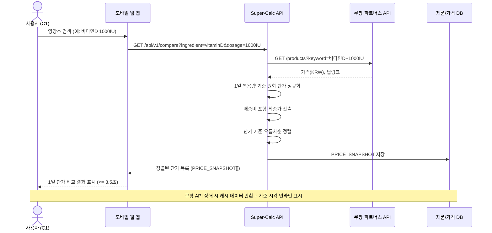

#### 3.4.2 핵심 흐름: 팩트체크 뱃지 조회 (F2 Anti-BS Dashboard)

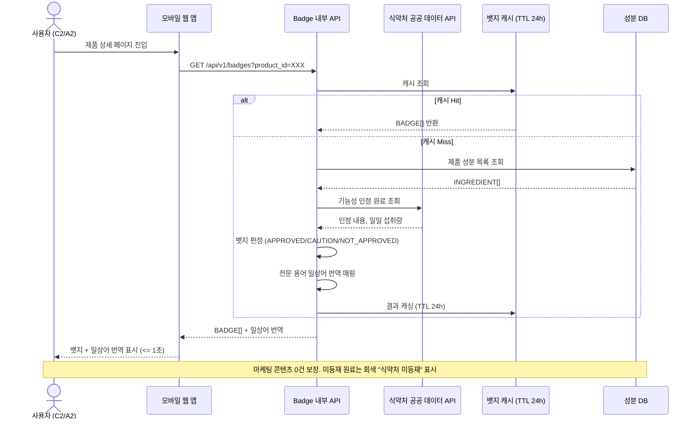

#### 3.4.3 핵심 흐름: 카카오톡 공유 (F3 Viral Engine)

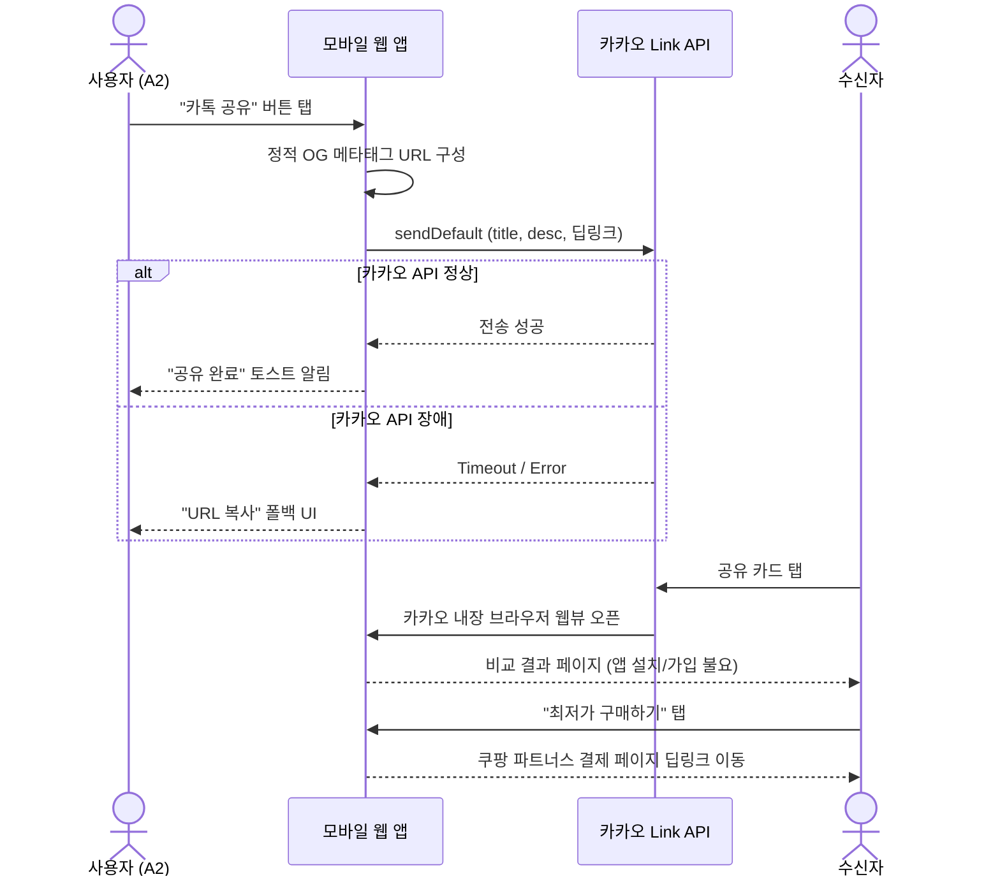

### 3.5 Use Case Diagram

> 주요 페르소나(C1, C2, A2, E2)와 시스템 간 상호작용 동작 범주를 나타낸다.

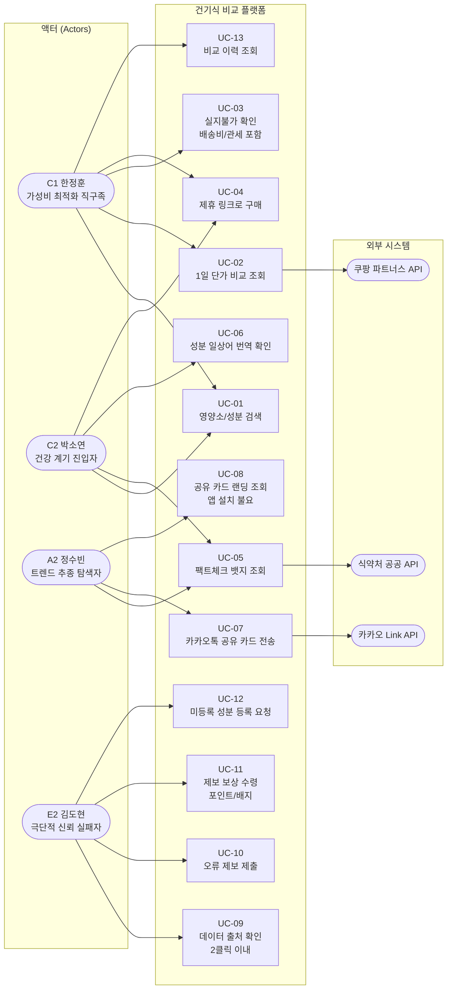

| Use Case ID | 사용자 스토리 | 주 액터 | 관련 REQ |
|---|---|---|---|
| UC-01 | 영양소/성분명으로 제품 검색 | C1, C2 | REQ-FUNC-030 |
| UC-02 | 쿠팡 파트너스 1일 단가 비교 조회 | C1 | REQ-FUNC-001~006 |
| UC-03 | 배송비/관세 포함 실지불가 확인 | C1 | REQ-FUNC-004 |
| UC-04 | 제휴 딥링크를 통한 구매 | C1, C2 | REQ-FUNC-009 |
| UC-05 | 식약처 공전 기반 팩트체크 뱃지 조회 | C2, A2 | REQ-FUNC-010~015 |
| UC-06 | 전문 용어 일상어 번역 확인 | C2 | REQ-FUNC-013 |
| UC-07 | 카카오톡 1-Tap 공유 카드 전송 | A2 | REQ-FUNC-016~018, 021 |
| UC-08 | 공유 카드 랜딩 페이지 조회 (앱 설치 불요) | A2 (수신자) | REQ-FUNC-019~020 |
| UC-09 | 데이터 원본 출처 확인 (2클릭 이내) | E2 | REQ-FUNC-022~023 |
| UC-10 | 데이터 오류 제보 제출 | E2 | REQ-FUNC-024~025, 027~028 |
| UC-11 | 오류 제보 보상 수령 (포인트/배지) | E2 | REQ-FUNC-026 |
| UC-12 | 미등록 성분 등록 요청 | E2 | REQ-FUNC-008 |
| UC-13 | 비교 이력 저장 및 재조회 | C1 | REQ-FUNC-035 |

### 3.6 Component Diagram

> Next.js App Router 기반의 단일 풀스택 모놀리스 아키텍처로, 서버 로직은 Route Handlers와 Server Actions로 구현된다.

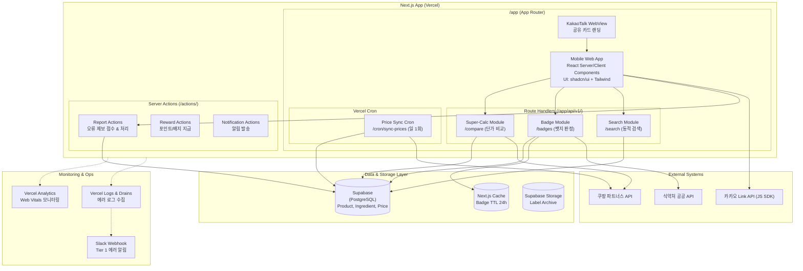

| 컴포넌트 | 유형 | 책임 | SLA / 제약 |
|---|---|---|---|
| **Next.js App** | 풀스택 앱 | Vercel (단일 배포) SSR/CSR 통합, 라우팅, 인증 | LCP <= 2,500ms |
| **Super-Calc Module** | Route Handler | 쿠팡 파트너스 단일 채널 가격 조회, 1일 단가 정규화 | p95 <= 3,500ms |
| **Badge Module** | Route Handler | 식약처 공전 기반 뱃지 판정, 일상어 번역 | p95 <= 1,000ms |
| **Search Module** | Route Handler | 성분/제품 검색, 자동완성 | p95 <= 1,000ms |
| **Report Module** | Server Action | 오류 제보 접수, 스팸 필터링, Prisma CRUD | p95 <= 3,000ms |
| **Reward Module** | Server Action | 제보 보상 포인트/배지 지급 | 수정 후 1시간 이내 |
| **Notification** | Server Action | 이메일 알림 발송 (Resend API) | 트리거 후 1시간 이내 |
| **Price Sync Cron** | Vercel Cron | 일 1회 쿠팡 파트너스 API 배치 호출, PRICE_SNAPSHOT 갱신 | Vercel Cron (일 1회) |
| **Supabase DB** | BaaS (PostgreSQL) | 제품, 성분, 가격, 제보 데이터 영구 저장 | 수동 백업 (Phase 2 자동화) |
| **Next.js Cache** | 내장 캐시 | 뱃지 캐시 (TTL 24h) | Next.js `revalidate` 활용 |
| **Supabase Storage** | Object Storage | 라벨 이미지 저장 | Free: 1GB |

---

## 4. Specific Requirements

### 4.1 Functional Requirements

> **범례:** Priority — M(Must), S(Should), C(Could), W(Won't)

#### 4.1.1 F1. Super-Calc Engine — 실시간 1일 단가 정규화 엔진

| ID | 요구사항 | Priority | Source | Acceptance Criteria |
|---|---|---|---|---|
| **REQ-FUNC-001** | 시스템은 사용자가 영양소명(예: 비타민D 1000IU)을 입력하면 쿠팡 파트너스 API를 단일 조회하여 해당 제품 목록을 반환한다. | M | Story 1, F1 | **Given** 사용자가 영양소 검색어를 입력한 상태 **When** "1일 단가 비교" 버튼을 탭하면 **Then** 쿠팡 파트너스 API 조회가 실행되고, 조회 완료까지 로딩 인디케이터가 표시된다. |
| **REQ-FUNC-002** | 시스템은 각 제품의 1일 권장 복용량을 기준으로 원화(KRW) 단가를 자동 산출한다. 산출 공식: `제품 가격 ÷ 총 복용 횟수`. | M | Story 1, F1 | **Given** 쿠팡 파트너스로부터 제품 목록이 조회된 상태 **When** 단가 정규화 엔진이 실행되면 **Then** 각 제품의 1일 복용량 기준 원화 단가가 산출되며, 산출 결과가 소수점 첫째 자리까지 표시된다. |
| ~~**REQ-FUNC-003**~~ | ~~시스템은 환율 API로부터 매매기준율을 적용하여 USD→KRW 환산을 수행한다.~~ | — | — | **삭제 (단일 채널 KRW 전용으로 환율 연동 불필요)** |
| **REQ-FUNC-004** | 시스템은 배송비, 관세, 적용 가능 할인코드를 포함한 "실지불가(최종가)"를 별도 컬럼으로 산출·표시한다. | M | Story 1 AC3, F1 | **Given** 배송비/관세/할인코드가 적용 가능한 제품이 포함된 상태 **When** 단가 랭킹이 표시되면 **Then** "실지불가" 컬럼이 별도로 제공되며, 최종가 오차율이 3% 이내이다. |
| **REQ-FUNC-005** | 시스템은 산출된 1일 단가를 기준으로 오름차순 정렬하여 결과를 표시한다. | M | Story 1 AC1, F1 | **Given** 모든 제품의 1일 단가가 산출 완료된 상태 **When** 결과 화면이 렌더링되면 **Then** 1일 단가 기준 오름차순(최저가 상위)으로 정렬 표시되며, 전체 응답 시간이 3.5초(p95) 이내이다. |
| **REQ-FUNC-006** | 시스템은 단가 비교 API 요청에 대해 p95 응답 시간 3,500ms 이내, 실패율 1.0% 미만을 보장한다. | M | Story 1 AC1 | **Given** 동시 접속 50명 조건하에서 **When** 단가 비교 API 요청이 수행되면 **Then** p95 응답 시간이 3,500ms 이내이고, 실패율이 1.0% 미만이다. |
| ~~**REQ-FUNC-007**~~ | ~~다중 채널 부분 실패(Partial Failure) 처리 로직~~ | — | — | **삭제 (단일 채널 전환으로 불필요)** |
| **REQ-FUNC-008** | 시스템은 DB에 미등록된 성분 검색 시 "해당 성분은 현재 데이터베이스에 미등록 상태입니다. [제품 등록 요청하기]" 버튼을 표시하며, 사용자가 등록 요청을 제출할 수 있다. | M | Story 1 AC5, F1 | **Given** 사용자가 미등록 성분(예: NMN)을 검색한 상태 **When** 검색 결과 화면이 로드되면 **Then** 안내 메시지와 [제품 등록 요청하기] CTA가 300ms 이내에 표시되고, 등록 요청 제출 성공률이 99% 이상이다. |
| **REQ-FUNC-009** | 시스템은 각 비교 결과 행에 쿠팡 파트너스 제휴 구매 링크(딥링크)를 표시하며, 사용자가 탭 시 결제 페이지로 이동한다. | M | Story 1, F1 | **Given** 단가 비교 결과가 표시된 상태 **When** 사용자가 특정 제품의 구매 링크를 탭하면 **Then** 쿠팡 파트너스 제휴 딥링크를 통해 결제 페이지로 이동한다. |

#### 4.1.2 F2. Anti-BS Dashboard — 식약처/논문 등급 배지 시스템

| ID | 요구사항 | Priority | Source | Acceptance Criteria |
|---|---|---|---|---|
| **REQ-FUNC-010** | 시스템은 제품 상세 페이지에서 제휴 광고 배너, 유저 리뷰, 별점, 체험단 블로그 링크를 0건 표시한다 (마케팅 노이즈 원천 차단). | M | Story 2 AC1, F2 | **Given** 사용자가 제품 상세 페이지에 진입한 상태 **When** 페이지가 로드되면 **Then** 마케팅 콘텐츠(광고 배너, 유저 리뷰, 별점, 체험단 링크) 노출이 0건이다. |
| **REQ-FUNC-011** | 시스템은 식약처 건강기능식품공전에 등재된 기능성 인정 원료에 대해 APPROVED, CAUTION, NOT_APPROVED 중 하나의 뱃지를 부여한다. 뱃지는 공전 원문과 1:1 매칭된다. | M | Story 2 AC2, F2 | **Given** 공전에 등재된 기능성 인정 원료가 포함된 제품 **When** 뱃지 영역이 렌더링되면 **Then** 뱃지가 식약처 공전 원문과 1:1 매칭 표시되며, 불일치율이 0.5% 미만이다. 뱃지 로드 시간 1초(p95) 이내. |
| **REQ-FUNC-012** | 시스템은 뱃지 텍스트에 질병 예방·치료 표현을 포함하지 않는다. 뱃지 DB는 건강기능식품공전 고시 문구만 래핑한다. | M | CON-2, F2 | **Given** 뱃지가 생성되어 표시되는 상태 **When** QA 체크리스트 "금지 표현 목록" 검수를 수행하면 **Then** 질병 예방·치료 표현이 0건 검출된다. |
| **REQ-FUNC-013** | 시스템은 성분 전문 용어(예: "콜레칼시페롤") 옆에 일상어 번역(예: "몸에 잘 흡수되는 비타민 D3")을 괄호 형태로 표시한다. | M | Story 2 AC3, F2 | **Given** 전문 용어가 포함된 성분표가 표시되는 상태 **When** 성분표가 렌더링되면 **Then** 식약처 등록 기능성 원료 기준 95% 이상의 전문 용어에 일상어 번역이 괄호로 표시되며, 번역 정확도 98% 이상이다. |
| **REQ-FUNC-014** | 시스템은 식약처 건강기능식품공전에 미등재된 성분에 "식약처 미등재 원료 — 기능성 인정 정보 없음" 라벨을 회색으로 표시하며, 뱃지를 부여하지 않는다. 미부여 사유를 툴팁으로 제공한다. | M | Story 2 AC5, F2 | **Given** 제품 성분 중 공전에 미등재된 원료가 포함된 상태 **When** 뱃지 영역이 렌더링되면 **Then** 해당 성분에 회색 라벨이 표시되고 뱃지가 부여되지 않으며, 미등재 원료 식별 정확도 99% 이상, 뱃지 오발급률 0%이다. |
| **REQ-FUNC-015** | 시스템은 각 뱃지에 근거 출처(식약처 공전 URL, 논문 DOI)를 연결하여 사용자가 1탭으로 출처를 확인할 수 있게 한다. | M | Story 2, F2 | **Given** 뱃지가 표시된 상태 **When** 사용자가 뱃지를 탭하면 **Then** 해당 뱃지의 근거 출처(공전 URL 또는 논문 DOI)가 표시된다. |

#### 4.1.3 F3. Viral Engine — 1-Tap 팩트 공유 카톡 공유

| ID | 요구사항 | Priority | Source | Acceptance Criteria |
|---|---|---|---|---|
| **REQ-FUNC-016** | 시스템은 제품 비교 결과 화면에서 "카톡 공유" 버튼을 제공한다. | M | Story 3, F3 | **Given** 사용자가 비교 결과 화면에 있을 때 **When** 화면이 렌더링되면 **Then** "카톡 공유" 버튼이 표시된다. |
| **REQ-FUNC-017** | 시스템은 고정된 서비스 로고 및 정적 메타태그(Open Graph)를 사용하여 카카오톡 표준 URL 공유를 수행한다. | M | Story 3 AC1, F3 | **Given** 사용자가 제품 비교 결과 화면에 있을 때 **When** "카톡 공유" 버튼을 탭하면 **Then** 정적 OG 메타태그가 포함된 URL이 카카오톡으로 공유되며, 실패율 1% 미만이다. |
| **REQ-FUNC-018** | 시스템은 카카오 Link API를 통해 공유 카드를 카카오톡으로 전송한다. | M | Story 3 AC1, F3 | **Given** OG 이미지가 생성 완료된 상태 **When** 카카오 Link API 호출이 실행되면 **Then** 카카오톡 공유 카드가 선택한 대화에 전송된다. |
| **REQ-FUNC-019** | 시스템은 공유 카드 수신자가 카카오톡에서 카드를 탭할 때 앱 설치·회원가입 요구 없이 카카오 내장 브라우저에서 비교 결과 웹뷰를 즉시 로드한다. | M | Story 3 AC2, F3 | **Given** 수신자가 카카오톡에서 공유 카드를 탭한 상태 **When** 링크가 열리면 **Then** 앱 설치·회원가입 없이 비교 결과 웹뷰가 로드되며, 랜딩 성공률 98% 이상, 페이지 로드 시간 2초 이내이다. |
| **REQ-FUNC-020** | 시스템은 공유 카드 랜딩 페이지에 "최저가 구매하기" 버튼을 제공하여 제휴 커머스 결제 페이지로 딥링크 이동시킨다. | M | Story 3 AC3, F3 | **Given** 수신자가 공유 카드 랜딩 페이지에 도착한 상태 **When** "최저가 구매하기" 버튼을 탭하면 **Then** 해당 제품의 제휴 커머스 결제 페이지로 딥링크 이동한다. |
| **REQ-FUNC-021** | 시스템은 카카오 Link API 장애 시 자동으로 "URL 복사" 폴백 UI를 표시한다. URL 복사 시 "링크가 복사되었습니다" 토스트 알림을 제공한다. | M | Story 3 AC4, F3 | **Given** 카카오 Link API가 타임아웃 또는 오류를 반환하는 상태 **When** 사용자가 "카톡 공유" 버튼을 탭하면 **Then** 1초 이내에 "URL 복사" 폴백 UI가 표시되고, 복사 완료 시 토스트 알림이 뜨며, 폴백 경로 공유 성공률 95% 이상. |

#### 4.1.4 F4. Data Trust System — 라벨 원본 아카이브 + 오류 제보

| ID | 요구사항 | Priority | Source | Acceptance Criteria |
|---|---|---|---|---|
| **REQ-FUNC-022** | 시스템은 각 제품의 성분 데이터에 "[출처 확인]" 버튼을 제공한다. 탭 시 해당 데이터의 원천(식약처 DB 링크, 제조사 라벨 이미지, 논문 DOI)이 아코디언 메뉴로 펼쳐진다. | M | Story 4 AC1, F4 | **Given** 사용자가 제품의 성분 데이터를 확인하는 상태 **When** "[출처 확인]" 버튼을 탭하면 **Then** 원천 출처가 아코디언 메뉴로 2클릭 이내에 도달 가능하며, 렌더링 시간 500ms 이내이다. |
| **REQ-FUNC-023** | 시스템은 제조사 원본 라벨 이미지를 LABEL_ARCHIVE 엔터티로 관리하며, 제품 상세 페이지에서 열람 가능하게 한다. | M | F4 | **Given** 라벨 이미지가 등록된 제품 **When** 출처 확인 아코디언을 펼치면 **Then** 제조사 원본 라벨 이미지가 표시되며, 이미지 로드 시간 1초 이내이다. |
| **REQ-FUNC-024** | 시스템은 "[오류 신고]" 버튼을 통해 사용자가 데이터 불일치를 제보할 수 있는 양식을 제공한다. 제보 제출 시 접수 확인 알림과 예상 처리 시간을 표시한다. | M | Story 4 AC2, F4 | **Given** 사용자가 데이터 불일치를 발견한 상태 **When** "[오류 신고]" 버튼을 탭하고 내용을 제출하면 **Then** 접수 확인 알림이 3초 이내에 표시되고, 예상 처리 시간(48시간)이 안내된다. |
| **REQ-FUNC-025** | 시스템은 제보 접수된 오류를 48시간 이내에 검증·수정 완료한다. | M | Story 4 AC2, F4 | **Given** 오류 제보가 접수된 상태 **When** 검증 프로세스가 시작되면 **Then** 접수 후 48시간 이내에 수정이 완료되거나 "미확인" 사유가 제보자에게 통보된다. |
| **REQ-FUNC-026** | 시스템은 오류 수정 완료 시 제보자에게 이메일 알림("귀하의 제보로 수정되었습니다")을 발송하고 리워드(포인트/배지)를 지급한다. | M | Story 4 AC3, F4 | **Given** 제보한 오류가 검증·수정 완료된 상태 **When** 수정이 반영되면 **Then** 수정 후 1시간 이내에 이메일 알림(Resend API)이 발송되고 리워드가 지급된다. |
| **REQ-FUNC-027** | 시스템은 동일 제품에 대해 24시간 내 5건 이상 반복 제보 또는 빈 문자열 제보를 차단한다. | M | Story 4 AC4, F4 | **Given** 사용자가 동일 제품에 24시간 내 5건 이상 반복 제보하거나 빈 문자열을 제출하는 상태 **When** "[오류 신고]" 제출을 시도하면 **Then** "중복 또는 불완전한 제보입니다" 안내와 함께 제출이 차단되고, 기존 유효 제보는 영향받지 않는다. 스팸 차단 정확도 95% 이상, 유효 제보 오차단률(false positive) 2% 이하. |
| **REQ-FUNC-028** | 시스템은 오류 제보 양식에 제보 대상 필드명, 기존 값, 올바른 값, 근거 자료(선택)를 입력받는 구조화된 폼을 제공한다. | M | F4 | **Given** 사용자가 "[오류 신고]" 버튼을 탭한 상태 **When** 제보 양식이 표시되면 **Then** 제보 대상 필드명, 기존 값, 올바른 값, 근거 자료(선택) 입력 필드가 포함된 구조화된 폼이 제공된다. |

#### 4.1.5 공통 기능 요구사항

| ID | 요구사항 | Priority | Source | Acceptance Criteria |
|---|---|---|---|---|
| **REQ-FUNC-029** | 시스템은 사용자 계정을 이메일 기반으로 생성·관리한다. MVP에서는 이메일과 비교 이력만 수집한다. | M | CON-4 | **Given** 미인증 사용자가 시스템에 접근한 상태 **When** 이메일 기반 회원가입을 진행하면 **Then** 이메일과 비교 이력만 수집되며, 추가 개인정보 입력 필드가 존재하지 않는다. |
| **REQ-FUNC-030** | 시스템은 영양소/성분명으로 제품을 검색하는 검색 기능을 제공한다. | M | Story 1, F1 | **Given** 사용자가 메인 화면에 진입한 상태 **When** 검색창에 영양소명을 입력하면 **Then** 자동 완성 후보가 표시되고, 검색 실행 시 해당 성분이 포함된 제품 목록이 반환된다. |
| **REQ-FUNC-031** | 시스템은 제품 상세 페이지에서 성분 목록, 뱃지, 1일 단가, 출처, 제휴 구매 링크를 통합 표시한다. | M | F1, F2, F4 | **Given** 사용자가 특정 제품을 선택한 상태 **When** 제품 상세 페이지가 로드되면 **Then** 성분 목록, 뱃지, 1일 단가, 출처 확인 버튼, 제휴 구매 링크가 단일 페이지에 통합 표시된다. |
| **REQ-FUNC-032** | 시스템은 미등록 제품 등록 요청을 접수·관리하는 백오피스 기능을 제공한다. | M | REQ-FUNC-008 | **Given** 사용자가 미등록 성분 등록 요청을 제출한 상태 **When** 관리자가 백오피스에 접근하면 **Then** 등록 요청 목록이 표시되고, 요청 건별 처리 상태를 관리할 수 있다. |
| **REQ-FUNC-033** | 시스템은 제휴 링크 클릭 이벤트를 추적하고 Mixpanel에 `affiliate_link_click` 이벤트로 기록한다. | M | 보조 KPI (전환) | **Given** 사용자가 제휴 구매 링크를 클릭한 상태 **When** 클릭 이벤트가 발생하면 **Then** Mixpanel에 `affiliate_link_click` 이벤트가 기록되며, 제품 ID, 채널, 가격 정보가 포함된다. |
| **REQ-FUNC-034** | 시스템은 카카오톡 공유 이벤트를 추적하고 Mixpanel에 `kakao_share_send` 이벤트로 기록한다. | M | 보조 KPI (바이럴) | **Given** 사용자가 카카오톡 공유를 완료한 상태 **When** 공유 이벤트가 발생하면 **Then** Mixpanel에 `kakao_share_send` 이벤트가 기록된다. |

#### 4.1.6 Should-Have 기능 요구사항 (출시 후 3개월)

| ID | 요구사항 | Priority | Source | Acceptance Criteria |
|---|---|---|---|---|
| **REQ-FUNC-035** | 시스템은 사용자의 비교 이력을 저장하고, 재방문 시 이전 비교 결과에 연속적으로 접근할 수 있게 한다. | S | F7 | **Given** 인증된 사용자가 비교를 완료한 상태 **When** 재방문하여 "비교 이력" 메뉴에 접근하면 **Then** 이전 비교 결과 목록이 시간순으로 표시되고, 각 항목을 탭하면 당시 비교 결과가 재현된다. |
| **REQ-FUNC-036** | 시스템은 트렌드 성분(예: NMN, 글루타치온 등)에 대한 식약처/논문 기반 팩트체크 콘텐츠를 제공한다. | S | F8 | **Given** 트렌드 성분 콘텐츠가 등록된 상태 **When** 사용자가 해당 성분 페이지에 접근하면 **Then** 식약처/논문 기반 팩트체크 콘텐츠가 표시되며, 마케팅 콘텐츠는 0건이다. |
| **REQ-FUNC-037** | 시스템은 사용자가 관심 등록한 제품의 가격 하락 시 이메일 알림을 발송한다. | S | F9 | **Given** 사용자가 특정 제품에 가격 알림을 등록한 상태 **When** 해당 제품의 1일 단가가 이전 대비 하락하면 **Then** 사용자에게 이메일 알림("[제품명] 1일 단가가 XX원으로 하락했습니다")이 발송된다. |

#### 4.1.7 Could-Have 기능 요구사항 (Phase 2)

| ID | 요구사항 | Priority | Source | Acceptance Criteria |
|---|---|---|---|---|
| **REQ-FUNC-038** | 시스템은 3탭 이내에 비교 결론에 도달할 수 있는 UX 최적화를 제공한다. | C | F10 | **Given** 사용자가 메인 화면에 진입한 상태 **When** 검색→비교→결론 여정을 수행하면 **Then** 3탭 이내에 비교 결론(구매 링크 또는 공유)에 도달 가능하다. |
| **REQ-FUNC-039** | 시스템은 B2B 마켓 인텔리전스 대시보드를 통해 익명화된 가격 저항선(WTP) 데이터를 기업 고객에게 제공한다. | C | F11 | **Given** B2B 고객이 인증된 상태 **When** 마켓 인텔리전스 대시보드에 접근하면 **Then** k-anonymity >= 5가 보장된 익명화 데이터가 표시된다. |

### 4.2 Non-Functional Requirements

#### 4.2.1 Performance (성능)

| ID | 요구사항 | 측정 지표 | 기준 | 측정 조건 | Source |
|---|---|---|---|---|---|
| **REQ-NF-001** | 단가 비교 API의 응답 시간은 p95 기준 3,500ms 이내이다. | p95 응답 시간 | <= 3,500ms | 동시 접속 50명, 피크 100명 | PRD 5-1, Story 1 AC1 |
| **REQ-NF-002** | 뱃지 렌더링 시간은 p95 기준 1,000ms 이내이다. | p95 렌더링 시간 | <= 1,000ms | 식약처 DB 캐시 활용 | PRD 5-1, Story 2 AC2 |
| **REQ-NF-003** | 카카오 공유 카드 생성 시간은 p95 기준 1,500ms 이내이다. | p95 생성 시간 | <= 1,500ms | OG 이미지 동적 생성 포함 | PRD 5-1, Story 3 AC1 |
| **REQ-NF-004** | 출처 아코디언 펼침 시간은 p95 기준 500ms 이내이다. | p95 렌더링 시간 | <= 500ms | 프리로드 또는 lazy load | PRD 5-1, Story 4 AC1 |
| **REQ-NF-005** | 전체 페이지 LCP(Largest Contentful Paint)는 2,500ms 이내이다. | LCP | <= 2,500ms | 모바일 웹 기준 | PRD 5-1 |
| **REQ-NF-006** | 시스템은 동시 접속 50명(피크 100명) 조건에서 모든 성능 기준을 충족한다. | 동시 접속 처리 | 50명(피크 100명) | MVP MAU 2,200명 기준 | PRD 5-1 |
| ~~**REQ-NF-007**~~ | ~~부하 테스트를 출시 전 1회 및 월 1회 수행한다.~~ | — | — | — | **삭제 (MVP 단계 오버엔지니어링 방지)** |
| **REQ-NF-008** | TTC(Time-To-Completion)의 p50은 5분 이내, p95는 30분 이내이다. | TTC p50/p95 | p50 <= 5분, p95 <= 30분 | 탐색→결제/공유 완료 | North Star KPI |

#### 4.2.2 Reliability (신뢰성/가용성)

| ID | 요구사항 | 측정 지표 | 기준 | Source |
|---|---|---|---|---|
| **REQ-NF-009** | 월간 서비스 가용성은 Best Effort(최선 노력) 수준으로 제공한다. SLA 수치 보장은 Phase 2에서 도입한다. | — | Best Effort | — |
| **REQ-NF-010** | API 오류율(5xx)은 0.5% 이하이다. | 5xx 비율 | <= 0.5% | PRD 5-2 |
| **REQ-NF-011** | 성분 DB 오류율은 Phase 1에서 5% 이하, Phase 2에서 2% 이하이다. | DB 오류율 | Phase 1: <= 5%, Phase 2: <= 2% | PRD 5-2, 목표 1-2 |
| **REQ-NF-012** | 오류 제보 처리 SLA는 접수에서 수정 완료까지 48시간 이내이다. | 처리 소요 시간 | <= 48시간 | PRD 5-2, Story 4 AC2 |
| **REQ-NF-013** | 데이터 백업은 수동 백업에 의존한다. 자동 백업은 Phase 2에서 도입한다. | 백업 방식 | 수동 (Phase 2 자동화) | PRD 5-2 |

#### 4.2.3 Security (보안/개인정보)

| ID | 요구사항 | 측정 지표 | 기준 | Source |
|---|---|---|---|---|
| **REQ-NF-014** | 전 구간 TLS 1.2+ 암호화를 적용한다. | SSL Labs 등급 | A 이상 | PRD 5-3 |
| **REQ-NF-015** | 사용자 데이터 수집은 최소 수집 원칙을 준수한다 (MVP: 이메일, 비교 이력). | 수집 필드 수 | 2개 (이메일, 비교 이력) | PRD 5-3, CON-4 |
| **REQ-NF-016** | B2B 데이터 제공 시 k-anonymity >= 5를 보장한다. | k-anonymity 수준 | >= 5 | PRD 5-3, CON-6 |
| **REQ-NF-017** | 건강기능식품법 준수를 위해 뱃지 텍스트에서 질병 예방·치료 표현을 원천 차단한다. | 금지 표현 검출 건수 | 0건 | PRD 5-3, CON-2 |
| **REQ-NF-018** | SSL Labs 보안 검증을 출시 전 1회 및 분기 1회 수행한다. | 검증 주기 | 출시 전 + 분기 1회 | PRD 5-3 |

#### 4.2.4 Cost (비용)

| ID | 요구사항 | 측정 지표 | 기준 | Source |
|---|---|---|---|---|
| **REQ-NF-019** | MVP 월간 인프라 비용은 월 $50 이하로 유지한다. | 월간 비용 | <= $50/월 | CON-3, 피드백 |
| **REQ-NF-020** | 인프라 비용이 월 8만 원 초과 시 Slack `#infra-cost` 채널에 자동 알림을 발송하고, 매월 1일 클라우드 비용 리포트를 경영진에게 공유한다. | 알림/리포트 | 8만 원 초과 시 경고 + 월 1회 리포트 | PRD 5-3 |

#### 4.2.5 Monitoring (운영/모니터링)

| ID | 요구사항 | 측정 지표 | 기준 | Source |
|---|---|---|---|---|
| **REQ-NF-021** | 시스템은 API 응답 시간, 에러 코드 등을 Vercel Analytics와 Vercel Logs로 로깅한다. p95 > 3초 또는 5xx > 1% 시 Vercel Log Drain을 통해 Slack에 즉시 알림을 발송한다. | 로그 수집율, 알림 지연 | p95 > 3s or 5xx > 1% 시 Slack 알림 | PRD 5-4 |
| **REQ-NF-022** | 시스템은 일간 MAU, 퍼널 전환율, CTR, K-Factor, DB 오류율을 Mixpanel/Amplitude 대시보드에 표시한다. 주간 리뷰를 수행한다. | 대시보드 항목 수, 리뷰 주기 | 6개 항목, 주 1회 | PRD 5-4, 보조 KPI |
| **REQ-NF-023** | 환율 API 장애, 제휴 API 연결 끊김, SLA 48시간 초과 제보 발생 시 Slack Webhook을 통해 실시간 에러 알림 채널에 즉시 보고한다. | 알림 지연 | 즉시 (Slack Webhook) | PRD 5-4 |

#### 4.2.6 Scalability / Maintainability (확장성/유지보수성)

| ID | 요구사항 | 측정 지표 | 기준 | Source |
|---|---|---|---|---|
| **REQ-NF-024** | 신규 채널(예: 아마존) 추가 시 기존 코드 변경 없이 `/lib/adapters/` 디렉토리에 `ChannelAdapter` 인터페이스를 구현하는 모듈만 추가하는 전략 패턴(Strategy Pattern)을 사용한다. | 채널 추가 시 수정 파일 수 | 어댑터 모듈 1개 추가로 한정 | 아키텍처 설계 원칙 |

---

## 5. Traceability Matrix

### 5.1 Story ↔ Requirement ↔ Test Case

| Story / Feature | Requirement ID | Test Case ID | Priority |
|---|---|---|---|
| Story 1 (C1, Super-Calc) | REQ-FUNC-001 | TC-FUNC-001 | M |
| Story 1 (C1, Super-Calc) | REQ-FUNC-002 | TC-FUNC-002 | M |
| Story 1 AC3 | REQ-FUNC-004 | TC-FUNC-004 | M |
| Story 1 AC1 | REQ-FUNC-005 | TC-FUNC-005 | M |
| Story 1 AC1 | REQ-FUNC-006 | TC-FUNC-006 | M |
| Story 1 AC5 (Sad Path) | REQ-FUNC-008 | TC-FUNC-008 | M |
| Story 1, F1 | REQ-FUNC-009 | TC-FUNC-009 | M |
| Story 2 AC1, F2 | REQ-FUNC-010 | TC-FUNC-010 | M |
| Story 2 AC2, F2 | REQ-FUNC-011 | TC-FUNC-011 | M |
| CON-2, F2 | REQ-FUNC-012 | TC-FUNC-012 | M |
| Story 2 AC3, F2 | REQ-FUNC-013 | TC-FUNC-013 | M |
| Story 2 AC5, F2 | REQ-FUNC-014 | TC-FUNC-014 | M |
| Story 2, F2 | REQ-FUNC-015 | TC-FUNC-015 | M |
| Story 3, F3 | REQ-FUNC-016 | TC-FUNC-016 | M |
| Story 3 AC1, F3 | REQ-FUNC-017 | TC-FUNC-017 | M |
| Story 3 AC1, F3 | REQ-FUNC-018 | TC-FUNC-018 | M |
| Story 3 AC2, F3 | REQ-FUNC-019 | TC-FUNC-019 | M |
| Story 3 AC3, F3 | REQ-FUNC-020 | TC-FUNC-020 | M |
| Story 3 AC4 (Sad Path), F3 | REQ-FUNC-021 | TC-FUNC-021 | M |
| Story 4 AC1, F4 | REQ-FUNC-022 | TC-FUNC-022 | M |
| F4 | REQ-FUNC-023 | TC-FUNC-023 | M |
| Story 4 AC2, F4 | REQ-FUNC-024 | TC-FUNC-024 | M |
| Story 4 AC2, F4 | REQ-FUNC-025 | TC-FUNC-025 | M |
| Story 4 AC3, F4 | REQ-FUNC-026 | TC-FUNC-026 | M |
| Story 4 AC4 (Sad Path), F4 | REQ-FUNC-027 | TC-FUNC-027 | M |
| F4 | REQ-FUNC-028 | TC-FUNC-028 | M |
| CON-4 | REQ-FUNC-029 | TC-FUNC-029 | M |
| Story 1, F1 | REQ-FUNC-030 | TC-FUNC-030 | M |
| F1, F2, F4 | REQ-FUNC-031 | TC-FUNC-031 | M |
| REQ-FUNC-008 | REQ-FUNC-032 | TC-FUNC-032 | M |
| 보조 KPI (전환) | REQ-FUNC-033 | TC-FUNC-033 | M |
| 보조 KPI (바이럴) | REQ-FUNC-034 | TC-FUNC-034 | M |
| F7 | REQ-FUNC-035 | TC-FUNC-035 | S |
| F8 | REQ-FUNC-036 | TC-FUNC-036 | S |
| F9 | REQ-FUNC-037 | TC-FUNC-037 | S |
| F10 | REQ-FUNC-038 | TC-FUNC-038 | C |
| F11 | REQ-FUNC-039 | TC-FUNC-039 | C |

### 5.2 NFR Traceability

| Source (PRD Section) | Requirement ID | Test Case ID | Category |
|---|---|---|---|
| PRD 5-1, Story 1 AC1 | REQ-NF-001 | TC-NF-001 | Performance |
| PRD 5-1, Story 2 AC2 | REQ-NF-002 | TC-NF-002 | Performance |
| PRD 5-1, Story 3 AC1 | REQ-NF-003 | TC-NF-003 | Performance |
| PRD 5-1, Story 4 AC1 | REQ-NF-004 | TC-NF-004 | Performance |
| PRD 5-1 | REQ-NF-005 | TC-NF-005 | Performance |
| PRD 5-1 | REQ-NF-006 | TC-NF-006 | Performance |
| North Star KPI | REQ-NF-008 | TC-NF-008 | Performance |
| PRD 5-2 | REQ-NF-009 | TC-NF-009 | Reliability |
| PRD 5-2 | REQ-NF-010 | TC-NF-010 | Reliability |
| PRD 5-2, 목표 1-2 | REQ-NF-011 | TC-NF-011 | Reliability |
| PRD 5-2, Story 4 AC2 | REQ-NF-012 | TC-NF-012 | Reliability |
| PRD 5-2 | REQ-NF-013 | TC-NF-013 | Reliability |
| PRD 5-3 | REQ-NF-014 | TC-NF-014 | Security |
| PRD 5-3, CON-4 | REQ-NF-015 | TC-NF-015 | Security |
| PRD 5-3, CON-6 | REQ-NF-016 | TC-NF-016 | Security |
| PRD 5-3, CON-2 | REQ-NF-017 | TC-NF-017 | Security |
| PRD 5-3 | REQ-NF-018 | TC-NF-018 | Security |
| PRD 5-3, CON-3 | REQ-NF-019 | TC-NF-019 | Cost |
| PRD 5-3 | REQ-NF-020 | TC-NF-020 | Cost |
| PRD 5-4 | REQ-NF-021 | TC-NF-021 | Monitoring |
| PRD 5-4, 보조 KPI | REQ-NF-022 | TC-NF-022 | Monitoring |
| PRD 5-4 | REQ-NF-023 | TC-NF-023 | Monitoring |
| 아키텍처 원칙 | REQ-NF-024 | TC-NF-024 | Scalability |

---

## 6. Appendix

### 6.1 API Endpoint List

#### 6.1.1 외부 API

| # | API | Endpoint (예시) | HTTP Method | 입력 파라미터 | 출력 | Rate Limit | 비고 |
|---|---|---|---|---|---|---|---|
| EXT-API-01 | 쿠팡 파트너스 API | `https://api.coupang.com/v2/products` | GET | `keyword`, `category` | 가격(KRW), 딥링크 URL, 제품 메타 | 일 10,000건 (추정) | 수수료: 3% |
| EXT-API-02 | 식약처 건강기능식품 공공데이터 | `https://openapi.mfds.go.kr/v1/hfoods` | GET | `ingredient_name`, `cert_no` | 기능성 인정 내용, 일일 섭취량, 주의사항 | 공공 API 정책 준수 | 갱신 주기: 월 1회 |
| EXT-API-03 | 카카오 Link API | Kakao JS SDK `Kakao.Link.sendDefault()` | JS SDK | `content` (title, desc), `buttons` | 카카오톡 공유 메시지 | 일 발송 제한 확인 필요 | — |

#### 6.1.2 내부 API

| # | API | Endpoint | HTTP Method | 입력 파라미터 | 출력 | 구현 주체 | 비고 |
|---|---|---|---|---|---|---|---|
| INT-API-01 | Super-Calc API | `GET /api/v1/compare` | GET | `ingredient`, `dosage` | `PRICE_SNAPSHOT[]` (1일 단가 정렬) | Route Handler | 쿠팡 파트너스 단일 조회 |
| INT-API-02 | Badge API | `GET /api/v1/badges` | GET | `product_id` | `BADGE[]` + 일상어 번역 | Route Handler | 캐시 TTL: 24시간 |
| INT-API-03 | 제품 검색 | `GET /api/v1/search` | GET | `query`, `category` | 제품 목록 | Route Handler | 서버 컴포넌트 직접 호출 가능 |
| INT-API-04 | 오류 제보 | `(Server Action)` | POST | `FormData` | 접수 상태 | Server Action | 스팸 필터링 포함 |
| INT-API-05 | 제품 등록 요청 | `(Server Action)` | POST | `FormData` | 접수 상태 | Server Action | — |

### 6.2 Entity & Data Model

#### 6.2.1 PRODUCT (제품)

| 필드명 | 타입 | 제약조건 | 설명 |
|---|---|---|---|
| `product_id` | String | PK | 제품 고유 식별자 |
| `product_name` | String | NOT NULL | 제품명 |
| `brand_name` | String | NOT NULL | 브랜드명 |
| `manufacturer` | String | — | 제조사명 |
| `category` | String | NOT NULL | 제품 카테고리 (예: 비타민, 미네랄, 프로바이오틱스) |
| `source_channel` | String | NOT NULL | 데이터 소스 채널 (쿠팡) |
| `original_url` | String | NOT NULL | 원본 상품 페이지 URL |
| `created_at` | DateTime | NOT NULL | 등록 일시 |
| `updated_at` | DateTime | NOT NULL | 최종 수정 일시 |

#### 6.2.2 INGREDIENT (성분)

| 필드명 | 타입 | 제약조건 | 설명 |
|---|---|---|---|
| `ingredient_id` | String | PK | 성분 고유 식별자 |
| `product_id` | String | FK → PRODUCT | 소속 제품 ID |
| `standard_name` | String | NOT NULL | 표준 성분명 (예: Cholecalciferol) |
| `common_name` | String | — | 일상어 번역명 (예: 비타민 D3) |
| `amount_per_serving` | Float | NOT NULL | 1회 복용량당 함량 |
| `unit` | String | NOT NULL | 단위 (mg, IU, CFU 등) |
| `mfds_status` | String | NOT NULL | 식약처 등록 상태 (REGISTERED / NOT_REGISTERED) |
| `mfds_claim` | String | — | 식약처 기능성 인정 문구 (공전 원문) |

#### 6.2.3 PRICE_SNAPSHOT (가격 스냅샷)

| 필드명 | 타입 | 제약조건 | 설명 |
|---|---|---|---|
| `snapshot_id` | String | PK | 스냅샷 고유 식별자 |
| `product_id` | String | FK → PRODUCT, NOT NULL | 대상 제품 ID |
| `price_krw` | Float | NOT NULL | 원화(KRW) 가격 |
| `shipping_fee` | Float | DEFAULT 0 | 배송비 |
| `daily_cost_krw` | Float | NOT NULL | 1일 복용량 기준 원화 단가 (최종가 포함) |
| `captured_at` | DateTime | NOT NULL | 가격 수집 시각 |

#### 6.2.4 BADGE (뱃지)

| 필드명 | 타입 | 제약조건 | 설명 |
|---|---|---|---|
| `badge_id` | String | PK | 뱃지 고유 식별자 |
| `ingredient_id` | String | FK → INGREDIENT, NOT NULL | 대상 성분 ID |
| `badge_type` | Enum | NOT NULL | 뱃지 유형: APPROVED / CAUTION / NOT_APPROVED |
| `badge_label` | String | NOT NULL | 뱃지 표시 라벨 (공전 원문 래핑) |
| `evidence_source` | String | NOT NULL | 근거 출처 유형 (MFDS / PAPER / MANUFACTURER) |
| `evidence_url` | String | NOT NULL | 근거 URL (식약처 DB 링크, 논문 DOI 등) |

#### 6.2.5 LABEL_ARCHIVE (라벨 아카이브)

| 필드명 | 타입 | 제약조건 | 설명 |
|---|---|---|---|
| `label_id` | String | PK | 라벨 고유 식별자 |
| `product_id` | String | FK → PRODUCT, NOT NULL | 대상 제품 ID |
| `image_url` | String | NOT NULL | 라벨 이미지 URL (Supabase Storage 등) |
| `uploaded_at` | DateTime | NOT NULL | 업로드 일시 |

#### 6.2.6 ERROR_REPORT (오류 제보)

| 필드명 | 타입 | 제약조건 | 설명 |
|---|---|---|---|
| `report_id` | String | PK | 제보 고유 식별자 |
| `product_id` | String | FK → PRODUCT, NOT NULL | 제보 대상 제품 ID |
| `reporter_id` | String | FK → USER, NOT NULL | 제보자 사용자 ID |
| `field_name` | String | NOT NULL | 제보 대상 필드명 (예: amount_per_serving) |
| `reported_value` | String | NOT NULL | 현재 표시 값 |
| `correct_value` | String | NOT NULL | 제보자가 주장하는 올바른 값 |
| `evidence_url` | String | — | 근거 자료 URL (선택) |
| `status` | Enum | NOT NULL | 처리 상태: SUBMITTED / REVIEWING / RESOLVED / REJECTED |
| `reported_at` | DateTime | NOT NULL | 제보 일시 |
| `resolved_at` | DateTime | — | 수정 완료 일시 |

#### 6.2.7 USER (사용자)

| 필드명 | 타입 | 제약조건 | 설명 |
|---|---|---|---|
| `user_id` | String | PK | 사용자 고유 식별자 |
| `email` | String | UNIQUE, NOT NULL | 이메일 주소 |
| `persona_type` | String | — | 페르소나 유형 (C1, C2, A2, E2) |
| `created_at` | DateTime | NOT NULL | 가입 일시 |

#### 6.2.8 Entity Relationship Summary

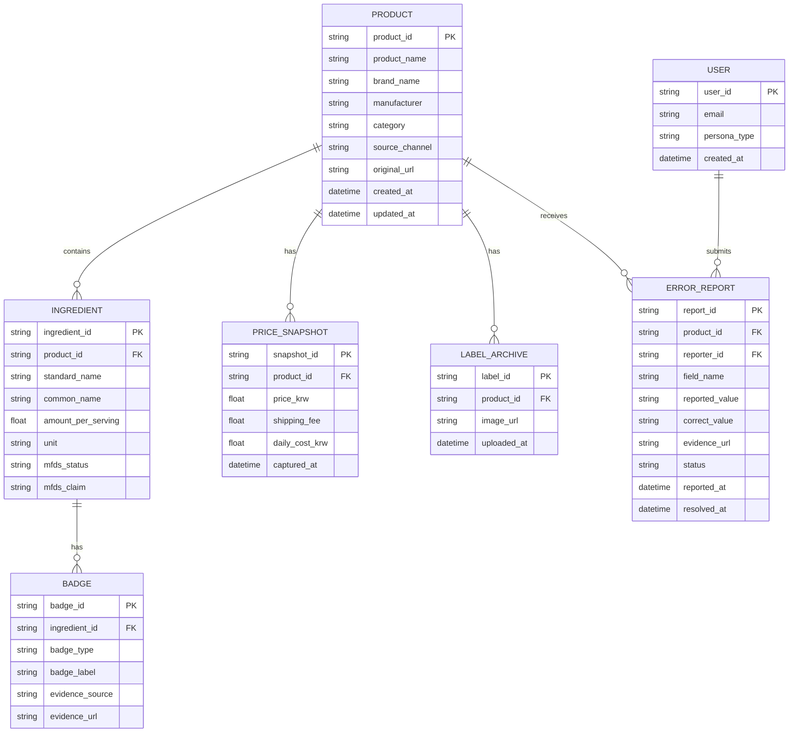

#### 6.2.9 Class Diagram (객체 지향 관점)

> 시스템 내 주요 도메인 객체 간의 관계, 속성, 핵심 오퍼레이션을 표현한다. 기존 ERD(6.2.8)를 객체 지향 설계 관점으로 확장한 것이다.

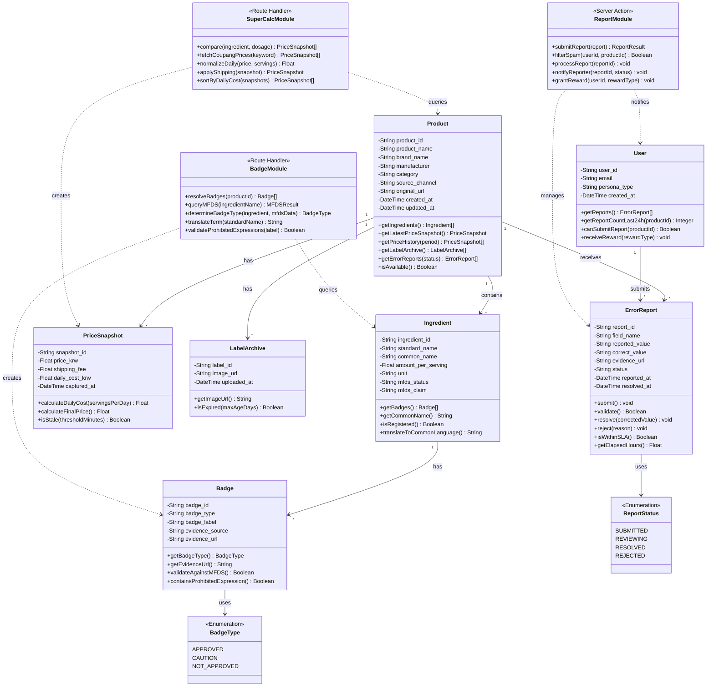

| 클래스 | 유형 | 책임 | 핵심 오퍼레이션 |
|---|---|---|---|
| **Product** | Entity | 제품 정보 관리, 성분·가격·라벨·제보 집합체 | `getIngredients()`, `getLatestPriceSnapshot()` |
| **Ingredient** | Entity | 성분 정보 및 식약처 등록 상태 관리 | `isRegistered()`, `translateToCommonLanguage()` |
| **PriceSnapshot** | Value Object | 특정 시점의 가격 스냅샷, 1일 단가 산출 | `calculateDailyCost()`, `calculateFinalPrice()` |
| **Badge** | Entity | 식약처 뱃지 판정 결과 및 근거 관리 | `validateAgainstMFDS()`, `containsProhibitedExpression()` |
| **LabelArchive** | Entity | 제조사 원본 라벨 이미지 관리 | `getImageUrl()` |
| **ErrorReport** | Entity | 오류 제보 생명주기 관리 (접수→검증→수정/반려) | `submit()`, `resolve()`, `isWithinSLA()` |
| **User** | Entity | 사용자 계정, 제보 이력, 보상 관리 | `canSubmitReport()`, `receiveReward()` |
| **SuperCalcModule** | Route Handler | 쿠팡 파트너스 단일 채널 가격 조회, 1일 단가 정규화·정렬 | `compare()`, `fetchCoupangPrices()` |
| **BadgeModule** | Route Handler | 식약처 공전 기반 뱃지 판정, 금지 표현 검증, 일상어 번역 | `resolveBadges()`, `validateProhibitedExpressions()` |
| **ReportModule** | Server Action | 오류 제보 접수, 스팸 필터링, 보상 지급, 알림 발송 | `submitReport()`, `filterSpam()`, `grantReward()` |

### 6.3 Detailed Interaction Models

#### 6.3.1 상세 시퀀스: 1일 단가 비교 전체 흐름 (F1)

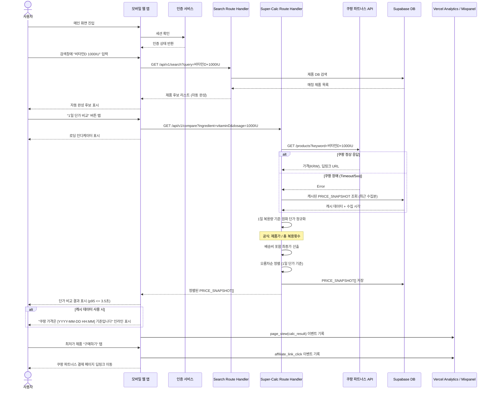

#### 6.3.2 상세 시퀀스: 팩트체크 뱃지 + 출처 확인 (F2 + F4)

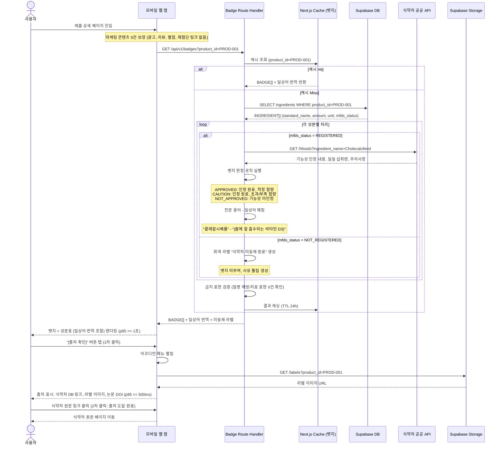

#### 6.3.3 상세 시퀀스: 오류 제보 → 수정 → 보상 (F4 Full Lifecycle)

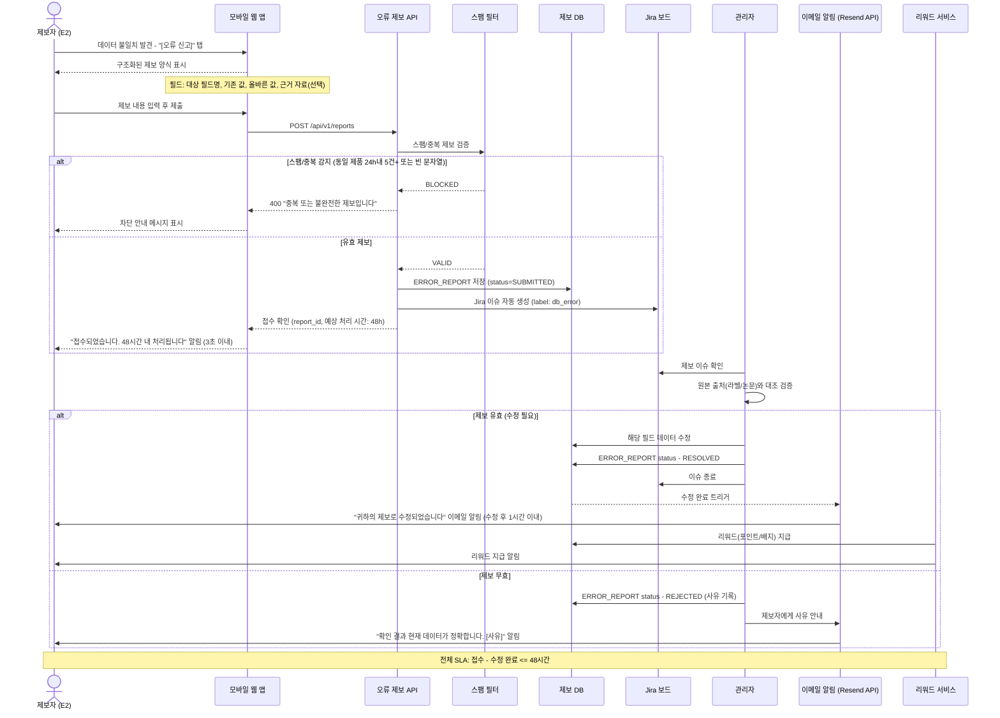

#### 6.3.4 상세 시퀀스: 카카오톡 공유 → 수신자 전환 (F3 Full Lifecycle)

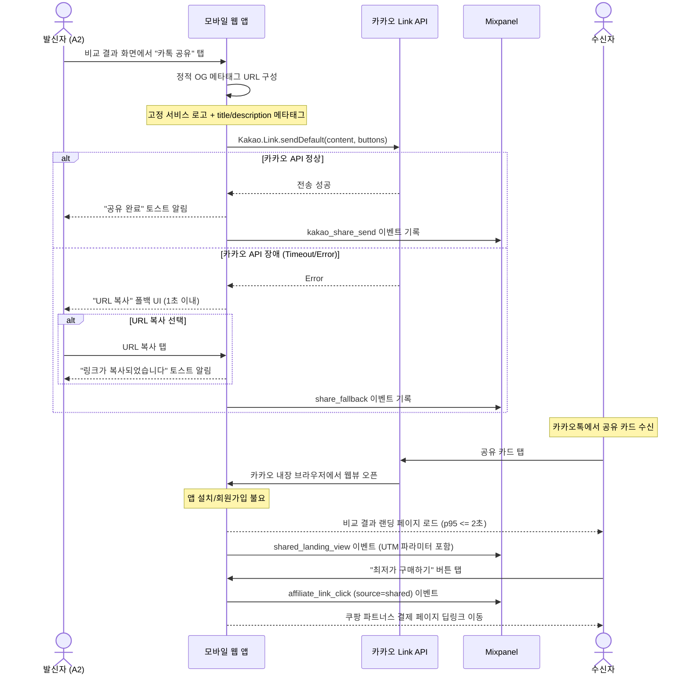

### 6.4 Validation Plan (검증 계획)

> PRD 8절(실험/롤아웃/측정)에서 도출된 검증 계획이다.

#### 6.4.1 롤아웃 단계

| 단계 | 대상 | 규모 | 목적 | 시기 |
|---|---|---|---|---|
| **Alpha** (내부) | 팀 구성원 + 지인 | 10명 | 크리티컬 버그, UX 플로우 검증 | 개발 완료 직후 |
| **Closed Beta 1** | C1 타겟 (건기식 커뮤니티, 쿠팡 파워유저) | 30명 | F1 정확도/속도 검증, TTC 측정 | Beta 단계 |
| **Closed Beta 2** | C2 타겟 (건강검진 후 첫 구매 경험자) | 20명 | F2 신뢰도/만족도, 결정 소요 시간 측정 | Beta 단계 |
| **Public Launch** | SEO 오가닉 + 건기식 커뮤니티 시딩 | MAU 2,200명 목표 | 퍼널 전환율, K-Factor, 제휴 CTR 실측 | Launch 단계 |

#### 6.4.2 실험 가설 및 성공 기준

| 실험 ID | 가설 | 측정 KPI | 성공 기준 | 연결 REQ |
|---|---|---|---|---|
| H1 | C1은 Super-Calc이 수동 계산보다 빠르고 정확하다고 느낀다 | 완료 시간(초), 오차율(%), 만족도(5점) | 시간 90% 단축, 오차 <= 3%, 만족도 >= 4.0 | REQ-FUNC-001~009, REQ-NF-001 |
| H2 | C2/A2는 Anti-BS Dashboard로 더 높은 신뢰감을 느낀다 (n=70, power >= 0.80) | 결정 시간(분), 확신도(5점), 동의율(%) | p50 결정 시간 <= 30분, 확신도 >= 4.0 (+1.0점 이상), 동의율 >= 70% | REQ-FUNC-010~015, REQ-NF-002 |
| H3 | 카카오 공유 수신자의 일정 비율이 구매 링크를 클릭한다 (n=200) | 랜딩률(%), 클릭률(%), K-Factor | 랜딩률 >= 50%, 클릭률 >= 8%, K-Factor >= 1.1 | REQ-FUNC-016~021, REQ-NF-003 |
| H4 | 오류 제보 48h SLA가 E2의 신뢰도를 유의미하게 높인다 (n=30) | 수정 완료율(%), 만족도(5점), D30 리텐션 | 완료율 >= 90%, 만족도 >= 4.0, D30 >= 25% | REQ-FUNC-022~028, REQ-NF-012 |
| H5 | 구매 여정 이탈률이 플랫폼에서 유의미하게 낮다 (n >= 500) | 단계별 이탈률(%), 퍼널 완주율(%) | 전체 퍼널 완주율 >= 15% | REQ-FUNC-030~031, REQ-NF-008 |

---

*— End of SRS-001 v1.4 —*
