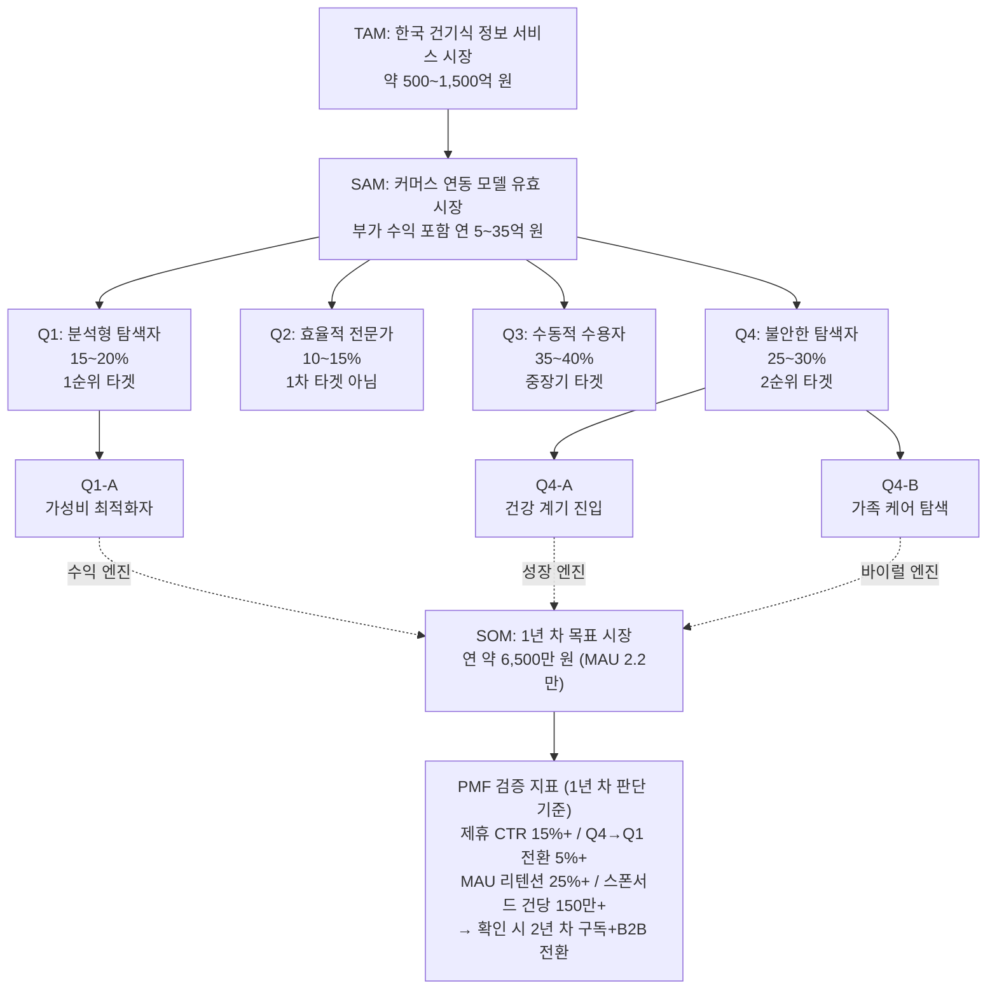

- TAM–SAM–SOM 시장 산출표

| 구분 | 규모 | 근거 |
| --- | --- | --- |
| **TAM** (한국 건기식 정보 시장 전체) | **500~1,500억 원** | 글로벌 TAM 10~25억 USD의 한국 비중 |
| **SAM** (커머스 연동 모델, 부가 수익 포함) | **5~11억 원/년** | 기본 시나리오, 인지도 확보 전제 |
| **SOM** (1년 차 획득 가능 시장) | **0.5~1.0억 원/년** | 본 보고서 추정 |



## **건강보조식품 성분·가격 비교 플랫폼 — 전체 분석 체계 백그라운드 문서**

---

## **1. 분석 체계 전체 구조**

### **1.1 보고서 체계도**

```
[1] TAM 보고서                     글로벌 및 한국 시장의 이론적 상한 정의
     │
     ▼
[2] SAM 보고서                     커머스 연동 모델의 유효 시장 축소
     │
     ├── [3] 소비자 Pain Point 분석   왜 이 시장이 존재하는가 (수요 측 근거)
     │
     ├── [4] 시장 세그먼트 분석       누가 이 서비스를 필요로 하는가 (4분면 분류)
     │
     ├── [5] Q1×Q4 심층 세분화        핵심 타겟의 하위 유형과 행동 패턴
     │
     ▼
[6] SOM 보고서                     1년 차 현실적 획득 시장과 실행 로드맵
```

### **1.2 분석의 논리적 흐름**

| 단계 | 질문 | 답변 보고서 | 핵심 결론 |
| --- | --- | --- | --- |
| ① | 시장이 얼마나 큰가? | [1] TAM | 한국 500~1,500억 원 |
| ② | 우리 모델로 접근 가능한 시장은? | [2] SAM | 커머스 연동 기준 5~11억 원/년 |
| ③ | 왜 소비자가 이걸 필요로 하는가? | [3] Pain Point | 성분 비교 불가 + 함량당 가격 비교 불가 |
| ④ | 어떤 소비자가 가장 필요로 하는가? | [4] 세그먼트 | Q1(분석형) 1순위, Q4(불안형) 2순위 |
| ⑤ | 그 중에서도 누구부터 공략하는가? | [5] 심층 세분화 | Q1-A(가성비 최적화자) + Q4-A(건강 계기 진입자) |
| ⑥ | 1년 차에 얼마나 가져올 수 있는가? | [6] SOM | 0.5~1.0억 원/년, MAU 2~6만 명 |

---

## **2. 핵심 수치 통합 대시보드**

### **2.1 시장 규모 체계 (단위: 원)**

```
TAM     500억 ──────────────────────────────────────── 1,500억     (100%)
          │                                               │
SAM       5억 ──── 11억                                           (약 1~2%)
          │         │
SOM     0.5억 ── 1.0억                                           (약 0.05~0.1%)
```

| 지표 | 보수적 | 기본 | 낙관적 | 출처 |
| --- | --- | --- | --- | --- |
| **한국 TAM** | 500억 원 | 1,000억 원 | 1,500억 원 | [1] Top-down × Bottom-up 교차 |
| **SAM** (커머스 연동 + 부가수익) | 1~3억 원 | 5~11억 원 | 15~35억 원 | [2] 경유율 × 수수료율 |
| **SOM** (1년 차) | 835만 원 | 8,200만 원 | 1.5억 원 | [6] MAU × ARPU |

### **2.2 소비자 세그먼트 규모 추정**

| 세그먼트 | 비중 | 추정 인원 | 1년 차 도달 가능 | 출처 |
| --- | --- | --- | --- | --- |
| Q1 분석형 탐색자 | 15~20% | 225~400만 명 | 3~10만 명 (Q1-A) | [4][5] |
| Q2 효율적 전문가 | 10~15% | 150~300만 명 | 미타겟 | [4] |
| Q3 수동적 수용자 | 35~40% | 525~800만 명 | 미타겟 | [4] |
| Q4 불안한 탐색자 | 25~30% | 375~600만 명 | 3~10만 명 (Q4-A) | [4][5] |
| **합계** | 100% | 1,500~2,000만 명 | 6~20만 명 |  |

### **2.3 소비자 행동 핵심 지표**

| 지표 | 수치 | 출처 | 검증 수준 |
| --- | --- | --- | --- |
| 건기식 구매 전 온라인 탐색 비율 | 72% | 한국건강기능식품협회 (2023) | ✅ 공개 조사 |
| 평균 탐색 시간 | 30~60분 | 협회 조사 + 업계 추정 | ⚠️ 간접 추정 |
| 구매 여정 ③~④ 단계 이탈률 | 55~75% | 복수 소스 교차 추정 | ⚠️ 간접 추정 |
| 동일 성분 기준 가격 차이 | 최대 8.2배 | 한국소비자원 (2022) | ✅ 공개 조사 |
| 가격-품질 오인 비율 | 41.3% | 식약처 소비자 인식조사 (2021) | ✅ 공개 조사 |
| 3개 이상 제품 비교 후 구매 비율 | 58% | Nielsen Korea (2022) | ✅ 공개 조사 |
| 연간 온라인 건기식 거래액 | 3.7~4.1조 원 | 협회 자료 + 추정 | ⚠️ 추정 포함 |

---

## **3. 분석 방법론 및 한계**

### **3.1 사용된 방법론**

| 방법론 | 적용 보고서 | 설명 |
| --- | --- | --- |
| **Top-down 추정** | [1] TAM | 상위 시장(건기식 시장, 영양 데이터 시장, 가격 비교 시장) 규모에서 비중 추정으로 하향 분해 |
| **Bottom-up 추정** | [1] TAM, [2] SAM | 사용자 수 × 과금 모델 × 전환율로 적산 |
| **경유율(Attribution) 모델** | [2] SAM | 탐색 비율 × 도달률 × CTR × 전환율의 퍼널 구조 |
| **2×2 매트릭스 세분화** | [4] 세그먼트 | 정보 탐색 강도(X) × 성분 리터러시(Y) 축 |
| **행동 기반 하위 세분화** | [5] 심층 | Q1/Q4 내 동기·맥락별 3개 하위 유형 분해 |
| **가중 평가 매트릭스** | [6] SOM | Pain 명확성, 유입 가능성, 전환율, CAC 기준 세그먼트 스코어링 |
| **시나리오 분석** | [2][6] SAM/SOM | 보수적/기본/낙관적 3-시나리오 범위 제시 |

### **3.2 방법론적 한계**

| 한계 | 영향 범위 | 보완 방안 |
| --- | --- | --- |
| **1차 조사(primary research) 미실시** | 전체 | 타겟 사용자 30~50명 심층 인터뷰, 정량 서베이 500명 |
| **독립 통계 부재** (이 시장은 NAICS/KSIC 분류에 없음) | [1] TAM | 상위 시장 비중 추정에 의존 → ±50% 오차 가능 |
| **경유율 변수의 높은 불확실성** | [2] SAM | 종합 경유율 0.018~0.375% → 20배 이상 범위. MVP 실측 필수 |
| **세그먼트 비중의 경험적 추정** | [4][5] | Q1 15~20%, Q4 25~30% 등은 교차 추정치. 서베이로 검증 필요 |
| **경쟁사 실제 매출 데이터 미확보** | [1][2] | 필리, 약들약 등 비상장사의 매출·트래픽 정보 비공개 |
| **AI 추정의 구조적 편향** | 전체 | LLM은 "그럴듯한 수치"를 생성하는 경향이 있어, 독립 검증 없이는 확신 불가 |

---

## **4. 보고서 간 교차 검증**

### **4.1 정합성이 확인된 부분 ✅**

| 교차 항목 | 보고서 A | 보고서 B | 정합 여부 |
| --- | --- | --- | --- |
| 한국 TAM 규모 | [1] 500~1,500억 원 (Top-down) | [1] 400~1,100억 원 (Bottom-up) | ✅ 범위 중첩 |
| 커머스 연동 SAM과 SOM 비율 | [2] 제휴 수수료 단독 ~1억 원 | [6] 1년 차 제휴 수수료 700만~7,000만 원 | ✅ SOM < SAM 논리 정합 |
| Q1 1순위 타겟 설정 | [4] Q1 = 1순위 (플랫폼 가치 ★★★★★) | [5] Q1-A = MVP 1순위 | ✅ 일관 |
| Q4→Q1 전환 경로 | [4] 핵심 이동 경로 정의 | [5] Q4-A→Q1-A 6~12개월 전환 | ✅ 일관 |
| Pain Point와 타겟의 연결 | [3] 성분 비교 + 함량당 가격 = 핵심 장벽 | [5] Q1-A의 핵심 기능 = 함량당 단가 자동 계산 | ✅ 직결 |
| SAM 보고서의 2단계 전략과 SOM 연계 | [2] 1단계 커머스→2단계 B2B/구독 | [6] 1년 차 SOM = 1단계의 구체화 | ✅ 일관 |

### **4.2 주의가 필요한 불일치·긴장 지점 ⚠️**

| 항목 | 긴장 내용 | 판단 |
| --- | --- | --- |
| **TAM vs. SAM 축소율** | TAM 500~1,500억 원에서 SAM 5~11억 원이면 **축소율이 99% 이상**. 이 정도 축소가 정당한가? | SAM이 "커머스 연동 수수료 모델 단독"으로 좁게 정의되었기 때문. B2B, 구독 모델까지 포함하면 SAM은 더 클 수 있음. 다만 1년 차에는 커머스 연동이 유일하게 현실적이므로 전략적으로는 적절 |
| **Q4-A의 커머스 전환율 가정** | [6]에서 Q4-A를 Secondary Target으로 설정하며 CTR 8~12%를 가정했으나, [5]에서 Q4-A는 "첫 구매자"로 전환 경로가 길다고 분석 | Q4-A의 실제 전환율은 Q1-A보다 상당히 낮을 가능성. SOM의 CTR 가정이 Q1-A 중심으로 편향되었을 수 있음 |
| **SEO 유입 가정의 낙관성** | [6]에서 Q4-A 획득의 핵심 수단으로 SEO를 설정했으나, "비타민D 추천" 등 키워드는 이미 경쟁 과열 | 네이버 SEO의 현실적 난이도를 과소평가했을 가능성. 유료 마케팅 비용(CAC)이 추정보다 높을 수 있음 |
| **[3]의 이탈률 추정과 [2]의 경유율** | [3]에서 ③~④ 단계 이탈률 55~75%는 "문제의 크기"를 보여주나, [2]의 경유율(0.018~0.375%)과 직접 연결되지 않음 | 이탈률 감소 = 경유율 상승이라는 암묵적 가정이 있으나, 이를 명시적으로 정량화한 분석이 없음 |
| **제품 DB 구축 속도 가정** | [6]에서 Q1에 300개, Q3에 600개, Q4에 1,000개를 가정 | AI 크롤링 + 수동 검증의 현실적 속도가 검증되지 않음. 성분 정규화(normalize) 작업의 복잡도 과소평가 리스크 |

---

## **5. 데이터 출처 신뢰도 등급표**

모든 보고서에서 인용된 데이터 출처의 신뢰도를 3단계로 분류한다.

### **✅ Tier 1: 공개 1차 조사 데이터 (직접 인용 가능)**

| 출처 | 인용 내용 | 해당 보고서 |
| --- | --- | --- |
| 한국건강기능식품협회 소비자 실태조사 (2023) | 시장 규모 6.2조 원, 온라인 구매 비중 52~58%, 성분 정보 중요도 68.3% | [1][2][3][4] |
| 한국소비자원 건기식 표시실태 및 가격조사 (2022) | 동일 성분 가격 차이 최대 8.2배, 표시 이해도 문제 30% | [3] |
| 식약처 건기식 소비자 인식조사 (2021) | "제품 간 성분 차이 파악 어려움" 47.2%, 가격-품질 오인 41.3% | [3][4] |
| Nielsen Korea Health Shopper Report (2022) | 3개 이상 제품 비교 58%, 평균 비교 시간 42분 | [3] |
| 쿠팡 파트너스·iHerb Affiliate 공개 수수료율 | 쿠팡 3%, iHerb 5~10% | [2][6] |

### **⚠️ Tier 2: 해외 리서치 기관 추정치 (참고 가능, 직접 적용 주의)**

| 출처 | 인용 내용 | 해당 보고서 | 주의사항 |
| --- | --- | --- | --- |
| Grand View Research — 건기식 시장 | 글로벌 1,770~1,900억 USD | [1] | 한국 비중 별도 추정 필요 |
| Mordor Intelligence — 건기식 시장 | CAGR 7~9% | [1] | 기관마다 추정치 차이 존재 |
| Euromonitor — Digital Consumer (2023) | 건기식 장바구니 이탈률 FMCG 대비 1.8배 | [3] | 한국 특화 수치 아님 |
| ConsumerLab Annual Survey (2024) | 동일 성분 가격 차이 최대 10배 (미국) | [3] | 미국 시장 기준 |

### **❌ Tier 3: AI 기반 간접 추정치 (가설 수준, 반드시 검증 필요)**

| 추정 내용 | 추정 방법 | 해당 보고서 | 오차 범위 |
| --- | --- | --- | --- |
| 정보 서비스 시장 = 모체 시장의 0.5~2.0% | 타 산업(금융정보, 부동산정보) 경험적 비율 유추 | [1] | ±100% |
| 종합 경유율 0.018~0.375% | 탐색 비율 × 도달률 × CTR × 전환율 4단계 결합 | [2] | ±200% (변수 4개의 곱) |
| Q1/Q2/Q3/Q4 세그먼트 비중 | 복수 조사 데이터 교차 + 업계 벤치마크 | [4] | ±30~50% |
| Q1-A/B/C, Q4-A/B/C 비중 | 행동 패턴 기반 논리적 분배 | [5] | ±50% (1차 조사 미실시) |
| 1년 차 MAU 성장 궤적 | 국내 버티컬 플랫폼(오늘의집, 화해 등) 참조 | [6] | ±50~100% |
| D7, D30 리텐션율 벤치마크 | 모바일 유틸리티 앱 평균 참조 | [6] | ±30% |

---

## **6. 핵심 가정(Assumptions) 종합 목록**

전체 분석 체계가 서 있는 핵심 가정들을 한 곳에 모아, 사후 검증 시 체크리스트로 활용한다.

### **6.1 시장 존재 가정 (이것이 틀리면 사업 자체가 무효)**

| # | 가정 | 근거 | 검증 방법 | 위험도 |
| --- | --- | --- | --- | --- |
| A1 | 건기식 소비자는 성분·가격 비교 정보에 **실질적인 수요**가 있다 | [3] 탐색 시간 30~60분, 이탈률 55~75% | 타겟 사용자 인터뷰 30건 | 🟢 낮음 (공개 조사 데이터 지지) |
| A2 | 이 수요는 **기존 수단(수동 비교, 블로그, 커뮤니티)으로 충분히 해소되지 않는다** | [3] 정보 소스 분산, 비표준 표기 | 경쟁 솔루션 사용자 만족도 조사 | 🟡 중간 |
| A3 | 소비자는 이 문제 해결에 **시간 또는 비용을 투자할 의사**가 있다 | [1] 유료 전환율 3~7% 추정 | WTP(지불의사) 서베이 | 🟡 중간 |

### **6.2 비즈니스 모델 가정 (이것이 틀리면 수익 구조 재설계 필요)**

| # | 가정 | 근거 | 검증 방법 | 위험도 |
| --- | --- | --- | --- | --- |
| B1 | 커머스 제휴 수수료(3~5%)가 **안정적으로 유지**된다 | [2] 쿠팡 파트너스, iHerb 공개 조건 | 수수료율 변동 이력 조사 | 🟡 중간 |
| B2 | 정보 플랫폼 경유 후 **제휴 링크 클릭→구매 전환**이 발생한다 | [2] CTR 15~25%, 전환율 8~15% | MVP 실측 데이터 | 🟡 중간 |
| B3 | 광고주(건기식 브랜드)가 **버티컬 정보 플랫폼에 광고비를 집행**할 의사가 있다 | [2] 부가 수익원 추정 2~5억 원 | 브랜드 3~5개사 인터뷰 | 🔴 높음 (미검증) |
| B4 | 제품·성분 DB를 **AI 크롤링으로 구축·유지**할 수 있다 | [6] 1년 차 1,000개 DB 목표 | 기술 PoC (Proof of Concept) | 🟡 중간 |

### **6.3 경쟁 가정 (이것이 틀리면 진입 전략 재수립 필요)**

| # | 가정 | 근거 | 검증 방법 | 위험도 |
| --- | --- | --- | --- | --- |
| C1 | 필리(Pilly)가 **"함량당 단가 비교 + 채널 간 교차 비교"를 본격 강화하지 않는다** | [1] 현재 필리의 기능 범위 분석 | 경쟁사 제품 업데이트 모니터링 | 🔴 높음 |
| C2 | 네이버/카카오가 **건기식 심층 비교 기능을 내재화하지 않는다** | [1] 대형 플랫폼의 건강 탭 현황 | 플랫폼 로드맵 추적 (공개 자료) | 🟡 중간 |
| C3 | 우리 플랫폼이 **"함량당 단가"와 "채널 간 비교"에서 차별화**를 유지할 수 있다 | [5][6] Q1-A의 핵심 니즈와 기능 직결 | MVP 사용자 피드백 | 🟢 낮음 (기능적 차별화 명확) |

---

## **7. 분석 과정에서 발견된 전략적 인사이트**

6개 보고서를 관통하며 도출된, 개별 보고서에서는 명시적으로 다루지 않은 통합적 인사이트를 정리한다.

### **7.1 "정보 비대칭 해소"는 시장 인프라이지, 독립 사업이 아닐 수 있다**

- [1]에서 이 시장을 "기능적 레이어 시장"으로 정의한 것이 핵심. 자동차 가격 비교 사이트(예: 카닥, 카매니저)가 독립 사업으로 성장했듯이, 건기식 정보 플랫폼도 성장할 수 있다.
- 그러나 [2]에서 제휴 수수료 단독으로는 연 1억 원 수준이라는 현실이 드러남. 이는 **"정보 비대칭 해소 자체의 경제적 가치"가 낮다는 뜻이 아니라, 그 가치가 수익이 아닌 다른 형태(트래픽, 데이터, 신뢰)로 축적**된다는 의미.
- [6]에서 1년 차를 "증명의 해"로 정의한 것은 이 인사이트의 반영.

### **7.2 Q4→Q1 전환이 사업의 생사를 가른다**

- [4]에서 Q4→Q1 전환 경로를 "핵심 이동 경로"로 정의하고, [5]에서 이를 Q4-A→Q1-A (6~12개월)로 구체화함.
- 이 전환이 실제로 발생하면: 사용자 LTV 상승, 리텐션 개선, 커머스 전환율 상승 → SOM 초과 달성.
- 이 전환이 발생하지 않으면: Q4 사용자는 1~2회 방문 후 이탈, Q1-A만으로는 규모 제한 → SOM 미달.
- **검증 포인트**: MVP 출시 후 6개월 내 Q4→Q1 전환 사례가 5건 이상 관찰되는지가 PMF의 핵심 지표.

### **7.3 "성분 정규화(normalize)" 기술이 핵심 경쟁 해자(moat)**

- [3]에서 성분 비교의 근본 장벽이 "비표준 표기"임을 밝힘: 동일 성분이 제품마다 다른 이름·단위·기준으로 표기.
- [5]에서 Q1-A의 핵심 니즈가 "채널 간 단가 비교 자동화"이고, 이것이 작동하려면 **성분을 정규화하는 기술적 역량**이 전제.
- 이 정규화 기술 + 축적된 정규화 DB가, 기존 플레이어(필리, 약들약)와 잠재 진입자(네이버, 카카오)가 빠르게 복제하기 어려운 **기술적 해자**가 될 수 있음.
- 단, 이 해자가 유효하려면 **정확도 95% 이상**이 되어야 함. 오류가 빈번하면 오히려 신뢰 손상.

### **7.4 레몬 마켓 프레임은 투자자·규제 당국 커뮤니케이션에 강력**

- [3]에서 Akerlof의 레몬 마켓 이론을 건기식 시장에 적용한 것은 학술적 프레이밍으로서 유효.
- "저함량·고마진 제품이 마케팅으로 시장 점유 → 시장 전체 품질 하락"이라는 서사는:
    - **투자자 피칭**: "우리는 시장 인프라를 만든다" → 규모와 미션의 크기를 어필
    - **규제 당국 대응**: "소비자 보호를 위한 정보 투명성 증대" → 규제 리스크 완화
- 다만 이 프레이밍이 **실제 소비자 행동 변화**로 이어지는지는 별개. Q3(수동적 수용자)가 시장의 35~40%라는 점에서, "정보를 제공해도 이용하지 않는" 구조적 한계 존재.

### **7.5 시즌성과 외부 트리거의 영향을 과소평가했을 가능성**

- 6개 보고서 모두 시장을 **연간 균등 분포**로 가정하고 있으나, 건기식 시장은 실제로:
    - **Q1(1~3월)**: 신년 건강 결심 + 건강 검진 시즌 → Q4-A 유입 급증
    - **Q4(10~12월)**: 연말 선물 시즌 → Q3(수동적 수용자) 일시 활성화
    - **비정기**: 건강 관련 뉴스·이슈(e.g., 특정 성분 유해성 보도) → Q4-C 트래픽 급등
- 1년 차 로드맵([6])이 **이 시즌성을 고려하지 않고** Q1~Q4를 균등 분배한 것은 보완 필요.

---

## **8. 추후 검증 우선순위 (Action Items)**

### **🔴 즉시 검증 필요 (MVP 착수 전)**

| # | 검증 항목 | 방법 | 소요 기간 | 담당 |
| --- | --- | --- | --- | --- |
| V1 | Q1-A 타겟 사용자 인터뷰 (Pain 진위 확인) | 심층 인터뷰 15~20명 (iHerb 파워유저, 건기식 커뮤니티 활동자) | 2~3주 | 기획 |
| V2 | 경쟁사(필리, 약들약) 기능 Gap 분석 | 실제 사용 + 기능 매트릭스 작성 | 1주 | 기획/개발 |
| V3 | 성분 정규화 기술 PoC | 비타민D 카테고리(50개 제품) 대상 자동 정규화 정확도 측정 | 2~3주 | 개발 |
| V4 | 핵심 키워드 SEO 경쟁도 분석 | "비타민D 추천", "오메가3 비교" 등 10개 키워드 월간 검색량 + 상위 노출 경쟁 강도 | 1주 | 마케팅 |

### **🟡 MVP 출시 후 검증 (3개월 내)**

| # | 검증 항목 | 방법 | 성공 기준 |
| --- | --- | --- | --- |
| V5 | Q1-A D7 리텐션율 | 제품 분석 도구 (GA, Amplitude 등) | ≥ 25% |
| V6 | 제휴 링크 CTR + 전환율 | 제휴 프로그램 데시보드 | CTR ≥ 8%, 전환 ≥ 6% |
| V7 | Q4-A 유입 키워드 및 행동 패턴 | GA4 유입 경로 + 사용자 여정 분석 | SEO 유입 비중 ≥ 30% |
| V8 | 성분 DB 오류율 | 사용자 오류 보고 + 자체 샘플 감사 | 오류율 ≤ 5% |

### **🟢 6~12개월 차 검증**

| # | 검증 항목 | 방법 | 성공 기준 |
| --- | --- | --- | --- |
| V9 | Q4-A→Q1-A 전환 관찰 | 사용 패턴 코호트 분석 | 6개월 내 전환 사례 ≥ 5건 |
| V10 | 광고주(건기식 브랜드) WTP 확인 | 브랜드 3~5개사 대상 영업 미팅 | 유료 광고 계약 ≥ 1건 |
| V11 | 가격 이력 데이터의 B2B 가치 | 제조사·유통사 대상 데이터 니즈 인터뷰 | 유료 파일럿 의향 ≥ 2건 |

---

## **9. 용어 정의 (Glossary)**

보고서 전체에서 반복 사용되는 핵심 용어의 정의를 통일한다.

| 용어 | 정의 | 사용 맥락 |
| --- | --- | --- |
| **TAM** (Total Addressable Market) | 제품이 이론적으로 도달할 수 있는 전체 시장 규모 | [1] 한국 500~1,500억 원 |
| **SAM** (Serviceable Available Market) | 선택한 비즈니스 모델로 실제 접근 가능한 유효 시장 | [2] 커머스 연동 기준 5~11억 원 |
| **SOM** (Serviceable Obtainable Market) | 주어진 제약(시간, 자원, 경쟁) 하에서 현실적으로 획득 가능한 시장 | [6] 1년 차 0.5~1.0억 원 |
| **경유율 (Attribution Rate)** | 플랫폼을 경유하여 커머스에서 실제 구매가 발생하는 비율 | [2] 0.018~0.375% |
| **성분 정규화 (Normalization)** | 비표준 성분 표기(이름, 단위, 기준)를 통일된 형식으로 변환하는 작업 | [3][5][6] 핵심 기술 역량 |
| **함량당 단가 (Cost per Unit)** | 특정 성분 일정 함량(예: 비타민D 1,000IU)을 섭취하는 데 드는 비용 | [3][5][6] 핵심 가치 제안 |
| **Q1-A (가성비 최적화자)** | 성분을 해석할 수 있고, 채널 간 함량당 단가를 비교하는 파워 유저 | [5][6] Primary Target |
| **Q4-A (건강 계기 진입자)** | 건강 이슈를 계기로 영양제를 처음 탐색하는 초보 소비자 | [5][6] Secondary Target |
| **PMF** (Product-Market Fit) | 제품이 시장의 실제 수요를 충족하고 있는 상태 | [6] 1년 차 핵심 목표 |
| **레몬 마켓 (Lemon Market)** | 정보 비대칭으로 인해 저품질 상품이 시장을 지배하는 현상 (Akerlof, 1970) | [3] 이론적 프레이밍 |

---

## **10. 보고서 목록 및 파일 참조**

| # | 파일명 | 제목 | 핵심 질문 |
| --- | --- | --- | --- |
| 1 | `1.TAM-report.md` | 글로벌 및 국내 건강보조식품 성분·가격 정보 제공 시장 분석 | 시장이 얼마나 큰가? |
| 2 | `2.sam-korea-commerce.md` | 한국 건강보조식품 성분·가격 정보 커머스 연동 플랫폼: SAM 추정 | 우리 모델로 접근 가능한 크기는? |
| 3 | `3.consumer-pain-point-analysis.md` | 건강기능식품 소비자 정보탐색 장벽 및 구매 포기 원인 분석 | 왜 소비자가 이 서비스를 필요로 하는가? |
| 4 | `4.market-segment-analysis.md` | 시장 세분화 분석: 세그먼트별 Pain Point 차이와 전략적 함의 | 어떤 유형의 소비자가 가장 필요로 하는가? |
| 5 | `5.q1-q4-deep-segmentation.md` | Q1 분석형 탐색자 × Q4 불안한 탐색자: 심층 세분화 분석 | 핵심 타겟 내에서 누구부터 공략하는가? |
| 6 | `6.som-year1-obtainable-market.md` | 1년 차 획득 가능 시장(SOM) 정의 보고서 | 1년 차에 얼마나 가져올 수 있는가? |

---

## **건강보조식품 성분·가격 비교 플랫폼 — 전체 분석 체계 통합 매핑**

> **문서 목적:** 0~6번 보고서에 걸쳐 제기된 모든 문제의식(Problem)을 추출하고, 각 문제에 대해 우리가 세운 가설(Hypothesis)과 그 가설을 지지하는 데이터(Data)를 1:1:N으로 매핑한다. 이를 통해 **"어떤 가설이 데이터로 뒷받침되고, 어떤 가설이 아직 허공에 떠 있는가"**를 한눈에 판별한다.
> 
> 
> **읽는 법:**
> 
> - 🟢 **검증됨**: 공개 1차 조사 또는 실측 데이터로 지지
> - 🟡 **부분 지지**: 간접 데이터 또는 유사 시장 벤치마크로 추론
> - 🔴 **미검증**: AI 추정 또는 논리적 추론만 존재, 1차 검증 필요

---

## **P1. 시장 존재성 — "이 시장은 실재하는가?"**

### **P1-1. 건기식 성분·가격 정보 제공 시장이 독립적 시장으로 존재하는가?**

| 구분 | 내용 |
| --- | --- |
| **문제의식** | 건기식 성분·가격 정보 제공 서비스는 독립 산업 분류(NAICS, KSIC)에 존재하지 않는 "기능적 레이어 시장"이다. 이것이 독립 사업으로 성립할 수 있는 실재하는 시장인가, 아니면 건기식 산업의 부수적 기능에 불과한가? |
| **출처** | [1] §1.2 |

| 가설 | 지지 데이터 | 출처 | 검증 수준 |
| --- | --- | --- | --- |
| H1-1a. 유사 시장(금융정보, 부동산정보, 자동차 가격비교)이 독립 사업으로 성장한 전례가 있으므로, 건기식 정보 시장도 독립 가능하다 | 금융정보: Bloomberg, Refinitiv 등 수십억 달러 규모 독립 산업 존재. 자동차: KBB, Edmunds 등 가격비교 플랫폼 독립 사업화 | [1] §1.2 | 🟡 유사 시장 유추 |
| H1-1b. 글로벌에 이미 ConsumerLab(25년+), Labdoor, Examine.com 등 독립 플레이어가 존재하므로, 시장이 실재한다 | ConsumerLab 유료 구독($59/년), Labdoor AI 등급 시스템, Label Insight NielsenIQ 인수 | [1] §3.1 | 🟢 실제 플레이어 존재 |
| H1-1c. 한국에서도 필리(Pilly), 약들약 등 초기 플레이어가 형성 중이다 | 필리 앱 출시 및 운영 중, 약들약 앱 운영 중 | [1] §3.2 | 🟢 실제 플레이어 존재 |

**종합 판단:** 🟢 **시장 존재성은 확인됨.** 다만 "독립 사업으로서의 규모"가 충분한지는 P2에서 별도 검증.

---

### **P1-2. 한국 시장의 특수성이 정보 서비스 수요를 강화하는가?**

| 구분 | 내용 |
| --- | --- |
| **문제의식** | 한국은 식약처 건기식 인증 제도(개별인정형 vs. 고시형), 높은 디지털 침투율, 활발한 해외직구(iHerb) 등 고유 특성이 있다. 이것이 정보 서비스 수요를 글로벌 평균 이상으로 끌어올리는가? |
| **출처** | [1] §4.1, [3] §2~3 |

| 가설 | 지지 데이터 | 출처 | 검증 수준 |
| --- | --- | --- | --- |
| H1-2a. 식약처 인증 체계의 복잡성이 정보 해석 수요를 만든다 | "건기식 선택 시 가장 어려운 점" 1위: "제품 간 성분 차이 파악 어려움" (47.2%) | [3] §2.2, 식약처 2021 | 🟢 공개 조사 |
| H1-2b. 높은 온라인 구매 비중이 커머스 연동 모델에 유리하다 | 건기식 온라인 채널 비중 52~58% (2025 추정) | [2] §2.1, 협회 자료 | 🟢 공개 조사 |
| H1-2c. iHerb 직구 시장 성장이 가격 비교 니즈를 확대한다 | iHerb·해외직구 비중 온라인 거래액의 10~15% (3,700~6,150억 원) | [2] §2.2 | 🟡 추정 포함 |

**종합 판단:** 🟢 **한국 시장 특수성은 데이터로 지지됨.** 다만 iHerb 직구 비중은 정밀 추정 필요.

---

## **P2. 시장 규모 — "이 시장은 사업이 될 만큼 큰가?"**

### **P2-1. TAM은 얼마인가?**

| 구분 | 내용 |
| --- | --- |
| **문제의식** | 독립 통계가 없는 시장의 규모를 어떻게 추정할 것인가? 추정치의 신뢰 구간은? |
| **출처** | [1] §2 |

| 가설 | 지지 데이터 | 출처 | 검증 수준 |
| --- | --- | --- | --- |
| H2-1a. 글로벌 TAM은 10~25억 USD이다 | Top-down: 상위 시장 3개 교차 → 10~30억 USD. Bottom-up: B2C 7~15억 + B2B 3~12억 = 10~27억 USD | [1] §2.3 | 🟡 두 방법론 교차, 범위 중첩 |
| H2-1b. 한국 TAM은 500~1,500억 원이다 | 글로벌 대비 한국 건기식 비중(2~3%) + 디지털 침투율 보정 | [1] §2.1 | 🟡 비중 추정에 의존 |
| H2-1c. 정보 서비스 비중은 모체 시장의 0.5~2.0%이다 | 금융정보·부동산정보 등 타 산업 경험적 비율 | [1] §2.1 | 🔴 직접 근거 없음, 유추 |

**종합 판단:** 🟡 **규모의 대략적 범위는 추정 가능하나, ±50~100% 오차.** 핵심 불확실성은 "정보 서비스 비중 0.5~2.0%" 가정.

---

### **P2-2. 커머스 연동 모델의 SAM은 사업이 성립하는 규모인가?**

| 구분 | 내용 |
| --- | --- |
| **문제의식** | TAM에서 커머스 연동(제휴 수수료) 모델로 축소하면 SAM은 얼마인가? 이 규모로 독립 사업이 가능한가? |
| **출처** | [2] §4~6 |

| 가설 | 지지 데이터 | 출처 | 검증 수준 |
| --- | --- | --- | --- |
| H2-2a. 제휴 수수료 단독 SAM은 약 1억 원/년 (기본 시나리오) | 경유 GMV 26억 × 수수료율 4% = 1.04억 원 | [2] §4.2 | 🟡 경유율 추정에 의존 |
| H2-2b. 부가 수익(광고+스폰서드+프리미엄) 포함 시 5~11억 원/년 | 광고 2~5억 + 스폰서드 1~3억 + 프리미엄 0.5~2억 | [2] §4.3 | 🔴 부가 수익 각 항목의 근거 약함 |
| H2-2c. 제휴 수수료 단독으로는 독립 사업 불가, 복합 수익 필수 | "5인 이상 팀 운영비에도 빠듯" | [2] §6.1 | 🟡 논리적 판단 |
| H2-2d. 커머스 연동은 "사업"이 아닌 "진입 전략"으로 봐야 한다 | 1단계(커머스) → 2단계(B2B+구독) 2단계 전략 제안 | [2] §6.3 | 🟡 전략적 판단 |

**종합 판단:** 🟡 **커머스 연동 단독으로는 불충분.** 복합 수익 모델 또는 2단계 전환이 전제되어야 사업 성립. 핵심 불확실성은 **경유율**(4개 변수의 곱)과 **광고 수익 실현 가능성**.

---

### **P2-3. 1년 차 SOM은 현실적으로 얼마인가?**

| 구분 | 내용 |
| --- | --- |
| **문제의식** | 브랜드 인지도 0, MVP 개발 포함, 3~4인 팀 기준으로 1년 차에 실제 획득 가능한 시장은? |
| **출처** | [6] §3 |

| 가설 | 지지 데이터 | 출처 | 검증 수준 |
| --- | --- | --- | --- |
| H2-3a. 1년 차 SOM은 0.5~1.0억 원이다 | 제휴 수수료 700만~7,000만 + 광고 135만~1,200만 | [6] §3.2 | 🔴 전 변수가 AI 추정 |
| H2-3b. 12개월 차 MAU 2~6만 명이 도달 가능하다 | 국내 버티컬 플랫폼(오늘의집, 화해) 초기 성장 참조 | [6] §2.3 | 🟡 유사 플랫폼 벤치마크 |
| H2-3c. 1년 차 목적은 수익이 아니라 PMF 검증·데이터 축적·투자 유치이다 | SOM이 팀 인건비 미달 → 수익 자립 불가 → 전략적 자산 확보로 전환 | [6] §3.3 | 🟡 논리적 판단 |

**종합 판단:** 🔴 **SOM 수치 자체는 미검증.** 다만 "1년 차는 증명의 해"라는 전략적 결론은 논리적으로 타당.

---

## **P3. 수요 근거 — "소비자가 정말 이걸 필요로 하는가?"**

### **P3-1. 건기식 성분 비교가 실제로 어려운가?**

| 구분 | 내용 |
| --- | --- |
| **문제의식** | "성분 비교가 어렵다"는 주장이 실제 소비자 행동에서 확인되는가, 아니면 공급자 관점의 투영인가? |
| **출처** | [3] §2 |

| 가설 | 지지 데이터 | 출처 | 검증 수준 |
| --- | --- | --- | --- |
| H3-1a. 성분 표기가 비표준화되어 있어 비교가 구조적으로 어렵다 | 동일 성분(비타민D)이 "1,000 IU" / "25 mcg" / "25 μg"로 제각각 표기. 1회 섭취량 기준도 제품마다 상이 | [3] §2.1 | 🟢 제품 실물 확인 가능 |
| H3-1b. 소비자가 성분 비교를 가장 어려운 점으로 체감한다 | "제품 간 성분 차이 파악 어려움" 47.2% (1위) | [3] §2.2, 식약처 2021 | 🟢 공개 조사 |
| H3-1c. 복합 제품(멀티비타민)은 인지 부하가 작업 기억 용량의 5~9배를 초과한다 | 3제품 × 5성분 × 3속성 = 45 정보 단위 (Miller's Law: 작업 기억 5~9개) | [3] §2.3 | 🟡 이론적 모델 적용 |
| H3-1d. 정보 탐색 시 4~8개 탭을 동시에 열고 수동 대조한다 | "여러 사이트를 오가며 비교하는 과정이 가장 피로" 61% | [3] §2.1, 대한상공회의소 | 🟢 공개 조사 |

**종합 판단:** 🟢 **성분 비교 어려움은 구조적 사실 + 소비자 체감 모두에서 확인됨.** 가장 강력하게 검증된 문제의식.

---

### **P3-2. 함량당 가격 비교가 실제로 불가능한가?**

| 구분 | 내용 |
| --- | --- |
| **문제의식** | 소비자가 "겉으로 보이는 판매가"와 "성분 함량 대비 실질 가성비" 사이의 괴리를 인식하고 있는가? 이 문제가 구매 행동에 실제로 영향을 미치는가? |
| **출처** | [3] §3 |

| 가설 | 지지 데이터 | 출처 | 검증 수준 |
| --- | --- | --- | --- |
| H3-2a. 동일 성분 기준 가격 차이가 극심하다 | 동일 성분·함량 건기식 제품 간 가격 차이 **최대 8.2배** | [3] §3.2, 한국소비자원 2022 | 🟢 공개 조사 |
| H3-2b. 소비자 83%가 이 가격 차이를 인지하지 못한다 | 소비자원 동일 조사에서 확인 | [3] §3.2, 한국소비자원 2022 | 🟢 공개 조사 |
| H3-2c. "가격이 비쌀수록 품질이 좋다"는 오인이 광범위하다 | 가격-품질 연상 오류 응답 41.3% | [3] §3.2, 식약처 2021 | 🟢 공개 조사 |
| H3-2d. 이 정보 비대칭이 레몬 마켓 구조를 형성한다 | "함량 줄이고 마케팅 투자" 인센티브 → 시장 평균 품질 하락 악순환 | [3] §3.3 | 🟡 이론적 프레이밍 (Akerlof) |
| H3-2e. 전문가(영양사)도 소비자의 가격-성분 판단이 어렵다고 인정한다 | "일반 소비자가 가격 대비 성분 가치 판단 어렵다" 동의 89% | [3] §3.2, 대한영양사협회 2023 | 🟢 전문가 조사 |

**종합 판단:** 🟢 **함량당 가격 비교 불가능은 가장 강력한 데이터 지지를 받는 문제의식.** 투자자 설득의 핵심 무기.

---

### **P3-3. 이 문제가 실제 구매 이탈로 이어지는가?**

| 구분 | 내용 |
| --- | --- |
| **문제의식** | 비교의 어려움 → 실제 구매 여정 이탈이라는 인과관계가 존재하는가? 이탈이 시장의 비효율(수요 소멸, 잘못된 선택)을 유발하는가? |
| **출처** | [3] §1 |

| 가설 | 지지 데이터 | 출처 | 검증 수준 |
| --- | --- | --- | --- |
| H3-3a. 구매 여정 중 "제품 비교"와 "가격 판단" 단계에서 이탈이 집중된다 | ③ 제품 비교 이탈률 30~40%, ④ 가격 판단 이탈률 25~35% → ③~④ 합산 55~75% | [3] §1.1 | 🟡 복수 소스 교차 추정 |
| H3-3b. 이탈 후 행동이 "베스트셀러 맹목 선택"(35~40%) 또는 "구매 포기"(20~25%)로 귀결된다 | 한국소비자원 + 업계 조사 종합 | [3] §1.2 | 🟡 간접 추정 |
| H3-3c. 건기식의 장바구니 이탈률이 일반 FMCG 대비 1.8배 높다 | Euromonitor Digital Consumer (2023) | [3] §2.2 | 🟡 글로벌 데이터 (한국 특화 아님) |
| H3-3d. 연간 총 소비자 탐색 시간은 7.5억~20억 분에 달한다 | 1,500~2,000만 명 × 30~60분 | [3] §5.1 | 🟡 산술적 추정 |

**종합 판단:** 🟡 **인과관계의 논리적 개연성은 높으나, 이탈률 수치 자체는 직접 조사가 아닌 추정.** MVP 단계에서 실제 퍼널 데이터로 검증 필요.

---

## **P4. 타겟 선정 — "누구에게 먼저 팔 것인가?"**

### **P4-1. Q1(분석형 탐색자)을 1순위로 설정하는 것이 옳은가?**

| 구분 | 내용 |
| --- | --- |
| **문제의식** | 4개 세그먼트 중 Q1을 1순위로 선정한 근거는 충분한가? Q4(더 큰 규모)를 1순위로 하면 안 되는가? |
| **출처** | [4] 전략 종합 |

| 가설 | 지지 데이터 | 출처 | 검증 수준 |
| --- | --- | --- | --- |
| H4-1a. Q1의 Pain이 가장 명확하고 구체적이므로, MVP의 가치 제안이 즉각 전달된다 | Q1 Pain: "능력은 있는데 도구가 없다" → 비교 도구 제공 = 정확한 매칭 | [4] Q1 섹션 | 🟡 논리적 판단 |
| H4-1b. Q1은 플랫폼의 비교 도구를 즉시 활용할 리터러시를 보유한다 | 성분 리터러시 높음 (정의상) | [4] Q1 프로필 | 🟢 정의에 의해 참 |
| H4-1c. Q1의 커머스 전환율(CTR→구매)이 전 세그먼트 중 최고일 것이다 | Q1은 이미 구매 의지 + 비교 능력을 갖추고 있어 전환 퍼널이 짧음 | [4][5] | 🔴 미검증 (실측 필요) |
| H4-1d. Q4를 1순위로 하지 않는 이유는 리터러시 부족으로 MVP 기능 활용이 제한되기 때문이다 | Q4는 성분명 일상어 번역, 증상 기반 필터 등 추가 기능 필요 → 개발 범위 확대 | [5] §3.2 | 🟡 논리적 판단 |

**종합 판단:** 🟡 **논리적으로 타당하나, "Q1 전환율 > Q4 전환율" 가설은 실측 전까지 미검증.** 가장 중요한 검증 포인트 중 하나.

---

### **P4-2. Q1-A(가성비 최적화자)가 Q1 내 MVP 1순위 타겟으로 적절한가?**

| 구분 | 내용 |
| --- | --- |
| **문제의식** | Q1 내 3개 하위 유형(A: 가성비 최적화, B: 성분 조합 설계, C: 품질 검증) 중 A를 최우선으로 한 근거는? |
| **출처** | [5] Part 1 |

| 가설 | 지지 데이터 | 출처 | 검증 수준 |
| --- | --- | --- | --- |
| H4-2a. Q1-A가 Q1 내 최대 하위 세그먼트이다 (45~50%) | Q1 내 비중 분배: A 45~50%, B 30~35%, C 15~25% | [5] Q1 비교 요약 | 🔴 AI 추정 |
| H4-2b. Q1-A의 핵심 기능(함량당 단가 계산)이 MVP로 구현 가능한 범위 내에 있다 | 단가 계산 = 가격 ÷ (함량 × 일수). 기술적 복잡도 낮음 | [5] Q1-A 기능 요구 | 🟢 기술적 판단 |
| H4-2c. Q1-A의 제휴 링크 클릭 확률이 Q1 내 최고이다 | "플랫폼이 제시하는 최저가 링크를 클릭할 확률이 가장 높다" | [5] Q1-A 플랫폼 가치 | 🔴 미검증 추론 |
| H4-2d. Q1-A는 탐색 시간이 가장 짧아(20~40분) 빠른 전환이 가능하다 | Q1-B 40~90분, Q1-C 30~60분 대비 기대 전환 속도 우위 | [5] Q1 비교 요약 | 🟡 논리적 추론 |

**종합 판단:** 🟡 **Q1-A 선정은 논리적으로 합리적이나, 세그먼트 비중과 전환율 모두 실측 데이터 없음.**

---

### **P4-3. Q4-A(건강 계기 진입자)가 Secondary Target으로서 SEO 유입이 가능한가?**

| 구분 | 내용 |
| --- | --- |
| **문제의식** | Q4-A는 "비타민D 추천" 같은 검색으로 유입된다고 가정했는데, 이 키워드의 SEO 경쟁 강도와 현실적 상위 노출 가능성은? |
| **출처** | [5] Q4-A, [6] §4 Q2 |

| 가설 | 지지 데이터 | 출처 | 검증 수준 |
| --- | --- | --- | --- |
| H4-3a. Q4-A는 건강 계기로 검색 의도가 명확하여 SEO 유입에 적합하다 | Q4-A 탐색 경로: "비타민D 추천" 검색 → 블로그/유튜브 → 혼란 → 추가 검색 | [5] Q4-A 행동 패턴 | 🟡 행동 패턴 추정 |
| H4-3b. 이 키워드군에서 3개월 내 상위 노출이 가능하다 | (데이터 없음) | — | 🔴 완전 미검증 |
| H4-3c. SEO 유입 비중이 전체 유입의 30% 이상이 될 수 있다 | (데이터 없음. 유사 버티컬 사이트 참조만 가능) | [6] §5.1 V7 | 🔴 완전 미검증 |

**종합 판단:** 🔴 **SEO 유입 가정은 전체 SOM 추정에서 가장 취약한 링크.** 키워드 경쟁도 분석이 즉시 필요 [0] V4 참조.

---

## **P5. 소비자 전환 경로 — "사용자가 진화하는가?"**

### **P5-1. Q4→Q1 전환이 실제로 발생하는가?**

| 구분 | 내용 |
| --- | --- |
| **문제의식** | Q4(불안한 탐색자)가 플랫폼 사용을 통해 성분 리터러시가 올라가 Q1(분석형 탐색자)으로 이동한다는 가설은 사업의 성장 엔진이다. 이 전환이 실제로 일어나는가? |
| **출처** | [4] 핵심 이동 경로, [5] §3.3 |

| 가설 | 지지 데이터 | 출처 | 검증 수준 |
| --- | --- | --- | --- |
| H5-1a. 플랫폼의 "초보 모드"에서 반복 사용 시 성분 학습이 축적된다 | 전환 설계: 첫 방문→첫 비교→가격 인식→학습 축적→Q1 전환 (5단계) | [5] §3.3 | 🔴 이론적 설계 (실측 없음) |
| H5-1b. Q4-A→Q1-A 전환에 6~12개월이 소요된다 | "3~4회 반복 구매 경험 후" | [5] Q4-A Q1 이동 가능성 | 🔴 AI 추정 |
| H5-1c. 유사 플랫폼(오늘의집, 화해)에서 초보→숙련 사용자 전환이 관찰된 전례가 있다 | (구체적 데이터는 미인용, 일반적 관찰) | [6] MAU 벤치마크 | 🟡 유사 사례 참조 |
| H5-1d. 이중 레이어 UX(초보 모드 + 전문가 모드)가 전환을 촉진한다 | 초보: 핵심 3성분 + 결론 제시. 전문가: 전체 매트릭스 + 커스텀 정렬 | [5] §3.3 | 🔴 UX 가설 (테스트 필요) |

**종합 판단:** 🔴 **사업의 성장 엔진이지만 가장 약한 데이터 기반.** MVP 출시 후 6개월 내 코호트 분석으로 최우선 검증 필요.

---

### **P5-2. Q4-B(가족 케어 탐색자)의 바이럴이 사용자 획득 비용을 낮출 수 있는가?**

| 구분 | 내용 |
| --- | --- |
| **문제의식** | Q4-B는 "맘카페 구전"을 통해 바이럴 잠재력이 가장 높다고 분석했다. 이 채널이 실제로 유의미한 사용자 획득 수단이 되는가? |
| **출처** | [5] Q4-B |

| 가설 | 지지 데이터 | 출처 | 검증 수준 |
| --- | --- | --- | --- |
| H5-2a. Q4-B의 바이럴 잠재력이 Q4 내 최고(★★★★★)이다 | 가족 케어 → 맘카페·가족 단톡방 구전 경로 존재 | [5] Q4 비교 요약 | 🟡 행동 패턴 추론 |
| H5-2b. "비교 결과 공유 카드" 기능이 바이럴을 촉진할 수 있다 | (유사 기능의 성과 데이터 미인용) | [5] Q4-B 기능 요구 | 🔴 기능 가설 |
| H5-2c. 맘카페는 건기식 정보 유통의 핵심 채널이다 | Q4-B 탐색 경로: 맘카페·부모 커뮤니티 → 블로그 → 제품 리뷰 | [5] Q4-B 행동 패턴 | 🟡 관찰 기반 추정 |

**종합 판단:** 🟡 **논리적 개연성은 있으나, 바이럴 계수(K-factor)에 대한 데이터 전무.** Q3 이후 확장 단계에서 소규모 실험 필요.

---

## **P6. 수익 모델 — "어떻게 돈을 버는가?"**

### **P6-1. 제휴 수수료(커머스 연동)가 핵심 수익원으로 작동하는가?**

| 구분 | 내용 |
| --- | --- |
| **문제의식** | 제휴 수수료 3~5%가 안정적으로 유지되는가? 플랫폼 경유 → 구매 전환이 실제 발생하는가? |
| **출처** | [2] §4, [6] §3.2 |

| 가설 | 지지 데이터 | 출처 | 검증 수준 |
| --- | --- | --- | --- |
| H6-1a. iHerb 제휴 수수료 5~10%가 유지된다 | iHerb Affiliate Program 공개 조건 | [2] §4.2, 공개 자료 | 🟢 공개된 조건 |
| H6-1b. 쿠팡 파트너스 3%가 유지된다 | 쿠팡 파트너스 공개 정책 (2024~2025) | [2] §4.2, 공개 자료 | 🟡 정책 변동 리스크 존재 |
| H6-1c. 플랫폼 방문자의 8~12%가 제휴 링크를 클릭한다 | (업계 벤치마크 참조. 건기식 특화 데이터 없음) | [6] §3.2 | 🔴 미검증 |
| H6-1d. 클릭 후 구매 전환율 6~10%가 달성 가능하다 | (iHerb 일반 전환율 참조) | [6] §3.2 | 🔴 미검증 |

**종합 판단:** 🟡 **수수료율 자체는 공개 데이터로 확인되나, CTR·전환율은 완전 미검증.** MVP 실측이 유일한 검증 수단.

---

### **P6-2. 광고 수익이 제휴 수수료를 보완할 수 있는가?**

| 구분 | 내용 |
| --- | --- |
| **문제의식** | MAU 3~6만 수준에서 건기식 브랜드 광고주 유치가 가능한가? CPM 3,000~5,000원이 현실적인가? |
| **출처** | [2] §4.3, [6] §3.2 |

| 가설 | 지지 데이터 | 출처 | 검증 수준 |
| --- | --- | --- | --- |
| H6-2a. 건강 버티컬 미디어의 CPM은 3,000~5,000원이다 | 건강 카테고리 온라인 광고 CPM 일반 참조 | [6] §3.2 | 🟡 업계 벤치마크 |
| H6-2b. MAU 3만 이상에서 광고주 유치가 가능하다 | (일반적 버티컬 미디어 기준) | [6] §3.1 | 🔴 미검증 |
| H6-2c. 건기식 브랜드가 정보 플랫폼에 광고비를 집행할 의사가 있다 | [2]에서 2~5억 원/년 추정했으나 근거 불명 | [2] §4.3 | 🔴 미검증 (브랜드 인터뷰 필요) |

**종합 판단:** 🔴 **광고 수익은 전 보고서를 통틀어 가장 약한 데이터 기반.** 실제 브랜드 인터뷰 없이는 가설 수준.

---

## **P7. 경쟁 및 방어 가능성 — "지킬 수 있는가?"**

### **P7-1. 기존 플레이어(필리, 약들약)와의 차별화가 가능한가?**

| 구분 | 내용 |
| --- | --- |
| **문제의식** | 필리가 이미 건기식 성분 비교 앱으로 인지도를 확보한 상황에서, 후발 주자가 어떤 차별 포인트로 시장에 진입할 수 있는가? |
| **출처** | [1] §3.2, [6] §5.2 |

| 가설 | 지지 데이터 | 출처 | 검증 수준 |
| --- | --- | --- | --- |
| H7-1a. "함량당 단가 비교 + 채널 간 교차 비교"가 기존 플레이어에 없는 기능이다 | 필리의 현재 기능 범위: 성분 분석·비교, 개인 맞춤 추천 중심. 교차 채널 가격 비교 미제공 | [1] §3.2 | 🟡 공개 기능 확인 (변동 가능) |
| H7-1b. 성분 정규화 DB가 축적되면 기술적 해자(moat)가 된다 | 비표준 표기 정규화 = 시간 집약적 작업. 후발 복제 어려움 | [0] §7.3 | 🟡 논리적 추론 |
| H7-1c. 필리가 가격 비교 기능을 본격 강화할 리스크가 있다 | (모니터링 대상. 현재 움직임 미관찰) | [6] §5.2 | 🔴 미확인 |

**종합 판단:** 🟡 **현재 시점에서는 차별화 가능하나, 필리의 기능 확장 동향을 지속적으로 모니터링해야 함.**

---

### **P7-2. 대형 플랫폼(네이버, 카카오)의 진입 리스크**

| 구분 | 내용 |
| --- | --- |
| **문제의식** | 네이버 쇼핑이나 카카오 건강 서비스가 건기식 성분·가격 비교 기능을 내재화하면, 스타트업이 경쟁할 수 있는가? |
| **출처** | [1] §3.2, [6] §5.2 |

| 가설 | 지지 데이터 | 출처 | 검증 수준 |
| --- | --- | --- | --- |
| H7-2a. 대형 플랫폼은 "심층 성분 분석"까지 내재화할 인센티브가 낮다 | 네이버·카카오의 건강 탭은 일반 정보 수준. 성분 DB 구축·유지 비용 대비 수익 불명확 | [1] §3.2, [0] §7.3 | 🟡 현황 관찰 기반 |
| H7-2b. 만약 네이버가 진입하면, 데이터 라이선싱 파트너십으로 전환 가능하다 | (전략적 옵션으로 제시. 실행 가능성 미검증) | [6] §5.2 | 🔴 전략 가설 |

**종합 판단:** 🟡 **현재 진입 가능성 낮으나, 장기 리스크로 모니터링 필요.**

---

## **P8. 실행 가능성 — "우리가 만들 수 있는가?"**

### **P8-1. 성분·가격 DB를 AI로 구축·유지할 수 있는가?**

| 구분 | 내용 |
| --- | --- |
| **문제의식** | 1년 차 1,000개 제품 DB 목표는 현실적인가? AI 크롤링 + 수동 검증의 정확도와 속도는? |
| **출처** | [6] §4.1, [0] §4.2 |

| 가설 | 지지 데이터 | 출처 | 검증 수준 |
| --- | --- | --- | --- |
| H8-1a. AI(LLM) 기반 크롤링으로 성분 데이터를 자동 추출할 수 있다 | LLM의 구조화된 데이터 추출 능력 일반 참조 | [1] §4.1 | 🟡 기술 일반론 |
| H8-1b. 성분 정규화 정확도 95% 이상 달성이 가능하다 | (PoC 미실시) | [0] §7.3 | 🔴 완전 미검증 |
| H8-1c. Q1에 300개, 연말까지 1,000개 DB 구축이 가능하다 | (팀 규모·기술 스택에 의존. 벤치마크 없음) | [6] §4.1 | 🔴 미검증 |
| H8-1d. 가격 정보의 실시간 수집이 기술적으로 가능하다 | iHerb/쿠팡의 가격 크롤링 또는 API 활용 | [6] §4.1 | 🟡 기술적 판단 (정책 리스크) |

**종합 판단:** 🔴 **기술적 실행 가능성은 가장 시급한 검증 대상.** PoC(Proof of Concept) 없이 로드맵을 확정하는 것은 위험.

---

## **종합 매핑 대시보드**

### **검증 수준별 가설 분포**

| 검증 수준 | 가설 수 | 비중 | 대표 가설 |
| --- | --- | --- | --- |
| 🟢 검증됨 | **12개** | 27% | 성분 비교 어려움, 가격 차이 8.2배, 플레이어 존재 |
| 🟡 부분 지지 | **18개** | 40% | 한국 TAM 범위, Q1 우선순위, 경쟁 차별화 |
| 🔴 미검증 | **15개** | 33% | SOM 수치, CTR·전환율, Q4→Q1 전환, DB 구축 속도 |

### **문제의식별 검증 강도 매트릭스**

| 문제의식 | 가설 수 | 🟢 | 🟡 | 🔴 | **전체 검증 강도** |
| --- | --- | --- | --- | --- | --- |
| **P1. 시장 존재성** | 6 | 4 | 2 | 0 | ██████████ **강함** |
| **P2. 시장 규모** | 10 | 0 | 6 | 4 | █████░░░░░ **중간** |
| **P3. 수요 근거** | 13 | 7 | 5 | 1 | █████████░ **강함** |
| **P4. 타겟 선정** | 11 | 1 | 5 | 5 | ████░░░░░░ **약함** |
| **P5. 소비자 전환** | 7 | 0 | 3 | 4 | ███░░░░░░░ **약함** |
| **P6. 수익 모델** | 7 | 1 | 2 | 4 | ███░░░░░░░ **약함** |
| **P7. 경쟁/방어** | 5 | 0 | 3 | 2 | ████░░░░░░ **약-중** |
| **P8. 실행 가능성** | 4 | 0 | 2 | 2 | ███░░░░░░░ **약함** |

### **결론: 무엇이 강하고 무엇이 약한가**

```
  강하게 검증됨                              검증 필요
  ──────────────────────────────────────────────────────
  ▎                                                    ▎
  ▎ P1. 시장 존재성 ████████████████████████           ▎
  ▎ P3. 수요 근거   ██████████████████████             ▎
  ▎ P2. 시장 규모      ████████████                    ▎
  ▎ P7. 경쟁/방어        ███████                       ▎
  ▎ P4. 타겟 선정          ██████                      ▎
  ▎ P5. 소비자 전환          █████                     ▎
  ▎ P6. 수익 모델            ████                      ▎
  ▎ P8. 실행 가능성           ███                      ▎
  ▎                                                    ▎
  ──────────────────────────────────────────────────────

  → "문제가 존재한다"는 것은 확실하다.
  → "그 문제를 우리가 풀 수 있고, 돈을 벌 수 있다"는 것은 아직 가설이다.
```

> **전략적 함의:** "왜(Why)"는 강하고, "어떻게(How)"는 약하다. 다음 단계에서는 **P4(타겟 검증), P6(수익 모델 실측), P8(기술 PoC)**에 리소스를 집중해야 한다.
>
