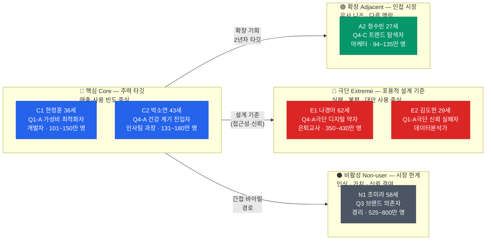
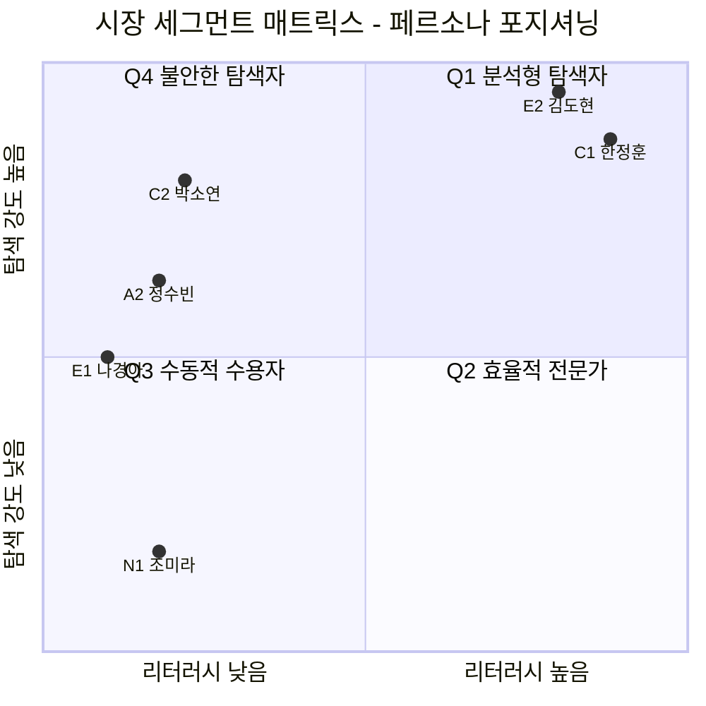
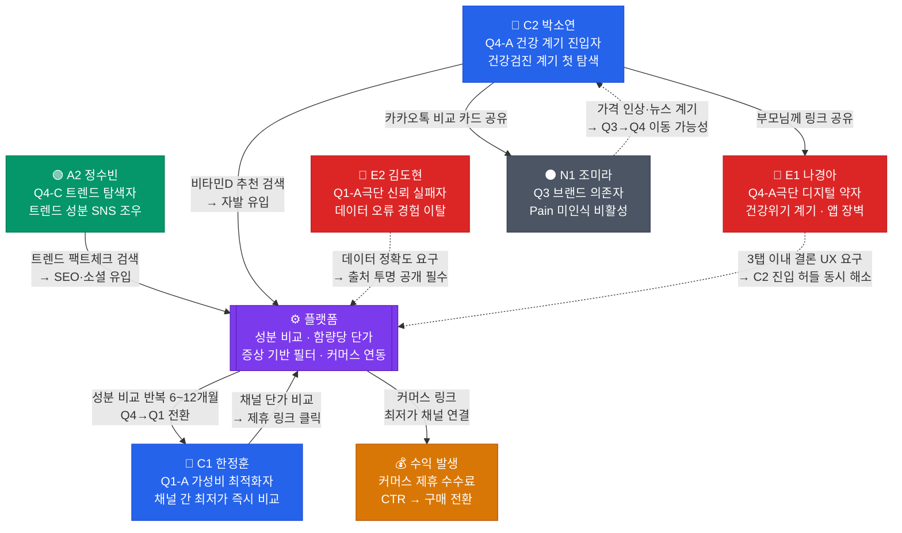
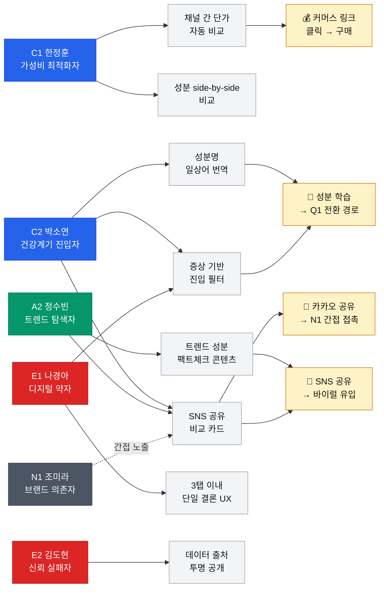
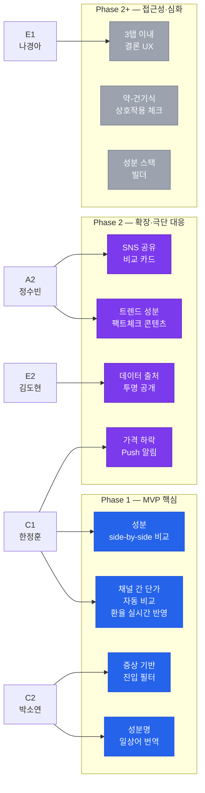
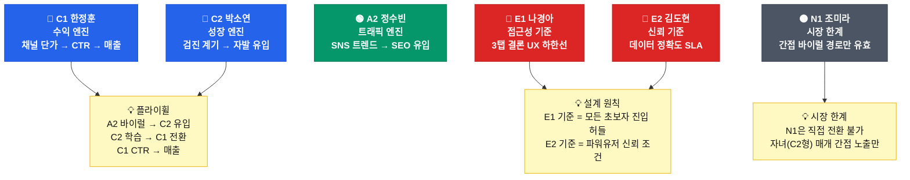

# 고객 페르소나 스펙트럼 및 관계 지도 (Persona Spectrum Map)

본 문서는 시장 세분화 분석을 바탕으로 도출된 4종의 최종 페르소나와 이들의 실재 가능성 검증, 그리고 페르소나 간의 상호작용 및 플랫폼 접점을 정의한 지식 문서입니다.

---

# **건강보조식품 성분·가격 비교 플랫폼 — 고객 페르소나 스펙트럼 (최종)**

## **스펙트럼 구조 요약**

| 유형 | 인원 | 목적 | 채택 페르소나 | 평가 점수 |
| --- | --- | --- | --- | --- |
| **핵심(Core)** | 2명 | 주력 타깃 — MVP 기능 설계·PMF 지표의 기준 | C1 한정훈, C2 박소연 | 각 15/15 |
| **확장(Adjacent)** | 1명 | 인접 시장 — 트래픽 유입·콘텐츠 전략 기준 | A2 정수빈 | 14/15 |
| **극단(Extreme)** | 2명 | 포용적 설계 기준 — 접근성·데이터 신뢰 SLA | E1 나경아, E2 김도현 | 15/15, 13/15 |
| **비활성(Non-user)** | 1명 | 진입 장벽·거부 요인 파악 | N1 조미라 | 15/15 |

---

## **1. 핵심 사용자 (Core) — 2명**

### **C1. 한정훈 (36) — "엑셀 비교왕"**

**세그먼트:** Q1-A 가성비 최적화자 | **역할:** 1년 차 SOM 수익 엔진 | **평가:** 문제 ★★★★★ / 행동 ★★★★★ / 맥락 ★★★★★

| 항목 | 내용 |
| --- | --- |
| **유형명** | 가성비 파워 비교러 |
| **직무** | IT기업 백엔드 개발자 |
| **주요 문제** | iHerb(달러)·쿠팡(원)·네이버를 탭 8개 열어놓고, 환율 적용 함량당 단가를 스프레드시트에 직접 기록해 비교한다. 제품 한 종의 용량별(60정/120정/240정) 단가를 나눗셈하는 데만 20분. 할인·쿠폰·적립금까지 반영하면 비교 복잡도가 기하급수적으로 상승한다. 가격 하락 타이밍을 놓쳐 최적 구매 시점을 잡지 못한다. |
| **목표** | "같은 비타민D 1,000IU면, 지금 이 순간 어느 채널이 가장 싼지 5초 안에 알고 싶다." |
| **사용 맥락** | 2~3개월 주기 정기 재구매 시, 또는 iHerb 세일 기간에 채널 간 최저가를 비교할 때. 이미 구매할 제품은 정해져 있고 '어디서 얼마에'만 알면 된다. |
| **감정** | 비교 자체는 즐기지만, 반복적인 수동 계산에 **피로감**을 느낀다. "이걸 자동화해주는 도구가 왜 없지?"라는 자기 모순적 불만이 지배적. 도구를 발견하면 즉각 신뢰하고 커머스 링크를 클릭한다. |
| **대체 솔루션** | 개인 구글 스프레드시트(환율 계산식 직접 구성), 에누리 건강플러스(부분적), iHerb 내 정렬 기능 |
| **핵심 니즈 기능** | 채널 간 실질 단가 자동 비교(환율 실시간 반영) / 용량별 단가 자동 계산 / 가격 하락 알림 / 구매 이력 기반 재구매 최저가 추천 |

> **MVP 설계 체크:** "이 기능이 C1의 스프레드시트를 완전히 대체하는가?"
> 

---

### **C2. 박소연 (43) — "검진 후 첫 구매자"**

**세그먼트:** Q4-A 건강 계기 진입자 | **역할:** 1년 차 SOM 성장 엔진 · 자발적 유입의 핵심 | **평가:** 문제 ★★★★★ / 행동 ★★★★★ / 맥락 ★★★★★

| 항목 | 내용 |
| --- | --- |
| **유형명** | 건강 계기 초보 탐색자 |
| **직무** | 중견기업 인사팀 과장 |
| **주요 문제** | 건강검진에서 비타민D 부족 판정을 받았다. 검색하면 "콜레칼시페롤 25μg"이 나오는데 이게 좋은 건지 나쁜 건지 모른다. 가격은 5,000원~50,000원 10배 차이에 "비싼 게 좋다"·"비싼 건 마케팅비"라는 상반된 정보가 쏟아져 불안만 커진다. 탐색 45~90분에도 결론을 내지 못하고 베스트셀러로 "그냥" 타협하지만 찝찝함이 남는다. |
| **목표** | "의사가 부족하다고 한 그 성분을, 적정 가격에, 안전한 제품으로 사고 싶다. 30분 안에." |
| **사용 맥락** | 건강검진 결과지를 받은 직후 1~2주 내, "비타민D 추천" 또는 "비타민D 뭐 먹어야 해"로 검색하며 플랫폼 자연 유입. 이 계기는 강력하고 반복적이며 SEO로 포착 가능한 진입점이다. |
| **감정** | 건강에 대한 **경각심과 불안** 공존. 탐색할수록 정보가 많아져 오히려 **혼란과 무력감** 확대. "그냥 많이 팔리는 거"로 타협 후에도 **찝찝한 잔존 불만**. 납득할 수 있는 설명을 받으면 즉각 강한 신뢰 형성. |
| **대체 솔루션** | 네이버 블로그·카페 후기, 약사 유튜버 콘텐츠, 약국 방문 상담, 쿠팡 베스트셀러 순 정렬 |
| **핵심 니즈 기능** | 증상/목적 기반 진입 필터 / 성분명 일상어 번역 / "이 가격이 적정한가?" 시장 평균 대비 위치 표시 / 광고·비광고 구분 표시 |

> **MVP 설계 체크:** "C2가 처음 방문 시 5분 안에 '이 제품이 적정하다'는 확신을 얻을 수 있는가?"
> 

---

## **2. 확장 사용자 (Adjacent) — 1명**

### **A2. 정수빈 (27) — "인스타에서 글루타치온 봤어"**

**세그먼트:** Q4-C 트렌드 추종 탐색자 | **역할:** SEO·콘텐츠 트래픽 유입 채널 | **평가:** 문제 ★★★★★ / 행동 ★★★★★ / 맥락 ★★★★

| 항목 | 내용 |
| --- | --- |
| **유형명** | 트렌드 검증형 뷰티 소비자 |
| **직무** | 뷰티 브랜드 마케터 |
| **주요 문제** | 인스타에서 "글루타치온이 피부에 좋다"는 포스트를 봤다. 검색하면 광고성 콘텐츠가 대부분이고, 같은 "글루타치온 500mg"인데 가격이 1만 원~8만 원까지 차이 난다. 인플루언서 추천이 진짜인지 스폰서인지 구분이 안 된다. FOMO로 충동 구매 후 "왜 이걸 샀지" 하는 후회가 반복된다. |
| **목표** | "이 트렌드 성분이 실제로 근거가 있는 건지, 이 가격이 합당한 건지를 빠르게 팩트체크하고 싶다." |
| **사용 맥락** | SNS·유튜브에서 새로운 성분 트렌드를 접한 직후 비정기적으로 검색 유입. "글루타치온 효과", "NMN 진짜야" 같은 트렌드 검색어가 플랫폼의 SEO 유입 핵심 채널. |
| **감정** | "놓치면 안 될 것 같다"는 **FOMO**와 "이거 또 광고 아니야?"라는 **의심** 사이의 갈등. 충동 구매 후 **후회** 반복. 객관적 팩트체크 콘텐츠를 만나면 강한 SNS 공유 행동. |
| **대체 솔루션** | 인스타·유튜브 인플루언서 콘텐츠, 네이버 검색, 올리브영 매장 직원 상담 |
| **핵심 니즈 기능** | 트렌드 성분 과학적 근거 등급 팩트체크 / 인플루언서 추천 제품 독립 분석 / "이 가격이 트렌드 프리미엄인가?" 시장 평균 대비 표시 / SNS 공유용 비교 카드 자동 생성 |

> **확장 전략 체크:** "A2가 공유한 비교 카드가 C2의 첫 유입 경로가 될 수 있는가?"
> 

---

## **3. 극단 사용자 (Extreme) — 2명**

### **E1. 나경아 (62) — "디지털이 어려운 건강 위기자"**

**세그먼트:** Q4-A 극단 변형 — 디지털 리터러시 제약 | **역할:** 접근성(Accessibility) 설계 기준 | **평가:** 문제 ★★★★★ / 행동 ★★★★★ / 맥락 ★★★★★

| 항목 | 내용 |
| --- | --- |
| **유형명** | 디지털 약자·건강 절실층 |
| **직무** | 은퇴한 초등학교 교사 |
| **주요 문제** | 당뇨 진단 후 영양제를 찾아보고 싶지만, 스마트폰 앱 설치부터 어렵다. 성분 비교 플랫폼에 접속해도 글씨가 작고, 필터링 조작이 복잡하고, "어떤 버튼을 눌러야 하는지" 자체가 장벽이다. 결국 TV 홈쇼핑이나 자녀가 대신 사다 주는 것에 의존한다. |
| **목표** | "누군가(또는 무언가)가 '어머니, 이거 드세요'라고 딱 하나만 말해줬으면 좋겠다." |
| **사용 맥락** | 건강 위기 이후 간헐적으로 시도하지만, 복잡한 인터페이스에 곧 포기. 자녀(C5형)가 링크를 공유해주는 경우 간접 유입 가능. |
| **감정** | 건강에 대한 **절박함**과 디지털 환경에서의 **소외감** 결합. "나는 이런 거 못 한다"라는 **학습된 무력감**. |
| **대체 솔루션** | TV 홈쇼핑 스토리텔링 구매, 약국 약사 대면 상담, 자녀 또는 지인의 대리 구매 |
| **설계 시사점 (접근성 기준)** | ① 3탭 이내 결론 도달 구조 ② 최소 글씨 크기(16px 이상) 및 고대비 UI ③ 카카오톡 기반 경량 공유 진입점 ④ "이 제품 추천" 단일 결론 CTA |

> **접근성 체크:** "E1이 스마트폰 하나로 3분 안에 하나의 결론을 얻을 수 있는가?"
> 

---

### **E2. 김도현 (29) — "데이터가 틀려서 손해 본 사람"**

**세그먼트:** Q1-A 극단 변형 — 플랫폼 신뢰 실패 경험자 | **역할:** 데이터 정확도·신뢰 설계 기준 | **평가:** 문제 ★★★★ / 행동 ★★★★★ / 맥락 ★★★★

| 항목 | 내용 |
| --- | --- |
| **유형명** | 오류 경험 이탈자 |
| **직무** | 데이터 분석가 |
| **주요 문제** | 기존 건기식 비교 앱에서 "함량 당 최저가"로 추천받아 구매했는데, 1회 섭취량 기준이 잘못 입력되어 있어 함량 대비 비싼 제품을 산 것이었다. 이후 모든 비교 플랫폼의 데이터를 불신하며, 직접 라벨을 확인하고 수동으로 계산하는 방식으로 복귀했다. |
| **목표** | "데이터의 출처와 정확도를 내가 직접 검증할 수 있는 투명한 시스템이 아니면 다시는 믿지 않겠다." |
| **사용 맥락** | 비교 플랫폼을 사용하더라도 반드시 원본 라벨과 대조. 오류 발견 시 즉시 이탈하고 주변에 부정적 구전을 퍼뜨린다. |
| **감정** | "시간 아끼려다 돈을 버렸다"는 **배신감**. 자동화 도구에 대한 **근본적 회의**. "차라리 내가 직접 하는 게 정확하다"는 **통제 욕구**. |
| **대체 솔루션** | 제품 실물 라벨 직접 확인 + 개인 스프레드시트 |
| **설계 시사점 (데이터 신뢰 기준)** | ① 오류율 5% 이상이면 C1형 파워 유저부터 이탈한다는 경고 ② 데이터 출처·수집 기준 투명 공개 ③ 사용자 오류 신고 체계 ④ 입력 데이터 교차 검증 프로세스 |

> **데이터 신뢰 체크:** "E2가 성분 데이터 출처를 클릭 2회 이내에 원본까지 추적할 수 있는가?"
> 

---

## **4. 비활성 사용자 (Non-user) — 1명**

### **N1. 조미라 (58) — "종근당이면 됐지"**

**세그먼트:** Q3 수동적 수용자 — 브랜드 의존형 | **역할:** 시장 확장 한계 인식·바이럴 간접 유입 전략 기준 | **평가:** 문제 ★★★★★ / 행동 ★★★★★ / 맥락 ★★★★★

| 항목 | 내용 |
| --- | --- |
| **유형명** | 브랜드 맹신 무탐색자 |
| **직무** | 아파트 관리사무소 경리 |
| **비활성 핵심 이유** | **문제를 인식하지 못하는 것이 문제.** 20년째 종근당 멀티비타민을 홈쇼핑에서 사먹고 있다. 동일 성분·함량의 제품이 3분의 1 가격에 존재한다는 사실을 모른다. "비싼 게 좋은 거"라고 믿으며 성분표를 볼 이유를 느끼지 못한다. |
| **목표** | (목표 부재) "지금 먹는 거 만족하고 있으니 건드리지 마세요." |
| **사용 맥락** | 플랫폼 자발 유입 가능성 거의 0. 다만 자녀(C2·C5형)나 지인이 공유해준 비교 카드를 카카오톡으로 받는 형태의 간접 접점은 존재. |
| **감정** | 현 선택에 대한 **강한 만족과 관성**. 비교 정보가 제시되면 "내가 바보라는 거냐"는 **방어적 반응**. 정보를 위협으로 인식. |
| **대체 솔루션** | TV·라디오 홈쇼핑 정기 구매, 지인 추천, 대형마트 익숙 브랜드 |
| **비활성 이유 구조** | ① 정보 니즈 자체 부재 ② 성분 리터러시 부족으로 플랫폼 가치 체감 불가 ③ 현재 소비 패턴에 대한 강한 관성 |
| **활성화 트리거 (모니터링 항목)** | 가격 인상 체감 / "엄마, 그거 함량이 너무 적어"라는 자녀 개입 / 특정 성분 유해성 언론 보도 → Q3 → Q4(불안한 탐색자) 이동 경로 |
| **진입 전략** | 직접 유입 배제. C2·A2가 공유하는 **비교 카드·카카오톡 공유 기능**을 통해 간접 노출 → 자녀가 대신 조사해주는 경로로 플랫폼 간접 활용 |

> **바이럴 체크:** "C2가 N1 어머니에게 공유하는 비교 카드가 N1을 움직이게 하는가?"
> 

---

## **페르소나 간 연결 구조**

```
[A2 정수빈] — 트렌드 성분 팩트체크 콘텐츠 공유
       ↓ SNS 바이럴
[C2 박소연] — 건강검진 계기 첫 유입 → 성분 비교 학습
       ↓ Q4 → Q1 전환 (6~12개월)
[C1 한정훈] — 채널 간 최저가 비교·커머스 전환 (수익 핵심)
       ↓ 카카오톡 비교 카드 공유
[N1 조미라] — 간접 노출 → 자녀 대리 탐색 경로
```

**E1 나경아** → 접근성 설계가 C2·N1의 진입 허들을 낮추는 역할

**E2 김도현** → 데이터 정확도 기준이 C1의 신뢰를 확보하는 전제 조건

---

## **페르소나별 MVP 기능 우선순위 매핑**

| 기능 | C1 한정훈 | C2 박소연 | A2 정수빈 | E1 나경아 | E2 김도현 | N1 조미라 |
| --- | --- | --- | --- | --- | --- | --- |
| 채널 간 단가 자동 비교 (환율 반영) | ★★★★★ | ★★★ | ★★★ | ★ | ★★★★★ | — |
| 제품 간 성분 비교 side-by-side | ★★★★★ | ★★★★ | ★★★★ | ★★ | ★★★★★ | — |
| 성분명 일상어 번역 | ★ | ★★★★★ | ★★★★ | ★★★★★ | ★ | ★★ |
| 증상/목적 기반 진입 필터 | ★ | ★★★★★ | ★★★ | ★★★★★ | ★ | ★★ |
| 가격 변동 알림 | ★★★★★ | ★★ | ★ | — | ★★★ | — |
| 트렌드 성분 팩트체크 콘텐츠 | ★ | ★★ | ★★★★★ | ★ | ★★ | — |
| SNS 공유용 비교 카드 | ★★ | ★★★ | ★★★★★ | — | ★ | ★★★ |
| 데이터 출처 투명 공개 | ★★★ | ★★ | ★★ | ★ | ★★★★★ | — |
| 3탭 이내 단일 결론 UX | ★★ | ★★★★ | ★★ | ★★★★★ | ★ | ★★★★ |

**Phase 1 MVP 핵심 기능 (공통도 최고):**

1. 제품 간 성분 비교 side-by-side + 성분명 일상어 번역
2. 채널 간 단가 자동 비교 (환율 실시간 반영)
3. 증상/목적 기반 진입 필터

---

## **스펙트럼별 전략적 활용 가이드**

| 스펙트럼 | 활용 시점 | 핵심 검증 질문 |
| --- | --- | --- |
| **핵심 (C1, C2)** | MVP 기능 우선순위, 유저 인터뷰 리크루팅, PMF 지표 설계 | "C1의 스프레드시트를 대체하는가? C2가 5분 안에 확신을 얻는가?" |
| **확장 (A2)** | 콘텐츠 마케팅 전략, SEO 키워드 설계, 공유 기능 우선순위 | "A2가 공유한 콘텐츠가 C2의 첫 유입 경로가 될 수 있는가?" |
| **극단 (E1, E2)** | 접근성 설계 기준, 데이터 정확도 SLA, 오류 대응 프로세스 | "E1이 3탭 안에 결론을 얻는가? E2가 데이터 출처를 직접 추적할 수 있는가?" |
| **비활성 (N1)** | 바이럴 콘텐츠 설계, 간접 유입 전략, 시장 확장 한계 인식 | "C2가 N1에게 공유한 비교 카드가 N1을 움직이게 하는가?" |

---

## **Map 1 · 페르소나 스펙트럼 전체 구조**

> **읽는 법:** 왼쪽(핵심)에서 오른쪽(비활성)으로 갈수록 플랫폼 자발 유입 가능성이 낮아지고, 설계·전략적 함의가 달라진다.
> 



---

## **Map 2 · 시장 세그먼트 매트릭스 포지셔닝**

> **읽는 법:** X축은 성분 리터러시(낮음→높음), Y축은 정보 탐색 강도(낮음→높음). 4개 사분면이 Q1~Q4 세그먼트에 대응. 각 페르소나의 좌표는 세그먼트 분석 기반 추정값.
> 



### **매트릭스 해설**

| 사분면 | 세그먼트명 | 위치한 페르소나 | 전략 방향 |
| --- | --- | --- | --- |
| **Q1 (우상단)** | 분석형 탐색자 | C1 한정훈, E2 김도현(극단) | 수익 엔진 — 함량당 단가·채널 비교 도구 |
| **Q4 (좌상단)** | 불안한 탐색자 | C2 박소연, A2 정수빈, E1 나경아(극단) | 성장 엔진 — 단순화·신뢰·진입 장벽 제거 |
| **Q2 (우하단)** | 효율적 전문가 | (A3 오영철 — Phase 2) | Push 알림 기반 찾아가는 서비스 |
| **Q3 (좌하단)** | 수동적 수용자 | N1 조미라 | 직접 전환 불가 — 간접 바이럴만 유효 |

---

## **Map 3 · 전환·바이럴 흐름도**

> **읽는 법:** 실선 화살표는 직접 행동 경로, 점선 화살표는 설계 요구사항 영향 관계. 플랫폼이 허브 역할을 하며 각 페르소나의 진입·이탈·전환 흐름을 보여준다.
> 



### **흐름도 핵심 동선 해설**

| 동선 | 설명 | 전략적 의미 |
| --- | --- | --- |
| **A2 → 플랫폼 → C2** | A2가 공유한 SNS 비교 카드가 C2의 첫 유입 경로가 됨 | 확장 사용자가 핵심 사용자를 끌어오는 바이럴 구조 |
| **C2 → 플랫폼 → C1** | Q4 사용자가 반복 사용으로 Q1으로 전환 (6~12개월) | 플랫폼의 성장 플라이휠 — LTV 증가의 핵심 경로 |
| **C1 → 플랫폼 → 수익** | 전환율 가장 높은 사용자의 커머스 클릭 | 1년차 SOM 기본 시나리오 매출의 55% 기여 |
| **C2 → N1 (간접)** | 비교 카드를 카카오톡으로 공유 | 비활성 사용자의 유일한 접점 — 직접 전환 아닌 인식 노출 |
| **E2 ⇢ 플랫폼** | 데이터 오류 경험자의 신뢰 요구 | 데이터 정확도 SLA 설계의 강제 기준 |
| **E1 ⇢ 플랫폼** | 3탭 이내 결론 UX 요구 | 접근성 설계가 C2 초보 UX에도 직접 적용됨 |

---

## **Map 4 · 플랫폼 접점 모델**

> **읽는 법:** 각 페르소나가 플랫폼의 어떤 기능과 접점을 갖는지, 그 결과로 어떤 행동이 발생하는지를 보여준다. 기능 개발 우선순위 판단에 직접 사용.
> 



---

## **Map 5 · 제품 설계 우선순위 매핑**

### **Phase 1 MVP 기능 (C1 + C2 중심)**



### **기능-페르소나 매핑 종합표**

| 기능 | C1 한정훈 | C2 박소연 | A2 정수빈 | E1 나경아 | E2 김도현 | N1 조미라 | Phase |
| --- | --- | --- | --- | --- | --- | --- | --- |
| 채널 간 단가 자동 비교 (환율) | ★★★★★ | ★★★ | ★★★ | ★ | ★★★★ | — | **1** |
| 성분 side-by-side 비교 | ★★★★★ | ★★★★ | ★★★★ | ★★ | ★★★★★ | — | **1** |
| 성분명 일상어 번역 | ★ | ★★★★★ | ★★★★ | ★★★★★ | ★ | ★★ | **1** |
| 증상 기반 진입 필터 | ★ | ★★★★★ | ★★★ | ★★★★★ | ★ | ★★ | **1** |
| 트렌드 성분 팩트체크 콘텐츠 | ★ | ★★ | ★★★★★ | ★ | ★★ | — | 2 |
| SNS 공유 비교 카드 | ★★ | ★★★ | ★★★★★ | — | ★ | ★★★ | 2 |
| 가격 하락 Push 알림 | ★★★★★ | ★★ | ★ | — | ★★★ | — | 2 |
| 데이터 출처 투명 공개 | ★★★ | ★★ | ★★ | ★ | ★★★★★ | — | 2 |
| 3탭 이내 단일 결론 UX | ★★ | ★★★★ | ★★ | ★★★★★ | ★ | ★★★★ | 2+ |
| 약-건기식 상호작용 체크 | ★ | ★★★ | ★ | ★★★ | ★ | — | 2+ |
| 성분 스택 빌더 | ★★★ | ★★ | ★ | — | ★★ | — | 2+ |

---

## **스펙트럼 맵 전체 요약**

