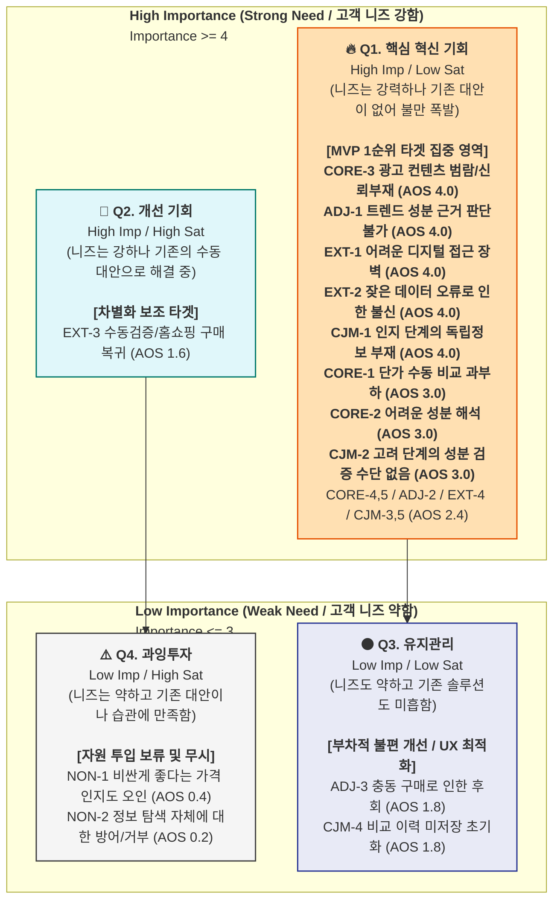
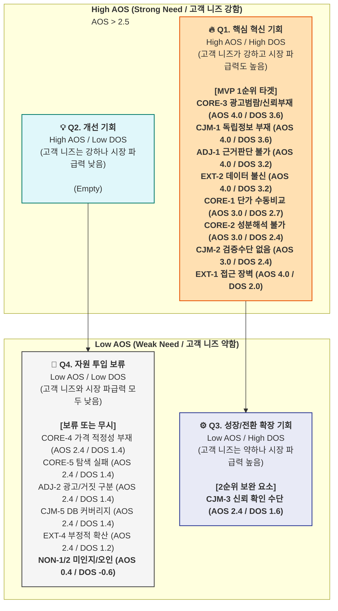

- AOS vs. DOS 통합 분석

| **분류 (세그먼트)** | **Pain / Goal** | **Imp** | **Sat** | **AOS** | **Market Rel.** | **DOS** | **Quadrant** | **전략적 해석** |
| --- | --- | --- | --- | --- | --- | --- | --- | --- |
| **Core (Q1+Q2)** | 광고 범람, 신뢰 정보 부재 (CORE-3) | 5 | 1 | **4.0** | 0.9 | **3.6** | **Q1** | **(1순위)** 양대 핵심 타겟(Q1, Q4) 유입의 최우선 전제 조건. |
| **CJM (인지)** | [인지] 독립 정보 부재 (CJM-1) | 5 | 1 | **4.0** | 0.9 | **3.6** | **Q1** | **(1순위)** 모든 유기적 유입(SEO)의 출발점이며 시장 공백. |
| **Adjacent (A2)** | 트렌드 성분 근거 판단 불가 (ADJ-1) | 5 | 1 | **4.0** | 0.8 | **3.2** | **Q1** | **(1순위)** 검색량과 트래픽 확보가 직결되는 고성장 기회 (Phase 2 우선). |
| **Extreme (E2)** | 데이터 오류 → 카테고리 불신 (EXT-2) | 5 | 1 | **4.0** | 0.8 | **3.2** | **Q1** | **(1순위)** 플랫폼 모델 기반을 흔드는 핵심 블로커(이탈 방어). |
| **Core (Q1)** | 채널 간 단가 수동 비교 과부하 (CORE-1) | 5 | 2 | **3.0** | 0.9 | **2.7** | **Q1** | **(1순위)** SOM 수익 모델의 핵심 축. 커머스 전환을 직접 창출. |
| **Core (Q2)** | 성분 해석 불가 → 비교 불가 (CORE-2) | 5 | 2 | **3.0** | 0.8 | **2.4** | **Q1** | **(1순위)** Q4(초보자)를 Q1(전문가)로 온보딩 시키는 핵심 가치. |
| **CJM (고려)** | [고려] 성분·검증 수단 없음 (CJM-2) | 5 | 2 | **3.0** | 0.8 | **2.4** | **Q1** | **(1순위)** 미드퍼널에서 이탈을 막고 거래로 이어주는 필수 기능. |
| **Extreme (E1)** | 디지털 인터페이스 접근 장벽 (EXT-1) | 5 | 1 | **4.0** | 0.5 | **2.0** | **Q1** | **(1순위)** AOS는 최고이나, 직접 해결 시 타겟 확산 제약. 점진적 개선 영역. |
| **CJM (결정)** | [결정] 신뢰 확인 수단 없음 (CJM-3) | 4 | 2 | **2.4** | 0.8 | **1.6** | **Q3** | (2순위) AOS는 조금 낮으나 DOS 파급력이 큼. 바텀퍼널 전환율 영향. |
| **Core (Q1+Q2)** | 가격 적정성 판단 기준 부재 (CORE-4) | 4 | 2 | **2.4** | 0.7 | **1.4** | **Q4** | (보류) 전환 보조 기능이나 즉각적인 매출원 창출은 아님. |
| **Core (Q1+Q2)** | 탐색 결론 실패 (CORE-5) | 4 | 2 | **2.4** | 0.7 | **1.4** | **Q4** | (보류) 장기 리텐션 보조 항목. |
| **Adjacent (A2)** | 광고/진짜 구분 + 가격 근거 (ADJ-2) | 4 | 2 | **2.4** | 0.7 | **1.4** | **Q4** | (보류) Phase 2 콘텐츠 기능. |
| **CJM (충성도)** | [충성도] DB 커버리지 한계 (CJM-5) | 4 | 2 | **2.4** | 0.7 | **1.4** | **Q4** | (보류) DB 점진 확보 과제. |
| **Extreme (E1/E2)** | 부정적 확산 (EXT-4) | 4 | 2 | **2.4** | 0.6 | **1.2** | **Q4** | (보류) 일반적 리스크 관리. |
| **Adjacent (A2)** | FOMO 충동 구매 → 후회 (ADJ-3) | 3 | 2 | **1.8** | 0.5 | **0.5** | **Q4** | (보류) 핵심 구매동인에서 벗어남. |
| **Extreme (E1/E2)** | 수동 검증/홈쇼핑 의존 (EXT-3) | 4 | 3 | **1.6** | 0.4 | **0.4** | **Q4** | (보류) 높은 Satisfaction(대안작동)으로 기회 창출력 미미. |
| **Non-user (N1)** | 미인지 / 가격-품질 오인 (NON-1/NON-2) | 1~2 | 4 | **0.2~0.4** | 0.2~0.3 | **-0.6** | **Q4** | **(무시)** 자원 투입 낭비. |


# **① 페르소나별 주요 Pain / Goal 종합 정리표**

## **1. 6명 페르소나 Pain / Goal 종합표**

| 유형 | 페르소나 | 세그먼트 | 핵심 Pain | 세부 Pain | Goal | 감정 키워드 |
| --- | --- | --- | --- | --- | --- | --- |
| 🔵 **핵심** | **C1 한정훈** (36) · 개발자 | Q1-A 가성비 최적화자 | **수동 단가 계산 반복** | ① iHerb(달러)·쿠팡(원)·네이버 탭 8개 교차 대조에 40~60분 소요 ② 60정/120정/240정 용량별 나눗셈 매번 반복 ③ 할인·쿠폰·적립금 반영 시 비교 복잡도 기하급수 상승 ④ 가격 하락 타이밍 놓쳐 최적 구매 시점 실패 | **"같은 비타민D 1,000IU, 지금 어느 채널이 가장 싼지 5초 안에 알고 싶다"** → 채널 통합 단가 자동 비교 + 가격 하락 알림 + 탐색 60분→5분 단축 | 피로·체념·짜증 → 해결감 |
| 🔵 **핵심** | **C2 박소연** (43) · 인사팀 과장 | Q4-A 건강 계기 진입자 | **정보 과잉 속 판단 불가** | ① 건강검진 이상 후 검색하면 광고성 콘텐츠만 쏟아짐 ② "콜레칼시페롤 25μg"이 좋은 건지 나쁜 건지 모름 ③ 5,000~50,000원 10배 가격 차이의 근거 없음 ④ 45~90분 탐색 후에도 결론 못 내고 베스트셀러로 타협 | **"의사가 부족하다고 한 성분을, 적정 가격에, 안전한 제품으로 30분 안에 사고 싶다"** → 증상 기반 필터 + 성분명 일상어 번역 + 시장 평균 대비 가격 위치 표시 | 불안·혼란·무력감 → 조심스러운 안도 |
| 🟢 **확장** | **A2 정수빈** (27) · 뷰티 마케터 | Q4-C 트렌드 추종 탐색자 | **광고-정보 구분 불가** | ① 인플루언서 추천이 스폰서인지 진짜인지 판별 불가 ② 동일 성분·함량인데 가격 1만~8만원 차이(8배) 근거 없음 ③ "효과 입증" vs. "근거 부족" 상반된 정보 혼재 ④ FOMO 충동 구매 → 후회 사이클 반복 | **"트렌드 성분이 근거 있는 건지, 이 가격이 합당한 건지 빠르게 팩트체크하고 싶다"** → 과학적 근거 등급 팩트체크 + 가격 분포 시각화 + SNS 공유 카드 | FOMO·의심 → 납득 → 공유 충동 |
| 🔴 **극단** | **E1 나경아** (62) · 은퇴 교사 | Q4-A 극단 (디지털 리터러시 제약) | **인터페이스 자체가 장벽** | ① 스마트폰 앱 설치·로그인 자체가 첫 번째 장벽 ② 작은 글씨·복잡한 필터·메뉴 구조에서 즉시 이탈 ③ "성분 비교"가 무엇인지 개념 자체가 낯섦 ④ TV 홈쇼핑·자녀 대리 구매에 의존 → 정보 격차 고착 | **"딱 하나만 알려줬으면. 광고 아닌 걸로"** → 단 하나의 결론("이 제품 드세요") + 선택지 3개 이하 + 카카오톡 공유 | 절박·소외·학습된 무력감 → 체념 |
| 🔴 **극단** | **E2 김도현** (29) · 데이터 분석가 | Q1-A 극단 (신뢰 실패 경험) | **데이터 오류로 인한 카테고리 불신** | ① 기존 비교 앱에서 1회 섭취량 기준 오입력 → 비싼 제품 구매 피해 ② 이후 모든 비교 플랫폼 데이터 불신 ③ 직접 라벨 확인 + 수동 계산으로 복귀 ④ 오류 발견 시 즉시 이탈 + 부정적 구전 | **"데이터 출처와 정확도를 직접 검증할 수 있는 투명한 시스템이 아니면 안 믿겠다"** → 출처 투명 공개 + 원본 라벨 대조 + 오류 신고·48h 처리 | 배신감·근본적 회의·통제 욕구 |
| ⚫ **비활성** | **N1 조미라** (58) · 경리 | Q3 수동적 수용자 (브랜드 의존) | **Pain을 인식하지 못함** | ① 20년째 같은 브랜드 반복 구매 — 동일 성분 1/3 가격 제품 존재 사실 모름 ② "비싼 게 좋은 것" 가격-품질 오인 고착 ③ 비교 정보 제시 시 "내가 바보라는 거냐" 방어 반응 ④ 성분표를 볼 이유 자체를 느끼지 못함 | **(목표 부재)** "지금 먹는 거 만족하니까 건드리지 마세요" → 외부 계기(가격 인상, 자녀 개입, 유해성 보도) 시에만 Q4 이동 가능 | 강한 관성·방어·거부감 |

---

## **2. Pain / Goal 매트릭스 — 한눈에 비교**

| 비교 축 | C1 한정훈 | C2 박소연 | A2 정수빈 | E1 나경아 | E2 김도현 | N1 조미라 |
| --- | --- | --- | --- | --- | --- | --- |
| **Pain 한 줄** | 수동 단가 계산 반복 | 정보 과잉 속 판단 불가 | 광고-정보 구분 불가 | 디지털 인터페이스 장벽 | 데이터 오류 → 불신 | Pain 미인식 |
| **Goal 한 줄** | 5초 최저 단가 | 30분 내 확신 있는 첫 구매 | 30초 팩트체크 + 공유 | 결론 하나만 | 투명한 데이터 검증 | (없음) |
| **탐색 시간** | 40~60분 | 45~90분 | 불규칙 (트렌드 계기) | 포기 | 전부 수동 검증 | 탐색 안 함 |
| **리터러시** | ★★★★★ | ★★ | ★★ | ★ | ★★★★★ | ★ |
| **전환 난이도** | 즉시 전환 | 신뢰 확보 시 전환 | 콘텐츠 유입 | 자녀 매개 간접 | 고기준 충족 시 조건부 | 직접 전환 불가 |

---

## **3. CJM 여정 단계별 공통 Pain — 플랫폼 우선 해결 과제**

| CJM 단계 | 가장 큰 공통 Pain | 해당 페르소나 | 최우선 개선 기회 |
| --- | --- | --- | --- |
| **인지** | 광고성 정보와 독립 정보의 구분 불가 | C2, A2 | SEO 콘텐츠 선점 + "광고 아님" 정체성 명확화 |
| **고려** | 성분 이해 불가 + 데이터 검증 수단 없음 | C2, E2, E1 | 일상어 번역 + 출처 투명 공개 |
| **결정** | 마지막 신뢰 확인 수단 없음 | C1, E2, A2 | 독립 평가 배지 + 오류 신고 기능 |
| **온보딩** | 이력 미저장으로 재방문 시 초기화 | C1, C2 | 비교 이력 저장 + 재방문 연속성 |
| **충성도** | DB 커버리지 한계로 이탈 | C1, A2 | 제품 DB 확장 + 사용자 요청 등록 |

---

## **4. 공통 Pain Top 3 — 페르소나 교차 빈도순**

| 순위 | 공통 Pain | 해당 페르소나 | 해결 기능 |
| --- | --- | --- | --- |
| **1** | **데이터 신뢰 부재** — "이 비교 결과를 믿을 수 있나?" | C1, E2, A2 | 데이터 출처 투명 공개 + 오류 신고 체계 |
| **2** | **성분 해석 불가** — "이게 무슨 뜻인지 모르겠다" | C2, A2, E1, N1 | 성분명 일상어 번역 + 한 줄 해석 |
| **3** | **결정 기준 부재** — "이 가격이 적정한지 모르겠다" | C2, A2, N1 | 시장 평균 대비 가격 위치 표시 |

| 비교 축 | C1 한정훈 | C2 박소연 | A2 정수빈 | E1 나경아 | E2 김도현 | N1 조미라 |
| --- | --- | --- | --- | --- | --- | --- |
| **Pain 한 줄** | 수동 단가 계산 반복 | 정보 과잉 속 판단 불가 | 광고-정보 구분 불가 | 디지털 인터페이스 장벽 | 데이터 오류 → 불신 | Pain 미인식 |
| **Goal 한 줄** | 5초 최저 단가 | 30분 내 확신 있는 첫 구매 | 30초 팩트체크 + 공유 | 결론 하나만 | 투명한 데이터 검증 | (없음) |
| **탐색 시간** | 40~60분 | 45~90분 | 불규칙 (트렌드 계기) | 포기 | 전부 수동 검증 | 탐색 안 함 |
| **리터러시** | ★★★★★ | ★★ | ★★ | ★ | ★★★★★ | ★ |
| **전환 난이도** | 즉시 전환 | 신뢰 확보 시 전환 | 콘텐츠 유입 | 자녀 매개 간접 | 고기준 충족 시 조건부 | 직접 전환 불가 |

# **② Importance 평가**

## **Importance 점수 기준**

| 점수 | 의미 | 판단 기준 |
| --- | --- | --- |
| **5** | 매우 중요 | 해결 안 되면 목표 자체가 불가능 |
| **4** | 중요 | 해결 안 되면 큰 불편·비효율 발생 |
| **3** | 보통 | 우회 경로로 목표 달성 가능 |
| **2** | 낮음 | 해결 없어도 대부분 진행 가능 |
| **1** | 매우 낮음 | 고객이 문제로 인식하지 않음 |

---

## **A. 스펙트럼 4분류별 Pain Importance**

### **🔵 핵심 (Core) — C1 한정훈 + C2 박소연 (추정 232~330만 명)**

| # | Pain / Goal | Imp | 근거 |
| --- | --- | --- | --- |
| CORE-1 | **채널 간 단가 비교 수동 작업 과부하** — iHerb(달러)·쿠팡(원)·네이버 교차 비교에 40~60분, 용량별 환산 나눗셈 매번 반복 | **5** | C1의 핵심 목표("5초 최저가")를 직접 가로막는 Pain. 자동화 없이는 목표 달성 자체 불가. 2~3개월 주기 반복 |
| CORE-2 | **성분 정보 해석 불가 → 비교 자체 불가능** — "콜레칼시페롤 25μg"이 뭔지 몰라 제품 간 비교 시작도 못 함 | **5** | C2의 첫 진입 장벽. 성분 리터러시 ★★인 사용자가 전체 Q4 세그먼트의 25~30%. 이해 없이는 비교 과정 자체가 성립 안 됨 |
| CORE-3 | **광고성 콘텐츠 범람으로 신뢰할 정보 부재** — 검색 결과 대부분 광고성 블로그, 중립적 진입점 없음 | **5** | C2의 건강검진 계기가 아무리 강력해도 신뢰 공백이 탐색 자체를 억제. CJM 인지 단계의 결정적 관문 |
| CORE-4 | **가격 적정성 판단 기준 부재** — 5,000~50,000원 10배 차이 근거 없음. 할인·쿠폰 반영 시 복잡도 급상승 | **4** | C1은 실질 최종가, C2는 "비싼 게 좋은 건지" 판단 기준을 요구. 결정 단계의 마지막 불확실성 |
| CORE-5 | **장시간 탐색에도 확신 있는 결론 실패** — C1: 가격 하락 타이밍 놓침 / C2: 45~90분 후 베스트셀러로 타협 | **4** | 탐색 투자 대비 만족 없음. C2의 "찝찝한 잔존 불만"이 재방문과 LTV를 좌우 |

---

### **🟢 확장 (Adjacent) — A2 정수빈 (추정 94~135만 명)**

| # | Pain / Goal | Imp | 근거 |
| --- | --- | --- | --- |
| ADJ-1 | **트렌드 성분의 과학적 근거 판단 불가** — "효과 입증" vs "근거 부족" 상반 정보 혼재 | **5** | 핵심 Goal이 "팩트체크". 네이버 트렌드 기준 글루타치온 검색 340% 급증 — Pain 발생 빈도 현재 급격히 증가 중 |
| ADJ-2 | **인플루언서 광고/진짜 추천 구분 불가 + 동일 성분 가격 8배 차이 근거 없음** | **4** | 인플루언서 마케팅 시장 연 3,000억 원. 트렌드 정보 최초 접촉점부터 신뢰 무너짐. 합리적 가격 결정 기준 부재 |
| ADJ-3 | **FOMO 충동 구매 → 후회 반복** | **3** | 탐색 실패의 결과적 감정. 직접 장벽이라기보단 반복되며 다음 탐색의 의심을 높이는 간접 효과 |

---

### **🔴 극단 (Extreme) — E1 나경아 + E2 김도현 (추정 350~430만 명+)**

| # | Pain / Goal | Imp | 근거 |
| --- | --- | --- | --- |
| EXT-1 | **디지털 인터페이스 접근 장벽** — 앱 설치·로그인 자체가 벽. 접속해도 작은 글씨·복잡한 메뉴에서 즉시 이탈 | **5** | E1 기준. KISA 디지털 정보격차 조사: 60대 앱 활용지수 41.3점(일반 71.3점). 진입 자체가 불가하면 이후 모든 가치 전달 차단 |
| EXT-2 | **데이터 오류 경험 → 비교 플랫폼 카테고리 전체 불신** — 기존 앱 오류로 금전 피해 → "비교 서비스" 자체를 불신 | **5** | E2 기준. 개별 플랫폼이 아닌 카테고리 수준 불신. 해소 없이는 사용 자체 불가. CJM에서 "선행 과제"로 명시 |
| EXT-3 | **자동화 도구 포기 → 수동 검증/홈쇼핑 의존** — E2: 라벨 직접 확인 복귀 / E1: TV 홈쇼핑·자녀 대리 구매 | **4** | 대체 솔루션이 "작동은 하지만 비효율적". E1은 정보 격차 고착, E2는 비효율적 통제감에 의존 |
| EXT-4 | **오류·불편 경험의 부정적 확산** — E2: 즉시 이탈 + 부정적 구전 / E1: "나는 못 한다" 학습된 무력감 | **4** | 개인 이탈에 그치지 않고 C1형 잠재 사용자 진입까지 막는 파급력. 플랫폼 신뢰의 시스템 리스크 |

---

### **⚫ 비활성 (Non-user) — N1 조미라 (추정 525~800만 명)**

| # | Pain / Goal | Imp | 근거 |
| --- | --- | --- | --- |
| NON-1 | **동일 성분 저가 제품 존재 미인지 + 가격-품질 오인** — "비싸면 좋은 거" 20년 고착. 소비자원: 가격 차이 최대 8.2배, 83% 미인지 | **2** | 객관적 손실은 크지만 본인이 인식 못하므로 주관적 중요도 낮음. 외부 계기(가격 인상, 자녀 개입) 전까지 변화 동기 0 |
| NON-2 | **정보 제공에 대한 방어·거부 + 탐색 니즈 자체 부재** — "내가 바보라는 거냐" 방어 반응. 성분표를 볼 이유 없음 | **1** | 정보를 위협으로 인식. 능동적 해결 의지 0. Nielsen: 동일 제품 재구매 62%. 관성이 지배적 |

---

## **B. CJM 여정 단계별 공통 Pain — Importance**

| # | CJM 단계 | 공통 Pain | Imp | 영향 분류 |
| --- | --- | --- | --- | --- |
| CJM-1 | **인지** | 광고성 정보 vs 독립 정보 구분 불가 | **5** | 핵심, 확장 |
| CJM-2 | **고려** | 성분 이해 불가 + 데이터 검증 수단 없음 | **5** | 핵심, 극단 |
| CJM-3 | **결정** | 마지막 신뢰 확인 수단 없음 | **4** | 핵심, 극단, 확장 |
| CJM-4 | **온보딩** | 이력 미저장으로 재방문 시 초기화 | **3** | 핵심 |
| CJM-5 | **충성도** | DB 커버리지 한계로 이탈 | **4** | 핵심, 확장 |

---

## **C. Importance 종합 순위**

| 순위 | Pain ID | Pain 내용 | 분류 | Imp |
| --- | --- | --- | --- | --- |
| 1 | CORE-1 | 채널 간 단가 비교 수동 작업 과부하 | 🔵 핵심 | **5** |
| 1 | CORE-2 | 성분 정보 해석 불가 → 비교 불가 | 🔵 핵심 | **5** |
| 1 | CORE-3 | 광고성 콘텐츠 범람, 신뢰 정보 부재 | 🔵 핵심 | **5** |
| 1 | ADJ-1 | 트렌드 성분 과학적 근거 판단 불가 | 🟢 확장 | **5** |
| 1 | EXT-1 | 디지털 인터페이스 접근 장벽 | 🔴 극단 | **5** |
| 1 | EXT-2 | 데이터 오류 → 카테고리 전체 불신 | 🔴 극단 | **5** |
| 7 | CORE-4 | 가격 적정성 판단 기준 부재 | 🔵 핵심 | **4** |
| 7 | CORE-5 | 장시간 탐색에도 확신 있는 결론 실패 | 🔵 핵심 | **4** |
| 7 | ADJ-2 | 광고/진짜 구분 불가 + 가격 차이 근거 없음 | 🟢 확장 | **4** |
| 7 | EXT-3 | 수동 검증/홈쇼핑 의존 복귀 | 🔴 극단 | **4** |
| 7 | EXT-4 | 오류·불편의 부정적 확산 | 🔴 극단 | **4** |
| 12 | ADJ-3 | FOMO 충동 구매 → 후회 반복 | 🟢 확장 | **3** |
| 13 | NON-1 | 저가 제품 미인지 + 가격-품질 오인 | ⚫ 비활성 | **2** |
| 14 | NON-2 | 정보 방어·거부 + 탐색 니즈 부재 | ⚫ 비활성 | **1** |

---

## **D. 평가 분포**

```
전체 14개 항목 Importance 분포
━━━━━━━━━━━━━━━━━━━━━━━━━━
  5점: ██████  6개 (43%)  ← 혁신 기회 후보
  4점: █████   5개 (36%)  ← 개선 기회 후보
  3점: █       1개 ( 7%)
  2점: █       1개 ( 7%)
  1점: █       1개 ( 7%)
━━━━━━━━━━━━━━━━━━━━━━━━━━
```

**핵심 인사이트:** 핵심·확장·극단 3분류의 Pain은 모두 Imp 4~5점대 → 다음 단계(Satisfaction 평가)에서 충족도가 낮게 나오면 AOS 고득점 영역. 비활성(N1)은 구조적으로 AOS 저득점 → 직접 전환 불가 전략과 일치.

| # | CJM 단계 | 공통 Pain | Imp | 영향 분류 |
| --- | --- | --- | --- | --- |
| CJM-1 | **인지** | 광고성 정보 vs 독립 정보 구분 불가 | **5** | 핵심, 확장 |
| CJM-2 | **고려** | 성분 이해 불가 + 데이터 검증 수단 없음 | **5** | 핵심, 극단 |
| CJM-3 | **결정** | 마지막 신뢰 확인 수단 없음 | **4** | 핵심, 극단, 확장 |
| CJM-4 | **온보딩** | 이력 미저장으로 재방문 시 초기화 | **3** | 핵심 |
| CJM-5 | **충성도** | DB 커버리지 한계로 이탈 | **4** | 핵심, 확장 |

# **③ Satisfaction 평가**

## **Satisfaction 점수 기준**

| 점수 | 의미 | 판단 기준 |
| --- | --- | --- |
| **5** | 완전 충족 | 현재 솔루션이 이 Pain을 거의 완벽히 해결 |
| **4** | 대체로 충족 | 불편은 있으나 고객이 수용 가능한 수준 |
| **3** | 보통 | 작동은 하지만 효율·정확성에 뚜렷한 한계 |
| **2** | 미흡 | 해결은 시도하지만 고객 불만이 높음 |
| **1** | 거의 미충족 | 대체 솔루션이 사실상 존재하지 않거나 전혀 해결 못 함 |

---

## **분류별 현재 대체 솔루션 현황**

| 분류 | 현재 사용 중인 대체 솔루션 |
| --- | --- |
| 🔵 **핵심** | 개인 구글 스프레드시트(C1), iHerb 내 정렬, 에누리 건강플러스, 네이버 블로그·카페(C2), 약사 유튜버, 약국 방문, 쿠팡 베스트셀러 |
| 🟢 **확장** | 인스타·유튜브 인플루언서, 네이버 블로그 체험단, 올리브영 매장 직원 |
| 🔴 **극단** | TV 홈쇼핑(E1), 약국 대면 상담(E1), 자녀 대리 구매(E1), 제품 실물 라벨 직접 확인 + 개인 스프레드시트(E2) |
| ⚫ **비활성** | TV·라디오 홈쇼핑 정기 구매, 대형마트 익숙 브랜드, 지인 추천 |

---

## **A. 스펙트럼 4분류별 Pain Satisfaction**

### **🔵 핵심 (Core) — C1 한정훈 + C2 박소연**

| # | Pain / Goal | Imp | Sat | 대체 솔루션 충족 현황 |
| --- | --- | --- | --- | --- |
| CORE-1 | 채널 간 단가 비교 수동 작업 과부하 | 5 | **2** | 스프레드시트로 해결은 가능하나 건당 40~60분. 에누리 건강플러스는 건기식 전문 비교 기능 미흡. iHerb 정렬은 단일 채널만 가능, 채널 간 교차 비교 불가 |
| CORE-2 | 성분 정보 해석 불가 → 비교 불가 | 5 | **2** | 약사 유튜버·네이버 블로그가 부분 설명하지만 품질이 들쭉날쭉. 체계적 일상어 번역을 제공하는 서비스 부재. 약국 방문은 이동 비용 발생 |
| CORE-3 | 광고성 콘텐츠 범람, 신뢰 정보 부재 | 5 | **1** | 검색 결과의 대부분이 광고성 블로그·체험단. 건기식 전문 독립 비교 플랫폼이 한국 시장에 **사실상 부재**. 가장 심각한 공백 |
| CORE-4 | 가격 적정성 판단 기준 부재 | 4 | **2** | "시장 평균 대비 이 가격의 위치"를 보여주는 도구 없음. 소비자원이 간헐적 보고서 발행하지만 실시간 아님. 고객은 직관에 의존 |
| CORE-5 | 장시간 탐색에도 확신 있는 결론 실패 | 4 | **2** | C1은 결국 계산 완료하지만 60분 소요. C2는 베스트셀러로 "타협". 확신을 주는 솔루션이 아닌 피로에 의한 포기로 귀결 |

---

### **🟢 확장 (Adjacent) — A2 정수빈**

| # | Pain / Goal | Imp | Sat | 대체 솔루션 충족 현황 |
| --- | --- | --- | --- | --- |
| ADJ-1 | 트렌드 성분 과학적 근거 판단 불가 | 5 | **1** | 소비자 대상 한국어 과학적 근거 등급 제공 서비스 **사실상 전무**. PubMed는 접근 가능하나 일반 소비자 해석 불가. 인플루언서 콘텐츠가 유일 정보원이나 광고 혼재 |
| ADJ-2 | 광고/진짜 구분 불가 + 가격 차이 근거 없음 | 4 | **2** | 인플루언서 협찬 표시 의무 있으나 실질 이행률 낮음. 가격 차이 원인(원료비 vs 마케팅비) 분석 도구 없음 |
| ADJ-3 | FOMO 충동 구매 → 후회 반복 | 3 | **2** | 구매 전 팩트체크 도구 없음. 후기 사이트는 구매 후 확인용. 충동 구매를 사전에 차단하는 메커니즘 부재 |

---

### **🔴 극단 (Extreme) — E1 나경아 + E2 김도현**

| # | Pain / Goal | Imp | Sat | 대체 솔루션 충족 현황 |
| --- | --- | --- | --- | --- |
| EXT-1 | 디지털 인터페이스 접근 장벽 | 5 | **1** | 현존 건기식 비교 플랫폼 중 고령자 접근성(큰 글씨·단순 UI·3탭 결론)을 지원하는 서비스 **전무**. KISA 디지털 격차 조사가 이를 구조적으로 입증 |
| EXT-2 | 데이터 오류 → 카테고리 전체 불신 | 5 | **1** | 데이터 출처 투명 공개·오류 신고 시스템을 갖춘 건기식 비교 서비스 **없음**. 검증 가능성 = 0이므로 E2의 신뢰 회복 경로 자체가 차단 |
| EXT-3 | 수동 검증/홈쇼핑 의존 복귀 | 4 | **3** | E2의 수동 라벨 확인은 정확하지만 비효율적. E1의 홈쇼핑은 실제로 제품을 전달하므로 "작동은 함". 대체 솔루션이 차선으로서 기능 중 |
| EXT-4 | 오류·불편의 부정적 확산 | 4 | **2** | 오류 발생 시 대응·수정 체계를 갖춘 플랫폼 없음. E2의 부정적 구전을 막을 수단도 없음. 신뢰 회복 메커니즘 부재 |

---

### **⚫ 비활성 (Non-user) — N1 조미라**

| # | Pain / Goal | Imp | Sat | 대체 솔루션 충족 현황 |
| --- | --- | --- | --- | --- |
| NON-1 | 저가 제품 미인지 + 가격-품질 오인 | 2 | **4** | 본인 기준으로는 TV 홈쇼핑·익숙 브랜드가 니즈를 충족. "비싼 게 좋은 것"이라는 확신이 만족감을 제공. 객관적 비효율이지만 주관적 만족 높음 |
| NON-2 | 정보 방어·거부 + 탐색 니즈 부재 | 1 | **4** | 탐색 자체를 하지 않으므로 "불만족"이 발생할 계기가 없음. 현재 패턴(브랜드 재구매)이 본인의 기대를 완전히 충족 |

---

## **B. CJM 여정 단계별 공통 Pain — Satisfaction**

| # | CJM 단계 | 공통 Pain | Imp | Sat | 충족 현황 |
| --- | --- | --- | --- | --- | --- |
| CJM-1 | **인지** | 광고성 vs 독립 정보 구분 불가 | 5 | **1** | 독립 비교 플랫폼 부재. 검색 결과 = 광고 생태계 |
| CJM-2 | **고려** | 성분 이해 불가 + 검증 수단 없음 | 5 | **2** | 유튜버·블로그가 부분 해결하나 체계성·신뢰 부족 |
| CJM-3 | **결정** | 마지막 신뢰 확인 수단 없음 | 4 | **2** | 독립 평가 배지·오류 신고 등 신뢰 메커니즘 부재 |
| CJM-4 | **온보딩** | 이력 미저장 → 재방문 초기화 | 3 | **2** | 기존 서비스(에누리 등)도 건기식 비교 이력 저장 미지원 |
| CJM-5 | **충성도** | DB 커버리지 한계로 이탈 | 4 | **2** | 건기식 전문 DB 자체가 소규모. 해외 제품 커버리지 특히 취약 |

---

## **C. Satisfaction 종합 — 점수순 오름차순 (미충족 심한 순)**

| 순위 | Pain ID | Pain 내용 | 분류 | Imp | Sat |
| --- | --- | --- | --- | --- | --- |
| 1 | CORE-3 | 광고성 콘텐츠 범람, 신뢰 정보 부재 | 🔵 핵심 | 5 | **1** |
| 1 | ADJ-1 | 트렌드 성분 과학적 근거 판단 불가 | 🟢 확장 | 5 | **1** |
| 1 | EXT-1 | 디지털 인터페이스 접근 장벽 | 🔴 극단 | 5 | **1** |
| 1 | EXT-2 | 데이터 오류 → 카테고리 전체 불신 | 🔴 극단 | 5 | **1** |
| 1 | CJM-1 | [인지] 광고 vs 독립 정보 구분 불가 | CJM | 5 | **1** |
| 6 | CORE-1 | 채널 간 단가 비교 수동 작업 과부하 | 🔵 핵심 | 5 | **2** |
| 6 | CORE-2 | 성분 정보 해석 불가 → 비교 불가 | 🔵 핵심 | 5 | **2** |
| 6 | CORE-4 | 가격 적정성 판단 기준 부재 | 🔵 핵심 | 4 | **2** |
| 6 | CORE-5 | 장시간 탐색에도 확신 있는 결론 실패 | 🔵 핵심 | 4 | **2** |
| 6 | ADJ-2 | 광고/진짜 구분 불가 + 가격 차이 근거 없음 | 🟢 확장 | 4 | **2** |
| 6 | ADJ-3 | FOMO 충동 구매 → 후회 반복 | 🟢 확장 | 3 | **2** |
| 6 | EXT-4 | 오류·불편의 부정적 확산 | 🔴 극단 | 4 | **2** |
| 6 | CJM-2 | [고려] 성분 이해 불가 + 검증 없음 | CJM | 5 | **2** |
| 6 | CJM-3 | [결정] 마지막 신뢰 확인 수단 없음 | CJM | 4 | **2** |
| 6 | CJM-4 | [온보딩] 이력 미저장 → 재방문 초기화 | CJM | 3 | **2** |
| 6 | CJM-5 | [충성도] DB 커버리지 한계 | CJM | 4 | **2** |
| 17 | EXT-3 | 수동 검증/홈쇼핑 의존 복귀 | 🔴 극단 | 4 | **3** |
| 18 | NON-1 | 저가 제품 미인지 + 가격-품질 오인 | ⚫ 비활성 | 2 | **4** |
| 18 | NON-2 | 정보 방어·거부 + 탐색 니즈 부재 | ⚫ 비활성 | 1 | **4** |

---

## **D. 평가 분포 및 핵심 발견**

```
전체 19개 항목 Satisfaction 분포
━━━━━━━━━━━━━━━━━━━━━━━━━━━━━━
  1점: █████   5개 (26%)  ← 시장 공백 (솔루션 사실상 부재)
  2점: ███████████ 11개 (58%)  ← 미흡 (시도하지만 불만 높음)
  3점: █       1개 ( 5%)
  4점: ██      2개 (11%)  ← N1 비활성 (본인이 만족 중)
  5점:         0개 ( 0%)
━━━━━━━━━━━━━━━━━━━━━━━━━━━━━━
```

### **핵심 발견**

1. **Satisfaction 1점 = 시장 공백 5개:** 독립 비교 플랫폼 부재(CORE-3), 과학적 근거 등급 서비스 전무(ADJ-1), 고령자 접근성 설계 전무(EXT-1), 데이터 투명성 시스템 전무(EXT-2), 인지 단계 독립 정보 부재(CJM-1) → **이 5개가 AOS 최고 득점 후보**
2. **Satisfaction 2점 = 미흡 11개:** 대체 솔루션이 존재하지만 고객 불만이 높은 영역. 스프레드시트·블로그·약국 등이 부분적으로 해결하나 체계성·효율·신뢰 부족
3. **N1(비활성) Sat 4점:** 본인이 만족하고 있으므로 Imp 낮음 + Sat 높음 → AOS가 구조적 최저점. 직접 전환 전략 무의미 재확인

| # | CJM 단계 | 공통 Pain | Imp | Sat | 충족 현황 |
| --- | --- | --- | --- | --- | --- |
| CJM-1 | **인지** | 광고성 vs 독립 정보 구분 불가 | 5 | **1** | 독립 비교 플랫폼 부재. 검색 결과 = 광고 생태계 |
| CJM-2 | **고려** | 성분 이해 불가 + 검증 수단 없음 | 5 | **2** | 유튜버·블로그가 부분 해결하나 체계성·신뢰 부족 |
| CJM-3 | **결정** | 마지막 신뢰 확인 수단 없음 | 4 | **2** | 독립 평가 배지·오류 신고 등 신뢰 메커니즘 부재 |
| CJM-4 | **온보딩** | 이력 미저장 → 재방문 초기화 | 3 | **2** | 기존 서비스(에누리 등)도 건기식 비교 이력 저장 미지원 |
| CJM-5 | **충성도** | DB 커버리지 한계로 이탈 | 4 | **2** | 건기식 전문 DB 자체가 소규모. 해외 제품 커버리지 특히 취약 |

# **④ AOS**

## **A. AOS 계산 결과 — 전체 항목**

### **🔵 핵심 (Core)**

| # | Pain / Goal | Imp | Sat | 1−Sat/5 | **AOS** |
| --- | --- | --- | --- | --- | --- |
| CORE-3 | 광고성 콘텐츠 범람, 신뢰 정보 부재 | 5 | 1 | 0.80 | **4.00** |
| CORE-1 | 채널 간 단가 비교 수동 작업 과부하 | 5 | 2 | 0.60 | **3.00** |
| CORE-2 | 성분 정보 해석 불가 → 비교 불가 | 5 | 2 | 0.60 | **3.00** |
| CORE-4 | 가격 적정성 판단 기준 부재 | 4 | 2 | 0.60 | **2.40** |
| CORE-5 | 장시간 탐색에도 확신 있는 결론 실패 | 4 | 2 | 0.60 | **2.40** |

### **🟢 확장 (Adjacent)**

| # | Pain / Goal | Imp | Sat | 1−Sat/5 | **AOS** |
| --- | --- | --- | --- | --- | --- |
| ADJ-1 | 트렌드 성분 과학적 근거 판단 불가 | 5 | 1 | 0.80 | **4.00** |
| ADJ-2 | 광고/진짜 구분 불가 + 가격 차이 근거 없음 | 4 | 2 | 0.60 | **2.40** |
| ADJ-3 | FOMO 충동 구매 → 후회 반복 | 3 | 2 | 0.60 | **1.80** |

### **🔴 극단 (Extreme)**

| # | Pain / Goal | Imp | Sat | 1−Sat/5 | **AOS** |
| --- | --- | --- | --- | --- | --- |
| EXT-1 | 디지털 인터페이스 접근 장벽 | 5 | 1 | 0.80 | **4.00** |
| EXT-2 | 데이터 오류 → 카테고리 전체 불신 | 5 | 1 | 0.80 | **4.00** |
| EXT-4 | 오류·불편의 부정적 확산 | 4 | 2 | 0.60 | **2.40** |
| EXT-3 | 수동 검증/홈쇼핑 의존 복귀 | 4 | 3 | 0.40 | **1.60** |

### **⚫ 비활성 (Non-user)**

| # | Pain / Goal | Imp | Sat | 1−Sat/5 | **AOS** |
| --- | --- | --- | --- | --- | --- |
| NON-1 | 저가 제품 미인지 + 가격-품질 오인 | 2 | 4 | 0.20 | **0.40** |
| NON-2 | 정보 방어·거부 + 탐색 니즈 부재 | 1 | 4 | 0.20 | **0.20** |

### **CJM 여정 단계별**

| # | Pain / Goal | Imp | Sat | 1−Sat/5 | **AOS** |
| --- | --- | --- | --- | --- | --- |
| CJM-1 | [인지] 광고 vs 독립 정보 구분 불가 | 5 | 1 | 0.80 | **4.00** |
| CJM-2 | [고려] 성분 이해 불가 + 검증 없음 | 5 | 2 | 0.60 | **3.00** |
| CJM-5 | [충성도] DB 커버리지 한계 | 4 | 2 | 0.60 | **2.40** |
| CJM-3 | [결정] 마지막 신뢰 확인 수단 없음 | 4 | 2 | 0.60 | **2.40** |
| CJM-4 | [온보딩] 이력 미저장 → 재방문 초기화 | 3 | 2 | 0.60 | **1.80** |

---

## **B. AOS 내림차순 종합 순위**

| 순위 | Pain ID | Pain 내용 | 분류 | Imp | Sat | **AOS** | 사분면 |
| --- | --- | --- | --- | --- | --- | --- | --- |
| **1** | CORE-3 | 광고성 콘텐츠 범람, 신뢰 정보 부재 | 🔵 핵심 | 5 | 1 | **4.00** | 🔥 Q1 혁신기회 |
| **1** | ADJ-1 | 트렌드 성분 과학적 근거 판단 불가 | 🟢 확장 | 5 | 1 | **4.00** | 🔥 Q1 혁신기회 |
| **1** | EXT-1 | 디지털 인터페이스 접근 장벽 | 🔴 극단 | 5 | 1 | **4.00** | 🔥 Q1 혁신기회 |
| **1** | EXT-2 | 데이터 오류 → 카테고리 전체 불신 | 🔴 극단 | 5 | 1 | **4.00** | 🔥 Q1 혁신기회 |
| **1** | CJM-1 | [인지] 광고 vs 독립 정보 구분 불가 | CJM | 5 | 1 | **4.00** | 🔥 Q1 혁신기회 |
| **6** | CORE-1 | 채널 간 단가 비교 수동 작업 과부하 | 🔵 핵심 | 5 | 2 | **3.00** | 🔥 Q1 혁신기회 |
| **6** | CORE-2 | 성분 정보 해석 불가 → 비교 불가 | 🔵 핵심 | 5 | 2 | **3.00** | 🔥 Q1 혁신기회 |
| **6** | CJM-2 | [고려] 성분 이해 불가 + 검증 없음 | CJM | 5 | 2 | **3.00** | 🔥 Q1 혁신기회 |
| **9** | CORE-4 | 가격 적정성 판단 기준 부재 | 🔵 핵심 | 4 | 2 | **2.40** | 🔥 Q1 혁신기회 |
| **9** | CORE-5 | 장시간 탐색에도 확신 결론 실패 | 🔵 핵심 | 4 | 2 | **2.40** | 🔥 Q1 혁신기회 |
| **9** | ADJ-2 | 광고/진짜 구분 불가 + 가격 근거 없음 | 🟢 확장 | 4 | 2 | **2.40** | 🔥 Q1 혁신기회 |
| **9** | EXT-4 | 오류·불편의 부정적 확산 | 🔴 극단 | 4 | 2 | **2.40** | 🔥 Q1 혁신기회 |
| **9** | CJM-3 | [결정] 마지막 신뢰 확인 수단 없음 | CJM | 4 | 2 | **2.40** | 🔥 Q1 혁신기회 |
| **9** | CJM-5 | [충성도] DB 커버리지 한계 | CJM | 4 | 2 | **2.40** | 🔥 Q1 혁신기회 |
| **15** | ADJ-3 | FOMO 충동 구매 → 후회 반복 | 🟢 확장 | 3 | 2 | **1.80** | ⚫ Q3 유지관리 |
| **15** | CJM-4 | [온보딩] 이력 미저장 → 재방문 초기화 | CJM | 3 | 2 | **1.80** | ⚫ Q3 유지관리 |
| **17** | EXT-3 | 수동 검증/홈쇼핑 의존 복귀 | 🔴 극단 | 4 | 3 | **1.60** | 💎 Q2 개선기회 |
| **18** | NON-1 | 저가 제품 미인지 + 가격-품질 오인 | ⚫ 비활성 | 2 | 4 | **0.40** | ⚠️ Q4 과잉투자 |
| **19** | NON-2 | 정보 방어·거부 + 탐색 니즈 부재 | ⚫ 비활성 | 1 | 4 | **0.20** | ⚠️ Q4 과잉투자 |

---

## **C. AOS 기회 매트릭스 시각화**

### **AOS 사분면 매트릭스**



---

## **D. 사분면별 전략 해석**

| 사분면 | 조건 | 항목 수 | 배치된 Pain (AOS 내림차순) | 전략 행동 |
| --- | --- | --- | --- | --- |
| 🔥 **Q1 혁신기회** | High Imp + Low Sat | **14개 (74%)** | **AOS 4.0:** CORE-3, ADJ-1, EXT-1, EXT-2, CJM-1 / **AOS 3.0:** CORE-1, CORE-2, CJM-2 / **AOS 2.4:** CORE-4, CORE-5, ADJ-2, EXT-4, CJM-3, CJM-5 | MVP 실험 1순위. JTBD 인터뷰 대상. 핵심·확장·극단 분류의 Pain이 모두 집중 |
| 💎 **Q2 개선기회** | High Imp + Mid Sat | **1개 (5%)** | **AOS 1.6:** EXT-3 | 대체 솔루션이 부분 작동 중(홈쇼핑·수동 검증). 차별화 포인트 확보 필요 |
| ⚫ **Q3 유지관리** | Mid Imp + Low Sat | **2개 (11%)** | **AOS 1.8:** ADJ-3, CJM-4 | UX 최적화 수준. Phase 2 이후 대응 |
| ⚠️ **Q4 과잉투자** | Low Imp + High Sat | **2개 (11%)** | **AOS 0.2~0.4:** NON-1, NON-2 | N1 비활성 영역. 직접 투자 불필요 — 간접 바이럴만 유효 |

### **🔥 Q1 혁신기회 Top 5 — MVP 타게팅 1순위**

| 순위 | Pain | AOS | 해결 기능 | 분류 |
| --- | --- | --- | --- | --- |
| **1** | 광고 범람 + 독립 비교 부재 | 4.00 | "광고 아님" 독립 플랫폼 정체성 + SEO 콘텐츠 | 🔵 핵심 |
| **2** | 트렌드 성분 근거 판단 불가 | 4.00 | 과학적 근거 등급 팩트체크 콘텐츠 | 🟢 확장 |
| **3** | 디지털 인터페이스 접근 장벽 | 4.00 | 3탭 결론 UX + 16px 고대비 + 카카오 공유 | 🔴 극단 |
| **4** | 데이터 오류 → 카테고리 불신 | 4.00 | 출처 투명 공개 + 오류 신고·48h 처리 | 🔴 극단 |
| **5** | 채널 간 단가 수동 비교 과부하 | 3.00 | 환율 실시간 채널 통합 단가 자동 비교 | 🔵 핵심 |

---

## **E. AOS 분포 요약**

```
전체 19개 항목 AOS 분포
━━━━━━━━━━━━━━━━━━━━━━━━━━━━━━
  4.00: █████   5개 (26%)  ← 최고 혁신기회
  3.00: ███     3개 (16%)  ← 강한 혁신기회
  2.40: ██████  6개 (32%)  ← 혁신기회 하단
  1.80: ██      2개 (11%)  ← 유지관리
  1.60: █       1개 ( 5%)  ← 개선기회
  0.40: █       1개 ( 5%)  ← 과잉투자
  0.20: █       1개 ( 5%)  ← 과잉투자
━━━━━━━━━━━━━━━━━━━━━━━━━━━━━━
  AOS 평균: 2.63 | 중앙값: 2.40
```

**핵심 인사이트:** 19개 항목 중 14개(74%)가 Q1 혁신기회에 집중 → 이 시장은 전반적으로 **Unmet Need가 극도로 높은 블루오션**. 특히 AOS 4.0 = 5개 항목은 대체 솔루션이 사실상 전무한 시장 공백.

```
전체 19개 항목 AOS 분포
━━━━━━━━━━━━━━━━━━━━━━━━━━━━━━
  4.00: █████   5개 (26%)  ← 최고 혁신기회
  3.00: ███     3개 (16%)  ← 강한 혁신기회
  2.40: ██████  6개 (32%)  ← 혁신기회 하단
  1.80: ██      2개 (11%)  ← 유지관리
  1.60: █       1개 ( 5%)  ← 개선기회
  0.40: █       1개 ( 5%)  ← 과잉투자
  0.20: █       1개 ( 5%)  ← 과잉투자
━━━━━━━━━━━━━━━━━━━━━━━━━━━━━━
  AOS 평균: 2.63 | 중앙값: 2.40
```

# **⑤ DOS**

## **A. Market Relevance 평가 기준**

> Market Relevance(0.1~1.0)는 해당 Pain이 **TAM-SAM-SOM에서 갖는 비중**과 **시장 성장률·채택 난이도·확산성**을 종합 평가
> 

| 시장 데이터 | 수치 | 출처 |
| --- | --- | --- |
| TAM (한국 건기식 정보 시장) | 500~1,500억 원 | TAM 보고서 |
| SAM (커머스 연동 모델) | 5~11억 원/년 | SAM 보고서 |
| SOM (1년 차) | 0.5~1.0억 원 | SOM 보고서 |
| Primary: Q1-A (가성비 최적화자) | 100~200만 명 | SOM 수익 엔진 55% |
| Secondary: Q4-A (건강 계기 진입자) | 130~240만 명 | 자발적 유입·성장 엔진 |
| Traffic: Q4-C (트렌드 추종) | 94~135만 명 | SEO 유입 채널 |
| Extreme: E1 (디지털 약자) | 350~430만 명 | 간접 전환만 가능 |
| Non-user: Q3 (브랜드 의존) | 525~800만 명 | 직접 전환 불가 |

---

## **B. DOS 계산 — 전체 항목**

### **🔵 핵심 (Core)**

| # | Pain / Goal | Imp | Sat | MR | MR 근거 | **DOS** |
| --- | --- | --- | --- | --- | --- | --- |
| CORE-3 | 광고 범람, 신뢰 정보 부재 | 5 | 1 | **0.9** | Q1-A+Q4-A 양 타겟 유입의 전제. 독립 플랫폼 차별화 핵심 | **3.60** |
| CORE-1 | 채널 간 단가 비교 수동 과부하 | 5 | 2 | **0.9** | Q1-A Primary, SOM 수익 55%. MVP 핵심 기능 직결 | **2.70** |
| CORE-2 | 성분 해석 불가 → 비교 불가 | 5 | 2 | **0.8** | Q4-A Secondary, Q4→Q1 전환으로 LTV 상승. SEO 유입 핵심 | **2.40** |
| CORE-4 | 가격 적정성 판단 기준 부재 | 4 | 2 | **0.7** | 전환 지원 기능. 핵심이나 독립 수익원은 아님 | **1.40** |
| CORE-5 | 장시간 탐색 → 확신 결론 실패 | 4 | 2 | **0.7** | 리텐션·LTV에 직접 영향. D30 리텐션 15% 목표와 연결 | **1.40** |

### **🟢 확장 (Adjacent)**

| # | Pain / Goal | Imp | Sat | MR | MR 근거 | **DOS** |
| --- | --- | --- | --- | --- | --- | --- |
| ADJ-1 | 트렌드 성분 근거 판단 불가 | 5 | 1 | **0.8** | Q4-C 트래픽 엔진. 글루타치온 검색 340%↑. SEO 최대 유입원 | **3.20** |
| ADJ-2 | 광고/진짜 구분 + 가격 근거 없음 | 4 | 2 | **0.7** | Q4-C 전환 지원. 구매 예측성 낮아 직접 수익 기여 제한적 | **1.40** |
| ADJ-3 | FOMO 충동 구매 → 후회 | 3 | 2 | **0.5** | 간접 Pain. 예방 중심으로 수익 연결 약함 | **0.50** |

### **🔴 극단 (Extreme)**

| # | Pain / Goal | Imp | Sat | MR | MR 근거 | **DOS** |
| --- | --- | --- | --- | --- | --- | --- |
| EXT-2 | 데이터 오류 → 카테고리 불신 | 5 | 1 | **0.8** | C1(수익 엔진) 신뢰의 전제 조건. 데이터 오류 시 파워유저부터 이탈 | **3.20** |
| EXT-1 | 디지털 인터페이스 접근 장벽 | 5 | 1 | **0.5** | 350~430만 명 최대 규모이나 간접 전환만 가능. 접근성 설계가 C2 UX도 개선 | **2.00** |
| EXT-4 | 오류·불편의 부정적 확산 | 4 | 2 | **0.6** | 시스템 리스크. C1 잠재 유입 억제 파급력 | **1.20** |
| EXT-3 | 수동 검증/홈쇼핑 의존 복귀 | 4 | 3 | **0.4** | 대체 솔루션이 작동 중. 긴급도 낮음 | **0.40** |

### **⚫ 비활성 (Non-user)**

| # | Pain / Goal | Imp | Sat | MR | MR 근거 | **DOS** |
| --- | --- | --- | --- | --- | --- | --- |
| NON-1 | 미인지 + 가격-품질 오인 | 2 | 4 | **0.3** | 525~800만 명이나 전환 확률 0. 간접 바이럴 경로만 | **−0.60** |
| NON-2 | 방어·거부 + 탐색 니즈 부재 | 1 | 4 | **0.2** | 직접 투자 대비 효과 없음 | **−0.60** |

### **CJM 여정 단계별**

| # | Pain / Goal | Imp | Sat | MR | MR 근거 | **DOS** |
| --- | --- | --- | --- | --- | --- | --- |
| CJM-1 | [인지] 독립 정보 부재 | 5 | 1 | **0.9** | 퍼널 최상단. 모든 유기적 유입의 출발점. SEO 전략 핵심 | **3.60** |
| CJM-2 | [고려] 성분·검증 수단 없음 | 5 | 2 | **0.8** | 미드퍼널. 여기서 이탈하면 전환 0 | **2.40** |
| CJM-3 | [결정] 신뢰 확인 수단 없음 | 4 | 2 | **0.8** | 바텀퍼널. 커머스 클릭(수익)에 직결 | **1.60** |
| CJM-5 | [충성도] DB 커버리지 한계 | 4 | 2 | **0.7** | 장기 LTV. 파워유저 이탈 시한폭탄 | **1.40** |
| CJM-4 | [온보딩] 이력 미저장 | 3 | 2 | **0.6** | 리텐션 영향이나 치명적이지는 않음 | **0.60** |

---

## **C. DOS 내림차순 종합 순위**

| 순위 | Pain ID | Pain 내용 | 분류 | AOS | **DOS** | Insight |
| --- | --- | --- | --- | --- | --- | --- |
| **1** | CORE-3 | 광고 범람 + 독립 비교 부재 | 🔵 핵심 | 4.00 | **3.60** | 고객 미충족 최고 × 양 타겟 유입 전제 = **최우선 혁신 기회** |
| **1** | CJM-1 | [인지] 독립 정보 부재 | CJM | 4.00 | **3.60** | 퍼널 최상단 공백. SEO 선점이 1년 차 유입의 생존 조건 |
| **3** | ADJ-1 | 트렌드 성분 근거 판단 불가 | 🟢 확장 | 4.00 | **3.20** | 검색 340%↑ 트렌드. 트래픽 확보와 직결되는 고성장 기회 |
| **3** | EXT-2 | 데이터 오류 → 카테고리 불신 | 🔴 극단 | 4.00 | **3.20** | C1 수익 엔진의 신뢰 전제. 데이터 정확도 SLA 필수 |
| **5** | CORE-1 | 채널 단가 수동 비교 과부하 | 🔵 핵심 | 3.00 | **2.70** | SOM 수익 55% 직결. MVP 핵심 기능 1순위 |
| **6** | CORE-2 | 성분 해석 불가 → 비교 불가 | 🔵 핵심 | 3.00 | **2.40** | Q4→Q1 전환 경로의 관문. 일상어 번역으로 해결 |
| **6** | CJM-2 | [고려] 성분·검증 수단 없음 | CJM | 3.00 | **2.40** | 미드퍼널 이탈 방지. 전환율의 핵심 변수 |
| **8** | EXT-1 | 디지털 접근 장벽 | 🔴 극단 | 4.00 | **2.00** | AOS 최고이나 간접 전환만 가능 → DOS가 억제. Phase 2 |
| **9** | CJM-3 | [결정] 신뢰 확인 수단 없음 | CJM | 2.40 | **1.60** | 커머스 클릭 직전 이탈 방지. 독립 평가 배지로 해결 |
| **10** | CORE-4 | 가격 적정성 판단 기준 부재 | 🔵 핵심 | 2.40 | **1.40** | 시장 평균 대비 가격 위치 표시 기능으로 대응 |
| **10** | CORE-5 | 탐색 결론 실패 | 🔵 핵심 | 2.40 | **1.40** | 리텐션 D30 ≥ 15% 달성의 핵심 변수 |
| **10** | ADJ-2 | 광고/진짜 구분 + 가격 근거 | 🟢 확장 | 2.40 | **1.40** | Phase 2 콘텐츠 전략 시 대응 |
| **10** | CJM-5 | [충성도] DB 커버리지 한계 | CJM | 2.40 | **1.40** | DB 1,000개 목표와 연결. 점진적 확장 |
| **14** | EXT-4 | 부정적 확산 | 🔴 극단 | 2.40 | **1.20** | 오류 신고 체계로 리스크 관리 |
| **15** | CJM-4 | [온보딩] 이력 미저장 | CJM | 1.80 | **0.60** | Phase 2 UX 개선 항목 |
| **16** | ADJ-3 | FOMO 충동 구매 → 후회 | 🟢 확장 | 1.80 | **0.50** | Phase 2 이후 콘텐츠로 대응 |
| **17** | EXT-3 | 수동 검증/홈쇼핑 의존 | 🔴 극단 | 1.60 | **0.40** | 대체 솔루션 작동 중. 긴급도 낮음 |
| **18** | NON-1 | 미인지 + 가격-품질 오인 | ⚫ 비활성 | 0.40 | **−0.60** | 직접 투자 불필요. 간접 바이럴만 |
| **18** | NON-2 | 방어·거부 + 탐색 니즈 부재 | ⚫ 비활성 | 0.20 | **−0.60** | 직접 투자 불필요. 간접 바이럴만 |

---

## **D. AOS-DOS 결합 매트릭스**

> **Y축:** AOS (고객 미충족 강도) | **X축:** DOS (시장 기회 강도) **기준선:** AOS 평균 2.5 / DOS 평균 1.5
> 



### **AOS-DOS 사분면별 Pain 배치**

| 사분면 | 조건 | 항목 수 | 배치된 Pain |
| --- | --- | --- | --- |
| 🔥 **Q1 혁신기회** | AOS ≥ 2.5 + DOS ≥ 1.5 | **8개** | CORE-3, CORE-1, CORE-2, ADJ-1, EXT-1, EXT-2, CJM-1, CJM-2 |
| 💡 **Q2 개선기회** | AOS ≥ 2.5 + DOS < 1.5 | **0개** | — |
| ⚙️ **Q3 유지관리** | AOS < 2.5 + DOS ≥ 1.5 | **1개** | CJM-3 |
| 🚫 **Q4 보류** | AOS < 2.5 + DOS < 1.5 | **10개** | CORE-4·5, ADJ-2·3, EXT-3·4, CJM-4·5, NON-1·2 |

### **🔥 Q1 혁신기회 8개 — 최종 타게팅 우선순위**

| 순위 | Pain | AOS | DOS | 전략 | Phase |
| --- | --- | --- | --- | --- | --- |
| **1** | CORE-3 광고 범람 + 독립 비교 부재 | 4.0 | 3.60 | "광고 아님" 독립 플랫폼 정체성 확립 | **MVP** |
| **1** | CJM-1 인지단계 독립 정보 부재 | 4.0 | 3.60 | SEO 콘텐츠 선점 (비타민D 추천 등) | **MVP** |
| **3** | ADJ-1 트렌드 성분 근거 판단 불가 | 4.0 | 3.20 | 과학적 근거 등급 팩트체크 콘텐츠 | **Phase 2** |
| **3** | EXT-2 데이터 오류 → 카테고리 불신 | 4.0 | 3.20 | 데이터 출처 투명 공개 + 오류 신고 체계 | **MVP** |
| **5** | CORE-1 채널 단가 수동 비교 과부하 | 3.0 | 2.70 | 환율 실시간 채널 통합 단가 자동 비교 | **MVP** |
| **6** | CORE-2 성분 해석 불가 | 3.0 | 2.40 | 성분명 일상어 번역 + 증상 기반 필터 | **MVP** |
| **6** | CJM-2 고려단계 검증 수단 없음 | 3.0 | 2.40 | 일상어 번역 + 출처 투명 공개 | **MVP** |
| **8** | EXT-1 디지털 접근 장벽 | 4.0 | 2.00 | 3탭 결론 UX + 카카오 공유 | **Phase 2** |

---

## **E. AOS vs. DOS 비교 — 핵심 발견**

| 발견 | 설명 |
| --- | --- |
| **AOS 최고 ≠ DOS 최고** | EXT-1(디지털 장벽)은 AOS 4.0이지만 DOS 2.0. 고객 니즈는 절박하나 시장 수익 연결이 간접적 → Phase 2로 배치 |
| **DOS가 AOS 순위를 역전하는 항목** | CORE-1(채널 단가 비교)는 AOS 3.0으로 중위권이지만 DOS 2.70으로 상위. SOM 수익 55% 직결이라 시장 가중치가 높음 |
| **DOS 음수 = 투자 불필요 확인** | NON-1·2는 DOS −0.60 → Satisfaction이 Importance를 초과하여 "이미 만족 중"인 영역. 시장 투자 무의미 재확인 |
| **AOS-DOS 양쪽 최고 = CORE-3, CJM-1** | "독립 비교 플랫폼" 정체성과 SEO 유입이 사업 전체의 최우선 과제 |

---

## **F. 최종 MVP 기능 우선순위 — AOS-DOS 결합 근거**

| 우선순위 | 기능 | 해결하는 Pain | AOS | DOS | 근거 |
| --- | --- | --- | --- | --- | --- |
| **1** | "광고 아님" 독립 플랫폼 정체성 + SEO | CORE-3, CJM-1 | 4.0 | 3.60 | AOS·DOS 양쪽 1위. 유입과 신뢰의 출발점 |
| **2** | 채널 통합 단가 자동 비교 (환율 실시간) | CORE-1 | 3.0 | 2.70 | SOM 수익 55%. MVP 핵심 가치 |
| **3** | 데이터 출처 투명 공개 + 오류 신고 | EXT-2 | 4.0 | 3.20 | 기능 ②의 신뢰 전제 조건 |
| **4** | 성분명 일상어 번역 + 증상 기반 필터 | CORE-2, CJM-2 | 3.0 | 2.40 | Q4-A 유입·전환. 두 번째 타겟 확보 |
| **5** | 과학적 근거 등급 팩트체크 콘텐츠 | ADJ-1 | 4.0 | 3.20 | SEO 트래픽 엔진. Phase 2 우선 |

| 발견 | 설명 |
| --- | --- |
| **AOS 최고 ≠ DOS 최고** | EXT-1(디지털 장벽)은 AOS 4.0이지만 DOS 2.0. 고객 니즈는 절박하나 시장 수익 연결이 간접적 → Phase 2로 배치 |
| **DOS가 AOS 순위를 역전하는 항목** | CORE-1(채널 단가 비교)는 AOS 3.0으로 중위권이지만 DOS 2.70으로 상위. SOM 수익 55% 직결이라 시장 가중치가 높음 |
| **DOS 음수 = 투자 불필요 확인** | NON-1·2는 DOS −0.60 → Satisfaction이 Importance를 초과하여 "이미 만족 중"인 영역. 시장 투자 무의미 재확인 |
| **AOS-DOS 양쪽 최고 = CORE-3, CJM-1** | "독립 비교 플랫폼" 정체성과 SEO 유입이 사업 전체의 최우선 과제 |

# **⑥ 최종 시장 기회 판단 (AOS+DOS)**

### **1. DOS 산출 근거 (Market Relevance 평가 기준)**

---

DOS를 계산하기 위해 각 Pain/Goal이 전체 시장(TAM/SAM/SOM)에서 차지하는 **전략적 중요성(Market Relevance)**을 수치화했습니다.

- **(높음: 0.8~0.9):** SOM 수익의 55%를 차지하는 Primary 타겟(Q1-A)의 핵심 니즈이거나, 자발적 유입을 이끄는 Secondary 타겟(Q4-A) 및 SEO 유입의 결정적 관문. (예: 광고 범람, 독립 채널 부재, 단가 수동 비교)
- **(중간: 0.6~0.7):** 가격 적정성 확인, DB 커버리지 확보 등 커머스 전환이나 리텐션을 보조하는 기능. 파급력은 높지만 플랫폼 진입 자체의 전제 조건은 아님.
- **(낮음: 0.5 이하):** 비활성(Non-user) 상태이거나, 대체를 이미 찾은 경우(홈쇼핑, 지인 의존), 또는 간접적인 파급력만 가지는 경우.

---

### **2. 🚀 종합 기회 평가표 (AOS vs. DOS)**

이 분석은 **"고객이 이 문제를 얼마나 중요하게 생각하는가?(AOS)"**와 **"이 문제를 해결하는 것이 우리 비즈니스 매출/유입에 얼마나 큰 영향을 미치는가?(DOS)"**를 종합적으로 평가합니다.

- **AOS 기준:** 2.5 초과 시 'High' / 2.5 이하 시 'Low'
- **DOS 기준:** 1.5 초과 시 'High' / 1.5 이하 시 'Low'

| **분류 (세그먼트)** | **Pain / Goal** | **Imp** | **Sat** | **AOS** | **Market Rel.** | **DOS** | **Quadrant** | **전략적 해석** |
| --- | --- | --- | --- | --- | --- | --- | --- | --- |
| **Core (Q1+Q2)** | 광고 범람, 신뢰 정보 부재 (CORE-3) | 5 | 1 | **4.0** | 0.9 | **3.6** | **Q1** | **(1순위)** 양대 핵심 타겟(Q1, Q4) 유입의 최우선 전제 조건. |
| **CJM (인지)** | [인지] 독립 정보 부재 (CJM-1) | 5 | 1 | **4.0** | 0.9 | **3.6** | **Q1** | **(1순위)** 모든 유기적 유입(SEO)의 출발점이며 시장 공백. |
| **Adjacent (A2)** | 트렌드 성분 근거 판단 불가 (ADJ-1) | 5 | 1 | **4.0** | 0.8 | **3.2** | **Q1** | **(1순위)** 검색량과 트래픽 확보가 직결되는 고성장 기회 (Phase 2 우선). |
| **Extreme (E2)** | 데이터 오류 → 카테고리 불신 (EXT-2) | 5 | 1 | **4.0** | 0.8 | **3.2** | **Q1** | **(1순위)** 플랫폼 모델 기반을 흔드는 핵심 블로커(이탈 방어). |
| **Core (Q1)** | 채널 간 단가 수동 비교 과부하 (CORE-1) | 5 | 2 | **3.0** | 0.9 | **2.7** | **Q1** | **(1순위)** SOM 수익 모델의 핵심 축. 커머스 전환을 직접 창출. |
| **Core (Q2)** | 성분 해석 불가 → 비교 불가 (CORE-2) | 5 | 2 | **3.0** | 0.8 | **2.4** | **Q1** | **(1순위)** Q4(초보자)를 Q1(전문가)로 온보딩 시키는 핵심 가치. |
| **CJM (고려)** | [고려] 성분·검증 수단 없음 (CJM-2) | 5 | 2 | **3.0** | 0.8 | **2.4** | **Q1** | **(1순위)** 미드퍼널에서 이탈을 막고 거래로 이어주는 필수 기능. |
| **Extreme (E1)** | 디지털 인터페이스 접근 장벽 (EXT-1) | 5 | 1 | **4.0** | 0.5 | **2.0** | **Q1** | **(1순위)** AOS는 최고이나, 직접 해결 시 타겟 확산 제약. 점진적 개선 영역. |
| **CJM (결정)** | [결정] 신뢰 확인 수단 없음 (CJM-3) | 4 | 2 | **2.4** | 0.8 | **1.6** | **Q3** | (2순위) AOS는 조금 낮으나 DOS 파급력이 큼. 바텀퍼널 전환율 영향. |
| **Core (Q1+Q2)** | 가격 적정성 판단 기준 부재 (CORE-4) | 4 | 2 | **2.4** | 0.7 | **1.4** | **Q4** | (보류) 전환 보조 기능이나 즉각적인 매출원 창출은 아님. |
| **Core (Q1+Q2)** | 탐색 결론 실패 (CORE-5) | 4 | 2 | **2.4** | 0.7 | **1.4** | **Q4** | (보류) 장기 리텐션 보조 항목. |
| **Adjacent (A2)** | 광고/진짜 구분 + 가격 근거 (ADJ-2) | 4 | 2 | **2.4** | 0.7 | **1.4** | **Q4** | (보류) Phase 2 콘텐츠 기능. |
| **CJM (충성도)** | [충성도] DB 커버리지 한계 (CJM-5) | 4 | 2 | **2.4** | 0.7 | **1.4** | **Q4** | (보류) DB 점진 확보 과제. |
| **Extreme (E1/E2)** | 부정적 확산 (EXT-4) | 4 | 2 | **2.4** | 0.6 | **1.2** | **Q4** | (보류) 일반적 리스크 관리. |
| **Adjacent (A2)** | FOMO 충동 구매 → 후회 (ADJ-3) | 3 | 2 | **1.8** | 0.5 | **0.5** | **Q4** | (보류) 핵심 구매동인에서 벗어남. |
| **Extreme (E1/E2)** | 수동 검증/홈쇼핑 의존 (EXT-3) | 4 | 3 | **1.6** | 0.4 | **0.4** | **Q4** | (보류) 높은 Satisfaction(대안작동)으로 기회 창출력 미미. |
| **Non-user (N1)** | 미인지 / 가격-품질 오인 (NON-1/NON-2) | 1~2 | 4 | **0.2~0.4** | 0.2~0.3 | **-0.6** | **Q4** | **(무시)** 자원 투입 낭비. |

---

### **3. AOS vs. DOS 기회 포트폴리오 (Mermaid)**


---

### **4. 최종 전략 결론: MVP의 우선순위**

AOS와 DOS의 교차 분석을 통해 매우 명확한 **시장 진입 로드맵**이 도출됩니다.

### **Phase 1 (MVP 핵심): Q1 "핵심 혁신 기회"에 집중 (AOS & DOS 모두 높음)**

Core(핵심), Extreme(극단) 페르소나 및 CJM 최상단 여정이 모두 Q1에 집중되었습니다. 즉, 이 Pain들이 시장 초기 진입(PMF)과 트래픽 확보의 열쇠입니다. MVP는 다음 사항을 최우선 해결해야 합니다.

1. **신뢰 기반 확보 (CORE-3, EXT-2, CJM-1):** 정보의 투명성 부재와 광고 범람을 깨는 **'독립 비교 플랫폼'** 포지셔닝이 필수입니다. "광고 없는 순수 데이터"와 "오류 신고 SLA(48시간 내 처리)" 제공으로 생태계 장벽(Blocker)을 해소해야 합니다.
2. **수익의 원천 설계 (CORE-1):** 1년 차 SOM 목표 달성의 핵심인 가성비 최적화자(Q1-A)를 위해, **실시간 환율 기반 채널(iHerb, 쿠팡 등) 단가 자동 비교 계산기**를 완성해야 합니다.
3. **신규 유입/전환 파이프라인 (CORE-2, CJM-2):** 건기식 입문자(Q4-A)가 성분 장벽에 막히지 않도록, 어려운 기능성 원료명을 쉬운 **일상어 번역(+증상 기반 필터)**으로 지원해 코어 유저로 육성해야 합니다.

### **Phase 2 (확장 보조): Q3 및 일부 Q1 기능 강화 (확장성 확보)**

- **콘텐츠 및 트래픽 폭발 (ADJ-1):** 트렌드 성분에 대한 판단 근거를 찾는 확장 페르소나(A2)를 대상으로 '의학/과학 데이터 기반 팩트체크 콘텐츠'를 제공하여 유기적 유입(SEO)을 극대화합니다.
- **바텀퍼널 전환율 제고 (CJM-3):** AOS는 2.4로 경계에 있으나 DOS 시장 파급력이 높은 결제 직전 신뢰 단계. **상대적 비교 인증 배지** 등을 도입해 실질적인 제휴 수수료 창출을 돕습니다.

### **Phase 3 (보류/무시): Q4 "자원 투입 보류" (AOS & DOS 모두 낮음)**

- **방어 기제 타겟 (NON-1, NON-2):** 정보 탐색 자체를 거부하거나(AOS 0.2~0.4), 이미 익숙한 홈쇼핑에 만족하는(DOS -0.6) N1(조미라) 타겟을 설득하려는 마케팅 및 기능 투자는 **철저히 배제**해야 합니다. 자녀(Extreme 대리구매)를 통한 간접 바이럴에만 의존합니다.
- **부차적 유지보수:** DB 무한 확장(CJM-5)보다는 핵심 성분 상위 300개의 데이터 퀄리티에 집중하는 게 타당합니다.